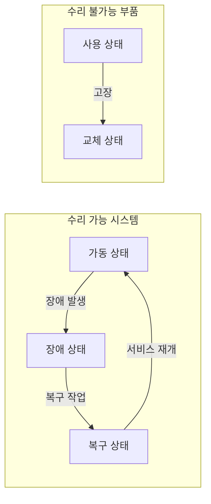
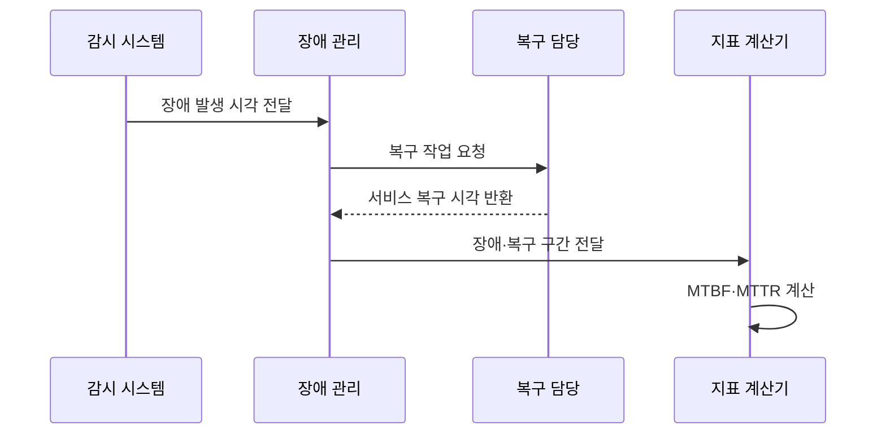

---
sidebar:
  order: 12
  label: "012. 시스템 신뢰성 지표 - MTBF·MTTR·MTTF (Reliability Metrics)"
  badge:
    text: "기출 · 50%"
    variant: note
title: "시스템 신뢰성 지표 - MTBF·MTTR·MTTF (Reliability Metrics)"
date: "2026-07-27T23:59:59+09:00"
tags:
  - "notes-evaluation"
weight: 12
extra:
  question_no: "012"
  source_status: "기출"
  source_history: "120회, 137회"
  priority: 50
  priority_note: "장애 간격·복구시간을 잇는 반복 기출 지표"
---

## 미리 알고가기

- **평균 고장 간격(Mean Time Between Failures, MTBF)**: 수리 가능한 시스템의 장애 사이 평균 가동시간입니다.
- **평균 복구시간(Mean Time To Repair, MTTR)**: 장애 발생부터 서비스 복구까지의 평균 시간입니다.
- **평균 고장시간(Mean Time To Failure, MTTF)**: 수리하지 않는 부품이 고장 날 때까지의 평균 사용시간입니다.
- **가용성(Availability)**: 전체 관측시간 중 서비스를 정상 제공한 시간의 비율입니다.
- **서비스 수준 협약(Service Level Agreement, SLA)**: 서비스 목표와 위반 책임을 정한 계약입니다.
- **약어 읽기와 표기**: MTBF·MTTR·MTTF는 엠티비에프·엠티티알·엠티티에프로 읽고 영문 머리글자를 딴 표기이며, 장애 간격·복구시간·고장 전 수명을 뜻합니다.

## Ⅰ. 개요

- 정의: 장애 간격·복구시간·수명의 **평균 지표**
- 기존 한계: 장애 건수만으로 **예방·복구 원인 구분 곤란**

### 쉽게 이해하기 (학습용)
- 시스템이 고장 없이 얼마나 오랫동안 돌아가는지, 고장이 났을 때 얼마나 빨리 복구되는지, 부품 수명은 언제 끝나는지 수치로 나타내는 방법입니다.

## Ⅱ. 특징

- **수리 가능 여부**에 따른 MTBF·MTTF 구분
- 장애·복구 경계에 따른 **MTTR 산정**
- 평균값 사용에 따른 **분포·꼬리값 은폐**

### 쉽게 이해하기 (학습용)
- 시스템 전체의 가용성을 높이기 위해서는 단순히 장비를 튼튼하게 만드는 것뿐만 아니라 고장 났을 때 신속하게 대처하는 복구 역량도 함께 확보해야 합니다.

## Ⅲ. 아키텍처 및 구성요소

| 설계 요소 | 설명 |
|:---|:---|
| 가동 상태 | MTBF의 정상 가동시간을 누적함 |
| 장애 상태 | 장애 발생 시각을 기록함 |
| 복구 상태 | MTTR의 복구시간을 누적함 |
| 사용 상태 | MTTF의 정상 사용시간을 누적함 |
| 교체 상태 | 수리하지 않고 새 부품으로 바꿈 |

### 쉽게 이해하기 (학습용)
- 수리할 수 있는 대상의 가동 시간과 복구 시간을 연결한 흐름과, 한 번 고장 나면 폐기하는 소모품의 생애주기를 비교합니다.

## Ⅳ. 원리 및 절차 흐름도

| 절차 | 설명 |
|:---|:---|
| 장애 발생 시각 전달 | 정상 가동 구간의 끝을 확정함 |
| 복구 작업 요청 | 장애 상태를 복구 상태로 바꿈 |
| 서비스 복구 시각 반환 | 복구시간의 끝을 확정함 |
| 장애·복구 구간 전달 | 가동·복구 누적시간을 구분함 |
| MTBF·MTTR 계산 | 누적시간을 사건 수로 나눔 |

### 쉽게 이해하기 (학습용)
- 하드웨어 대상을 구분하고 장애 로그에서 누락값을 제거한 후, 산식을 이용해 시스템의 실제 안정성을 검증합니다.

## Ⅴ. 종류 및 비교

| 신뢰성 지표 비교 | MTBF | MTTR | MTTF |
|:---|:---|:---|:---|
| 적용 기준 | 장애 예방 및 점검 주기 설정 시 | 복구 절차 및 SLA 준수율 개선 시 | 소모성 장비의 조기 교체 판단 시 |
| 핵심 특징 | 장애 사이 평균 가동시간 | 장애 후 평균 복구시간 | 고장 전 평균 사용시간 |
| 한계 | 장애 정의 불일치 | 복구 종료 기준 불일치 | 수리 대상에 오적용 |

> 요약: 가동은 MTBF, 복구는 MTTR, 수명은 MTTF

### 쉽게 이해하기 (학습용)
- 고쳐 쓸 수 있는 기계의 고장 간격, 수리에 걸리는 시간, 고쳐 쓸 수 없어 교체해야 하는 부품의 수명 차이를 비교합니다.

## Ⅵ. 실무 사례

1. 서버 장애의 **MTBF·MTTR 개선**

### 쉽게 이해하기 (학습용)
- 시스템 장애 복구에 대한 오차를 없애기 위해 모니터링 경보 시각과 백업 장비 가동 완료 시각을 엄격히 약속합니다.

## Ⅶ. 결론

- 신뢰성 개선을 위해 수리 가능성·목적을 검토하여 **MTBF·MTTR** 활용

### 쉽게 이해하기 (학습용)
- 세 가지 신뢰성 핵심 수치를 바탕으로 장비의 사전 점검 일정과 전산실 유지보수 대행업체와의 계약 한도를 결정합니다.
