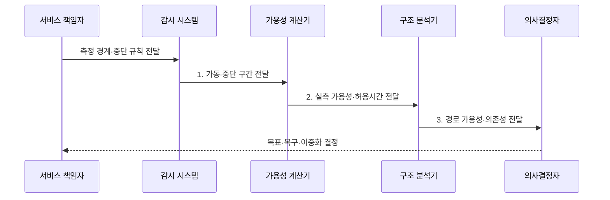

---
sidebar:
  order: 13
  label: "013. 가용성 계산 - 99.9% vs 99.99% (Availability Calculation)"
  badge:
    text: "기출 · 30%"
    variant: note
title: "가용성 계산 - 99.9% vs 99.99% (Availability Calculation)"
date: "2026-07-31T11:31:53+09:00"
tags:
  - "notes-evaluation"
weight: 13
extra:
  question_no: "013"
  source_status: "기출"
  source_history: "120회"
  priority: 30
  priority_note: "가용성 산식의 기본이나 최근 독립 출제는 약함"
---

## 미리 알고가기

- **가동시간(Uptime)**: 측정 기간 중 서비스를 정상 제공한 시간입니다.
- **중단시간(Downtime)**: 장애나 점검으로 서비스를 제공하지 못한 시간입니다.
- **나인 수(Nines)**: 가용성 백분율에 연속된 숫자 9의 개수입니다.
- **계획 정지(Planned Downtime)**: 사전 공지한 유지보수 중단으로 계약에 따라 포함 여부가 달라집니다.
- **평균 복구시간(Mean Time To Repair, MTTR)**: 장애 발생부터 서비스 복구까지의 평균 시간입니다.
- **서비스 수준 협약(Service Level Agreement, SLA)**: 서비스 목표와 위반 책임을 정한 계약입니다.
- **단일 실패 지점(Single Point of Failure, SPOF)**: 하나가 고장 나면 전체 서비스가 중단되는 요소입니다.
- **MTTR·SLA·SPOF**: 가용도에 영향을 주는 평균 복구시간·서비스 품질 협약·단일 장애점을 나타내는 핵심 요소
- **가용성 기호($A$·에이)**: Availability의 머리글자를 딴 기호이며, $A=Uptime/(Uptime+Downtime)$으로 정상 제공 비율을 나타냅니다.
- **IEC 61703:2016**: 신뢰성·가용성·유지보수성 지표의 수학적 표현을 제시한 국제표준이다.
- **ISO/IEC 20000-1:2018+Amd1:2024**: 서비스 수준·가용성 등 서비스관리시스템 요구사항을 규정한 국제표준이다.

> **키워드:** 가용성 계산 - 99.9% vs 99.99% (Availability Calculation)

## Ⅰ. 개요

- 정의/개념: 전체 측정시간 중 **정상 서비스 제공 시간**이 차지하는 비율을 나타내는 연속성 지표
- 배경/필요성: 총 가동률만으로는 **허용 중단시간**과 필요한 복구·이중화 수준 산정 곤란

### 쉽게 이해하기 (학습용)
- 시스템이 1년 또는 1달 동안 장애로 중단되지 않고 정상적으로 가동되어 서비스를 제공한 시간의 비율을 백분율로 계산하는 방법입니다.

## Ⅱ. 특징

- 가동·중단시간 기반 **가용성 산식**
- 나인 수 증가에 따른 **허용 중단시간 감소**
- 측정 경계·계획 정지에 따른 **산정값 변화**

### 쉽게 이해하기 (학습용)
- 가용성 목표치가 99.9%에서 99.99%로 한 단계만 올라가도 1년 동안 허용되는 고장 시간이 몇 시간에서 수십 분 수준으로 줄어들어 대비 비용이 크게 듭니다.

## Ⅲ. 구조 및 구성요소

| 구성요소 | 책임 |
|:---|:---|
| 서비스·측정 경계 | 사용자 기능·**기간·지역** |
| 가동·중단 판정 규칙 | 계획 정지·부분 장애·**면책** |
| 상태·사건·시간 로그 | 시작·종료·**중복 구간** |
| 가용성·허용 중단시간 | 실측 비율과 **목표 시간** |
| 직렬·병렬 의존성 | 경로의 **SPOF·공통 원인** 반영 |

### 쉽게 이해하기 (학습용)
- 어떤 서비스를 언제 중단으로 셀지 먼저 정한 뒤 상태 기록으로 비율을 계산합니다.

## Ⅳ. 흐름도

1. **가동·중단 구간 전달**: 중복·유실·**부분 장애** 처리 결과 제공
2. **실측 가용성·허용시간 전달**: $A$와 **중단 예산** 산출 결과 제공
3. **경로 가용성·의존성 전달**: 직렬·병렬과 **공통 원인** 분석 제공

### 쉽게 이해하기 (학습용)
- 가용성을 측정할 영역과 예외 기준을 합의하고 실제 가동 및 중단 시간을 집계해 공식을 적용한 다음 미달 원인을 분석합니다.

## Ⅴ. 종류 및 비교

| 연간 가용성 목표 | 99.9% | 99.99% | 99.999% |
|:---|:---|:---|:---|
| 적용 기준 | **일반 업무 서비스** | **자동 복구 이중화 서비스** | 중단 허용이 낮은 **핵심 거래** |
| 핵심 특징 | 연간 약 **8.76시간 중단** | 연간 약 **52.6분 중단** | 연간 약 **5.26분 중단** |
| 한계 | **긴 장애 허용** | **자동 복구 비용** | **공통 원인 장애** |

> 요약: **나인 수 증가**에 따른 연간 **허용 중단시간 급감**

### 쉽게 이해하기 (학습용)
- 연간 허용 중단 시간이 8시간 대인 가용성 수준과, 1시간 미만인 수준, 그리고 5분 이내여야 하는 최상위 무중단 수준의 요구 사양을 비교합니다.

## Ⅵ. 실무 고려사항 및 대책

| 고려사항 | 대책 | 효과 |
|:---|:---|:---|
| **가용성 산식·조합** | **IEC 61703:2016** 적용 | 지표·경로의 **계산 정렬** |
| **서비스 목표·관리** | **ISO/IEC 20000-1:2018+Amd1:2024** 적용 | 가용성 **계획·검토 체계화** |
| **공통 원인·측정 왜곡** | **의존성·면책·부분 장애** 명시 | 가용성 **과대평가 방지** |

### 쉽게 이해하기 (학습용)
- 여러 서버를 거쳐 동작하는 복잡한 시스템에서 단 하나만 고장 나도 전체가 멈추는 취약 부위를 찾아내어 안전 장치를 적용합니다.

## Ⅶ. 결론

- 연간 중단 예산이 8.76시간이면 **99.9%**, 52.6분이면 **99.99%** 이상 적용

### 쉽게 이해하기 (학습용)
- 보장해야 하는 서비스 가용성 등급에 맞추어 인프라에 로드밸런서와 예비 장비를 배치할 규모를 결정합니다.
