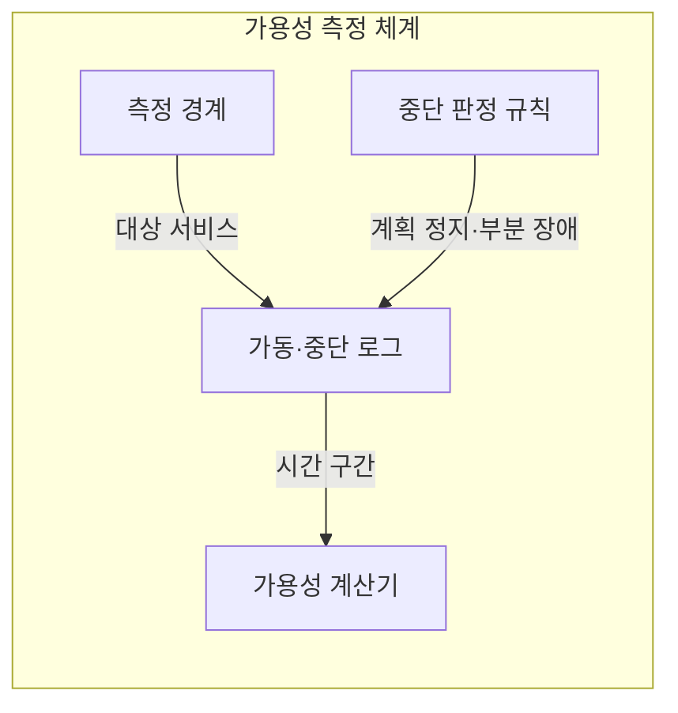
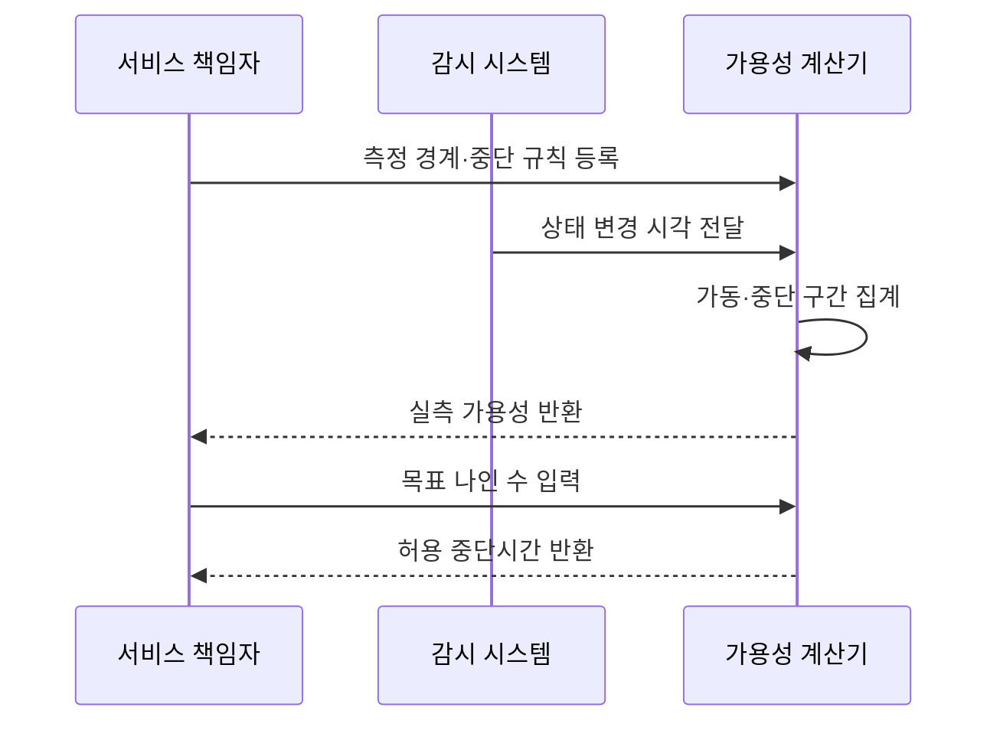

---
sidebar:
  order: 13
  label: "013. 가용성 계산 - 99.9% vs 99.99% (Availability Calculation)"
  badge:
    text: "기출 · 30%"
    variant: note
title: "가용성 계산 - 99.9% vs 99.99% (Availability Calculation)"
date: "2026-07-27T23:59:59+09:00"
tags:
  - "notes-evaluation"
weight: 13
extra:
  question_no: "013"
  source_status: "기출"
  source_history: "120회"
  priority: 30
  priority_note: "가용성 산식의 기본이나 최근 독립 출제는 약함"
---

## 미리 알고가기

- **가동시간(Uptime)**: 측정 기간 중 서비스를 정상 제공한 시간입니다.
- **중단시간(Downtime)**: 장애나 점검으로 서비스를 제공하지 못한 시간입니다.
- **나인 수(Nines)**: 가용성 백분율에 연속된 숫자 9의 개수입니다.
- **계획 정지(Planned Downtime)**: 사전 공지한 유지보수 중단으로 계약에 따라 포함 여부가 달라집니다.
- **평균 복구시간(Mean Time To Repair, MTTR)**: 장애 발생부터 서비스 복구까지의 평균 시간입니다.
- **서비스 수준 협약(Service Level Agreement, SLA)**: 서비스 목표와 위반 책임을 정한 계약입니다.
- **단일 실패 지점(Single Point of Failure, SPOF)**: 하나가 고장 나면 전체 서비스가 중단되는 요소입니다.
- **로드밸런서(Load Balancer)**: 요청을 여러 서버에 분산하는 장치입니다.
- **핵심 약어 읽기와 표기**: MTTR·SLA·SPOF는 엠티티알·에스엘에이·스포프로 읽고 영문 머리글자를 딴 표기이며, 복구시간·품질 계약·단일 장애점을 뜻합니다.
- **가용성 기호($A$·에이)**: Availability의 머리글자를 딴 기호이며, $A=Uptime/(Uptime+Downtime)$으로 정상 제공 비율을 나타냅니다.

## Ⅰ. 개요

- 정의: 전체 측정시간 중 **정상 서비스시간 비율**
- 기존 한계: 백분율 목표의 **중단 허용량 해석 곤란**

### 쉽게 이해하기 (학습용)
- 시스템이 1년 또는 1달 동안 장애로 중단되지 않고 정상적으로 가동되어 서비스를 제공한 시간의 비율을 백분율로 계산하는 방법입니다.

## Ⅱ. 특징

- 가동·중단시간 기반 **가용성 산식**
- 나인 수 증가에 따른 **허용 중단시간 감소**
- 측정 경계·계획 정지에 따른 **산정값 변화**

### 쉽게 이해하기 (학습용)
- 가용성 목표치가 99.9%에서 99.99%로 한 단계만 올라가도 1년 동안 허용되는 고장 시간이 몇 시간에서 수십 분 수준으로 줄어들어 대비 비용이 크게 듭니다.

## Ⅲ. 아키텍처 및 구성요소

| 설계 요소 | 설명 |
|:---|:---|
| 측정 경계 | 가용성을 셀 서비스 범위를 정함 |
| 중단 판정 규칙 | 계획 정지·부분 장애 포함 여부 정의 |
| 가동·중단 로그 | 상태별 시작·종료 시각을 보관함 |
| 가용성 계산기 | 가동시간을 전체 시간으로 나눔 |

### 쉽게 이해하기 (학습용)
- 어떤 서비스를 언제 중단으로 셀지 먼저 정한 뒤 상태 기록으로 비율을 계산합니다.

## Ⅳ. 원리 및 절차 흐름도

| 절차 | 설명 |
|:---|:---|
| 측정 경계·중단 규칙 등록 | 산정 대상과 예외를 고정함 |
| 상태 변경 시각 전달 | 가동·중단의 시작과 끝을 보냄 |
| 가동·중단 구간 집계 | 중복 없이 상태별 시간을 합산함 |
| 실측 가용성 반환 | 가동시간을 전체 시간으로 나눔 |
| 목표 나인 수 입력 | 계약할 가용성 백분율을 넣음 |
| 허용 중단시간 반환 | 기간별 중단 한도를 계산함 |

### 쉽게 이해하기 (학습용)
- 가용성을 측정할 영역과 예외 기준을 합의하고 실제 가동 및 중단 시간을 집계해 공식을 적용한 다음 미달 원인을 분석합니다.

## Ⅴ. 종류 및 비교

| 연간 가용성 목표 | 99.9% | 99.99% | 99.999% |
|:---|:---|:---|:---|
| 적용 기준 | 일반 업무 서비스 | 자동 복구 이중화 서비스 | 중단 허용이 매우 낮은 거래 |
| 핵심 특징 | 연간 약 8.76시간 중단 | 연간 약 52.6분 중단 | 연간 약 5.26분 중단 |
| 한계 | 긴 장애 허용 | 자동 복구 비용 | 공통 원인 장애 |

> 요약: 소수점 나인 수가 늘어날수록 연간 허용 중단 시간 급감

### 쉽게 이해하기 (학습용)
- 연간 허용 중단 시간이 8시간 대인 가용성 수준과, 1시간 미만인 수준, 그리고 5분 이내여야 하는 최상위 무중단 수준의 요구 사양을 비교합니다.

## Ⅵ. 실무 사례

1. 결제 경로의 **직렬 가용성 곱 계산**

### 쉽게 이해하기 (학습용)
- 여러 서버를 거쳐 동작하는 복잡한 시스템에서 단 하나만 고장 나도 전체가 멈추는 취약 부위를 찾아내어 안전 장치를 적용합니다.

## Ⅶ. 결론

- **허용 중단시간·복구 역량**으로 목표 결정

### 쉽게 이해하기 (학습용)
- 보장해야 하는 서비스 가용성 등급에 맞추어 인프라에 로드밸런서와 예비 장비를 배치할 규모를 결정합니다.
