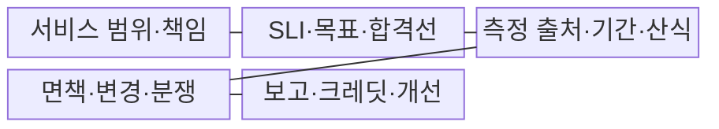
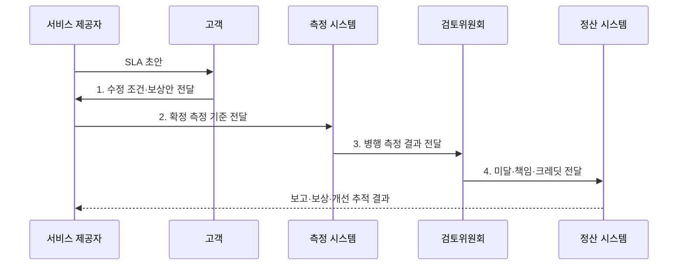

---
sidebar:
  order: 14
  label: "014. SLA 서비스 수준 협약 (Service Level Agreement)"
  badge:
    text: "기출 · 50%"
    variant: note
title: "SLA 서비스 수준 협약 (Service Level Agreement)"
date: "2026-08-02T12:14:00+09:00"
tags:
  - "notes-evaluation"
weight: 14
extra:
  question_no: "014"
  source_status: "기출"
  source_history: "123회, 137회"
  priority: 50
  priority_note: "서비스 목표와 보상 기준을 잇는 계약 설계축"
---

## Ⅰ. 개요

핵심 용어

- **서비스 수준 협약(SLA)**: 고객과 제공자가 품질 목표·측정·면책·미달 책임을 합의한 외부 계약이다.
- **서비스 수준 지표(SLI)**: 실제 서비스 품질을 정한 방식으로 측정한 값이다.

- 정의/개념: 고객과 제공자가 **서비스 목표·측정·면책**과 미달 책임을 합의한 **외부 품질 계약**
- 배경/필요성: 추상적 품질 약속만으로는 **미달 여부·책임·보상**을 검증하고 정산하기 곤란

### 쉽게 이해하기 (학습용)
- IT 서비스를 제공하는 기업이 고객에게 특정 수준 이상의 품질(예: 가용성 99.9% 보장)을 약속하고, 이를 지키지 못하면 요금을 환불해 주겠다고 문서로 보장하는 계약입니다.

## Ⅱ. 특징

핵심 용어

- **서비스 수준 목표(SLO)**: 조직 내부에서 SLI에 설정한 운영 목표값이다.
- **면책 조항**: 계획 정지·고객 원인처럼 제공자의 SLA 책임에서 제외할 조건이다.
- **서비스 크레딧**: SLA 목표 미달 시 고객 요금에서 차감하는 계약상 보상이다.

- SLI·목표값 기반 **품질 위반 판정**
- 범위·기간·면책 기반 **측정 기준**
- 서비스 크레딧 기반 **미달 책임**

### 쉽게 이해하기 (학습용)
- 단순한 품질 약속을 넘어 측정 방식, 제외 조건, 미달 시 보상 절차를 계약으로 정합니다.

## Ⅲ. 구조 및 구성요소

핵심 용어

- **서비스 범위**: SLA가 적용되는 기능·사용자·지역·시간대와 제외 대상을 정한 경계이다.
- **측정 규칙**: 지표의 데이터 원천·집계 주기·성공 기준·반올림 방법을 정한 규칙이다.
- **보고·검토**: 측정 결과와 위반·개선 조치를 정기적으로 고객과 확인하는 활동이다.

| 구성요소 | 책임 |
|:---|:---|
| 서비스 범위·책임 | 기능·지역·시간과 **계약 당사자** |
| SLI·목표·합격선 | 가용성·지연·**지원 수준** |
| 측정 출처·기간·산식 | 원천·분모·**집계 구간** |
| 면책·변경·분쟁 | 계획 정지·고객 원인·**조정 절차** |
| 보고·크레딧·개선 | 통지·보상·**재발 방지** |

### 쉽게 이해하기 (학습용)
- 서비스의 목표 성능을 실시간 계측하는 시스템과, 이를 지키기 위한 내부 운영 지침, 그리고 고객과의 책임 보상선이 유기적으로 연결됩니다.

## Ⅳ. 흐름도

핵심 용어

- **병행 측정**: 고객과 제공자가 같은 기간의 품질을 각각 측정하여 결과를 대조하는 방식이다.
- **분쟁 조정**: 측정값이 다를 때 원시 데이터와 계약 규칙으로 위반 여부를 재판정하는 절차이다.

1. **수정 조건·보상안 전달**: 기능·품질·책임의 **조정 요구** 제공
2. **확정 측정 기준 전달**: 산식·면책·**서비스 크레딧** 확정
3. **병행 측정 결과 전달**: 원천·기간과 **측정 편차** 검증
4. **미달·책임·크레딧 전달**: 위반 수준과 **보상 금액** 제공

### 쉽게 이해하기 (학습용)
- 서비스의 범위를 정하고 품질 지표에 합의한 다음, 계약 체결 전에 데이터 대조 기간을 거쳐 약정서에 서명하고 가동 중 고장 여부를 판정합니다.

## Ⅴ. 종류 및 비교

핵심 용어

- **SLI**: 실제 서비스 품질을 보여 주는 측정값이다.
- **SLO**: 장애 예방과 배포 판단에 사용하는 내부 품질 목표이다.
- **SLA**: 목표 미달의 외부 책임과 보상을 포함하는 품질 계약이다.

| 서비스 수준 관리 | SLA | SLO | SLI |
|:---|:---|:---|:---|
| 적용 기준 | **SLA**: 미달 시 금전적 보상 | **SLO**: 장애 예방·품질 한도 | **SLI**: 실시간 품질 측정 |
| 핵심 특징 | 외부 **품질·보상 계약** | 내부 **품질 목표** | 실제 **품질 측정값** |
| 한계 | 측정·면책의 **분쟁** | 과도한 목표의 **비용** | 잘못된 **측정 경계** |

> 요약: **SLI로 SLO 판정**, **SLA로 책임 정산**

### 쉽게 이해하기 (학습용)
- 실시간 성능 계기판의 수치(SLI)와, 내부 개발팀이 지키려는 가이드라인(SLO), 그리고 고객과 맺은 법적 위반 배상 기준(SLA)의 관계를 비교합니다.

## Ⅵ. 실무 고려사항 및 대책

핵심 용어

- **측정 경계 오류**: 고객 여정과 다른 시작·종료·제외 조건으로 품질을 계산하여 결과가 왜곡되는 문제이다.
- **과도한 목표**: 사용자 가치보다 지나치게 높은 SLO·SLA가 비용과 변경 제약을 키우는 상태이다.

| 문제 | 대책 | 효과 |
|:---|:---|:---|
| **서비스 수준 관리 요구** | **ISO/IEC 20000-1:2018+Amd1:2024** 적용 | 합의·감시·**검토 체계화** |
| **요구사항 해석·구현** | **ISO/IEC 20000-2:2019+Amd1:2020** 참조 | 운영 적용의 **편차 감소** |
| **측정·면책 분쟁** | **병행 측정·원시값 보존** | 판정의 **증거·신뢰 확보** |

### 쉽게 이해하기 (학습용)
- 서비스 장애가 났을 때 양사의 모니터링 수치가 서로 달라 발생할 수 있는 분쟁을 예방하기 위해 사용할 측정 도구를 사전에 명문화합니다.

## Ⅶ. 결론

핵심 용어

- **ISO/IEC 20000-1**: 서비스 수준 합의·감시·검토를 포함한 서비스관리시스템 요구사항을 규정한 국제표준이다.
- **ISO/IEC 20000-2**: ISO/IEC 20000-1 요구사항의 적용 지침을 제공하는 국제표준이다.

- 고객 책임은 **SLA·서비스 크레딧**, 내부 품질 관리는 **SLO**로 분리

### 쉽게 이해하기 (학습용)
- 운영 역량과 고객 요구를 함께 고려해 측정 가능하고 감당할 수 있는 서비스 품질 계약을 정합니다.
