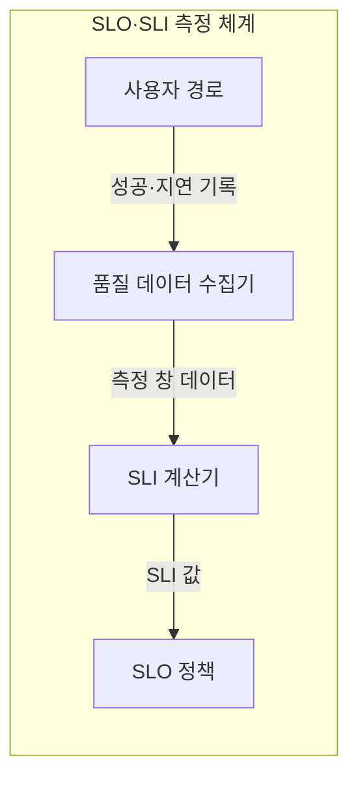
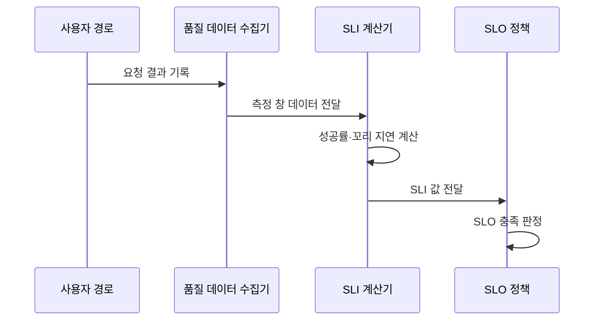

---
sidebar:
  order: 15
  label: "015. SLO·SLI (Service Level Objective·Indicator)"
  badge:
    text: "기출 · 50%"
    variant: note
title: "SLO·SLI (Service Level Objective·Indicator)"
date: "2026-07-27T23:59:59+09:00"
tags:
  - "notes-evaluation"
weight: 15
extra:
  question_no: "015"
  source_status: "기출"
  source_history: "137회, 138회"
  priority: 50
  priority_note: "최근 연속 기출, SRE 목표·측정의 핵심 관계"
---

## 미리 알고가기

- **서비스 수준 목표(Service Level Objective, SLO)**: 특정 기간에 달성할 내부 서비스 품질 목표입니다.
- **서비스 수준 지표(Service Level Indicator, SLI)**: 실제 사용자 요청의 품질을 나타내는 측정값입니다.
- **서비스 수준 협약(Service Level Agreement, SLA)**: 고객과 품질 목표·측정·책임을 합의한 계약입니다.
- **사이트 신뢰성 공학(Site Reliability Engineering, SRE)**: SLI·SLO로 신뢰성과 변경 속도를 조정하는 운영 방식입니다.
- **이동 측정 창(Rolling Window)**: 현재 시점에서 일정 길이의 과거 구간을 계속 갱신합니다.
- **꼬리 지연(Tail Latency)**: 응답시간 분포에서 늦은 일부 요청의 지연입니다.
- **백분위수(Percentile)**: p95·p99처럼 일정 비율의 요청이 끝난 지연값입니다.
- **오류 예산(Error Budget)**: SLO가 허용하는 실패량에서 실제 실패량을 뺀 여유입니다.
- **약어 읽기와 표기**: SLO·SLI·SLA·SRE는 에스엘오·에스엘아이·에스엘에이·에스알이로 읽고 영문 머리글자를 딴 표기이며, 목표·지표·협약·신뢰성 공학을 뜻합니다.
- **백분위 기호($p95$·피 구십오)**: percentile의 p와 백분율 수치를 결합한 표기이며, 요청 95%가 이 값 이하에서 완료됨을 뜻합니다.

## Ⅰ. 개요

- 정의: SLI **실측값**과 SLO **내부 목표**의 관리
- 기존 한계: 자원 지표의 **사용자 체감 품질 반영 부족**

### 쉽게 이해하기 (학습용)
- 시스템 성능을 사용자 경험 관점에서 평가하기 위해 실시간 측정값을 정의하고, 이 측정값들이 지켜야 할 내부적인 운영 한계 목표치를 수립하는 기법입니다.

## Ⅱ. 특징

- 사용자 경로 기반 **성공률·지연 SLI**
- 측정값과 목표를 분리한 **SLI·SLO 관계**
- 측정 창 기반 **품질 충족 판정**

### 쉽게 이해하기 (학습용)
- 인프라 리소스 위주의 측정이 아니라, 가상 사용자가 실제 느끼는 성공률과 꼬리 지연을 바탕으로 시스템 가용 성능을 통제합니다.

## Ⅲ. 아키텍처 및 구성요소

| 설계 요소 | 설명 |
|:---|:---|
| 사용자 경로 | 품질을 판단할 핵심 업무 흐름 |
| 품질 데이터 수집기 | 성공·오류·지연 기록을 수집함 |
| SLI 계산기 | 측정 창의 실제 품질값을 산출함 |
| SLO 정책 | SLI와 내부 목표를 비교함 |

### 쉽게 이해하기 (학습용)
- 모니터링이 필요한 핵심 경로를 선택해 측정 공식을 만들고, 이를 달성해야 하는 목표값 및 예외 조항과 연계하여 시스템을 제어합니다.

## Ⅳ. 원리 및 절차 흐름도

| 절차 | 설명 |
|:---|:---|
| 요청 결과 기록 | 성공·오류·응답시간을 남김 |
| 측정 창 데이터 전달 | 중복·유실을 정제해 구간화함 |
| 성공률·꼬리 지연 계산 | 사용자 품질 수치를 산출함 |
| SLI 값 전달 | 실제값을 목표 정책에 보냄 |
| SLO 충족 판정 | 내부 목표의 충족 여부를 결정함 |

### 쉽게 이해하기 (학습용)
- 측정 대상을 정하고 변수를 정의해 데이터 오류를 정제한 후, 실제 측정값을 계산하고 목표치와 비교해 신규 기능의 배포 여부를 결정합니다.

## Ⅴ. 종류 및 비교

| 서비스 수준 요소 | SLO | SLI | SLA |
|:---|:---|:---|:---|
| 적용 기준 | 운영·배포 판단 | 사용자 품질 측정 | 고객 보상 합의 |
| 핵심 특징 | 내부 품질 목표 | 실제 품질 측정값 | 외부 품질·책임 계약 |
| 한계 | 과도한 목표 비용 | 측정 경계 오류 | 계약 위반 책임 |

> 요약: SLI 수치로 SLO 배포를 조율하고 SLA 책임 관리

### 쉽게 이해하기 (학습용)
- 실제 시스템 수치와, 개발팀이 배포를 중단할 내부 기준선, 그리고 고객과의 법적 배상 한계선을 비교합니다.

## Ⅵ. 실무 사례

1. 결제 경로의 **성공률·꼬리 지연 SLI**
2. 30일 이동 창의 **SLO 충족 판정**

### 쉽게 이해하기 (학습용)
- 메인 페이지 진입과 결제 같은 핵심 경로별 성공률과 상위 지연 구간의 꼬리 지연을 따로 측정합니다.
- 한 달 주기의 슬라이딩 윈도우를 활용해 허용된 오류 예산이 100% 소진되면 즉시 개발을 멈추고 버그 수정을 개시합니다.

## Ⅶ. 결론

- **사용자 경로·측정 창**에 따라 SLI·SLO 설정

### 쉽게 이해하기 (학습용)
- 시스템 가동을 통해 누적되는 수치적 오류 예산을 이정표 삼아 신규 피처 배포와 장애 개선의 최적 균형을 조율합니다.
