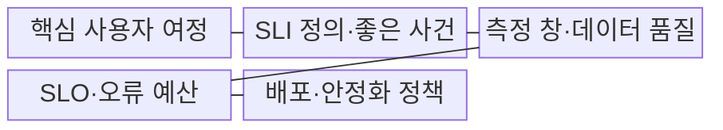
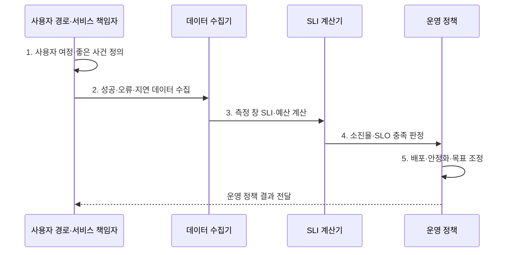

---
sidebar:
  order: 15
  label: "015. SLO·SLI (Service Level Objective·Indicator)"
  badge:
    text: "기출 · 50%"
    variant: note
title: "SLO·SLI (Service Level Objective·Indicator)"
date: "2026-08-02T12:15:00+09:00"
tags:
  - "notes-evaluation"
weight: 15
extra:
  question_no: "015"
  source_status: "기출"
  source_history: "137회, 138회"
  priority: 50
  priority_note: "최근 연속 기출, SRE 목표·측정의 핵심 관계"
---

## Ⅰ. 개요

핵심 용어

- **서비스 수준 지표(SLI)**: 실제 사용자 요청의 품질을 정한 방식으로 측정한 값이다.
- **서비스 수준 목표(SLO)**: 특정 기간에 SLI가 달성해야 할 내부 서비스 품질 목표이다.

- 정의/개념: **SLI·SLO**는 사용자 관점의 서비스 품질을 SLI로 측정하고 일정 기간에 달성할 내부 목표 수준을 SLO로 정해 신뢰성을 관리하는 지표 체계
- 배경/필요성: 서버 평균 지표만으로는 **여정 실패·꼬리 지연 판단 불가**

#### 한줄 요약
- 시스템 성능을 사용자 경험 관점에서 평가하기 위해 실시간 측정값을 정의하고, 이 측정값들이 지켜야 할 내부적인 운영 한계 목표치를 수립하는 기법입니다.

## Ⅱ. 특징

핵심 용어

- **사이트 신뢰성 공학(SRE)**: SLI·SLO·오류 예산으로 신뢰성과 변경 속도를 조정하는 운영 방식이다.
- **이동 측정 창**: 현재 시점을 기준으로 일정 길이의 과거 측정 구간을 계속 갱신하는 창이다.
- **백분위수**: p95·p99처럼 일정 비율의 요청이 해당 시간 이하에서 완료되는 지연값이다.

- 사용자 경로 기반 **성공률·지연 SLI**
- 측정값과 목표를 분리한 **SLI·SLO 관계**
- 측정 창 기반 **품질 충족 판정**
- 오류 예산 기반 **SRE 변경·신뢰성 조정**

#### 한줄 요약
- 인프라 리소스 위주의 측정이 아니라, 가상 사용자가 실제 느끼는 성공률과 꼬리 지연을 바탕으로 시스템 가용 성능을 통제합니다.

## Ⅲ. 구조 및 구성요소

핵심 용어

- **좋은 이벤트**: 전체 유효 요청 중 SLI 성공 조건을 만족한 요청이다.
- **전체 이벤트**: SLI 계산에 포함하도록 경계와 제외 규칙을 적용한 모든 유효 요청이다.
- **꼬리 지연**: 응답시간 분포에서 상위 백분위에 속하는 느린 일부 요청의 지연이다.

| 구성요소 | 책임 |
|:---|:---|
| 핵심 사용자 여정 | 로그인·검색·**결제 경로** |
| SLI 정의·좋은 사건 | 성공·지연의 **분자·분모** |
| 측정 창·데이터 품질 | 이동창·유실·**중복·편향** |
| SLO·오류 예산 | 목표·**허용 실패량** |
| 배포·안정화 정책 | 예산 소진율·**조치 기준** |

#### 한줄 요약
- 모니터링이 필요한 핵심 경로를 선택해 측정 공식을 만들고, 이를 달성해야 하는 목표값 및 예외 조항과 연계하여 시스템을 제어합니다.

## Ⅳ. 흐름도

핵심 용어

- **SLI 계산**: 좋은 이벤트를 전체 유효 이벤트로 나누어 실제 서비스 품질을 산출하는 과정이다.
- **SLO 판정**: 측정 창의 SLI가 목표값 이상인지 비교하여 오류 예산 사용과 운영 조치를 결정하는 과정이다.

1. **사용자 여정·좋은 사건 정의**: 경계·분자·분모 확정
2. **성공·오류·지연 데이터 수집**: 체감 품질 원시값 확보
3. **측정 창 SLI·예산 계산**: 실제값·허용실패량 산출
4. **소진율·SLO 충족 판정**: 위험·예산 소비속도 평가
5. **배포·안정화·목표 조정**: 변경 중지·개선·재설정

#### 한줄 요약
- 측정 대상을 정하고 변수를 정의해 데이터 오류를 정제한 후, 실제 측정값을 계산하고 목표치와 비교해 신규 기능의 배포 여부를 결정합니다.

## Ⅴ. 종류 및 비교

핵심 용어

- **SLO**: 운영·배포 판단을 위한 내부 품질 목표이다.
- **SLI**: 사용자 관점의 실제 품질 측정값이다.
- **SLA**: 고객과 품질 목표·측정·위반 책임을 합의한 외부 계약이다.

| 서비스 수준 요소 | SLO | SLI | SLA |
|:---|:---|:---|:---|
| 적용 기준 | **운영·배포 판단** | 사용자 **품질 측정** | 고객 **보상 합의** |
| 핵심 특징 | 내부 **품질 목표** | 실제 **품질 측정값** | 외부 **품질·책임 계약** |
| 한계 | **과도한 목표 비용** | **측정 경계 오류** | **계약 위반 책임** |

> 요약: **SLI·SLO**로 배포를 조율하고 **SLA** 책임 관리

#### 한줄 요약
- 실제 시스템 수치와, 개발팀이 배포를 중단할 내부 기준선, 그리고 고객과의 법적 배상 한계선을 비교합니다.

## Ⅵ. 실무 고려사항 및 대책

핵심 용어

- **오류 예산**: SLO가 허용하는 실패량에서 실제 실패량을 뺀 변경·실험의 여유이다.
- **오류 예산 정책**: 남은 오류 예산에 따라 배포·안정화 우선순위를 정하는 운영 규칙이다.
- **측정 경계**: SLI에 포함할 사용자·기능·지역·응답 코드·시간대를 정한 범위이다.

| 문제 | 대책 | 효과 |
|:---|:---|:---|
| **사용자 관점 누락** | **여정별 성공률·p99 SLI 적용** | **체감 품질** 반영 |
| **서비스 수준 관리** | **ISO/IEC 20000-1:2018 연계** | 감시·보고·**검토 정렬** |
| **목표만 있고 운영 기준 부재** | **오류 예산 정책 적용** | **배포·안정화 균형** |

#### 한줄 요약
- 메인 페이지 진입과 결제 같은 핵심 경로별 성공률과 상위 지연 구간의 꼬리 지연을 따로 측정합니다.

## Ⅶ. 결론

핵심 용어

- **사용자 여정 SLI**: 서버 내부 지표가 아니라 사용자가 목적을 완료하는 경로의 성공·지연을 측정한 지표이다.
- **ISO/IEC 20000-1**: 합의한 서비스 수준의 감시·보고·검토 요구사항을 규정한 국제표준이다.

- 오류 예산 소진율이 높으면 **배포 중지·안정화**, 여유면 **변경 진행**

#### 한줄 요약
- 시스템 가동을 통해 누적되는 수치적 오류 예산을 이정표 삼아 신규 피처 배포와 장애 개선의 최적 균형을 조율합니다.
