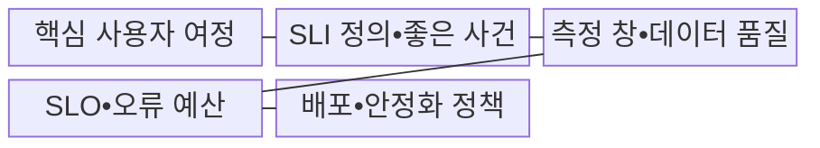
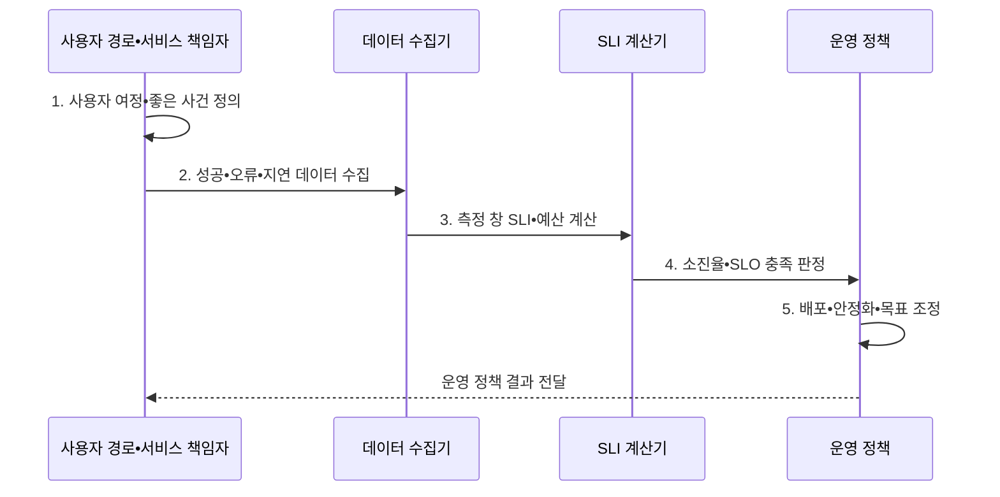

---
sidebar:
  order: 15
  label: "015. SLO•SLI (Service Level Objective•Indicator)"
  badge:
    text: "기출 • 50%"
    variant: note
title: "SLO•SLI (Service Level Objective•Indicator)"
date: "2026-08-04T20:27:00+09:00"
tags:
  - "notes-evaluation"
weight: 15
extra:
  question_no: "015"
  source_status: "기출"
  source_history: "137회, 138회"
  priority: 50
  priority_note: "최근 연속 기출, SRE 목표•측정의 핵심 관계"
---

## Ⅰ. 개요

핵심 용어

- **SLI(Service Level Indicator)**: 실제 사용자 요청의 품질 측정값이다.
- **SLO(Service Level Objective)**: 일정 기간에 SLI가 달성할 내부 목표이다.

- 정의/개념: 사용자 품질을 **SLI** 로 측정하고 **SLO** 로 목표를 관리하는 체계
- 배경/필요성: 서버 평균 지표만으로는 **여정 실패•꼬리 지연 판단 불가**

#### 한줄 요약
- 사용자 관점 측정값과 내부 운영 목표를 결합한 신뢰성 관리

## Ⅱ. 특징

핵심 용어

- **SRE(Site Reliability Engineering)**: SLI•SLO•오류 예산으로 신뢰성을 관리하는 방식이다.
- **이동 측정 창**: 현재 시점을 기준으로 일정 길이의 과거 측정 구간을 계속 갱신하는 창이다.
- **백분위수**: p95•p99처럼 일정 비율의 요청이 해당 시간 이하에서 완료되는 지연값이다.

- 사용자 경로 기반 **성공률•지연 SLI**
- 측정값과 목표를 분리한 **SLI•SLO 관계**
- 측정 창 기반 **품질 충족 판정**
- 오류 예산 기반 **SRE 변경•신뢰성 조정**

#### 한줄 요약
- 사용자 여정의 성공률•꼬리 지연 기반 가용 성능 통제

## Ⅲ. 구조 및 구성요소

핵심 용어

- **좋은 이벤트**: 전체 유효 요청 중 SLI 성공 조건을 만족한 요청이다.
- **전체 이벤트**: SLI 계산에 포함하도록 경계와 제외 규칙을 적용한 모든 유효 요청이다.
- **꼬리 지연**: 응답시간 분포에서 상위 백분위에 속하는 느린 일부 요청의 지연이다.

| 구성요소 | 책임 |
|:---|:---|
| 핵심 사용자 여정 | 로그인•검색•**결제 경로** |
| SLI 정의•좋은 사건 | 성공•지연의 **분자•분모** |
| 측정 창•데이터 품질 | 이동창•유실•**중복•편향** |
| SLO•오류 예산 | 목표•**허용 실패량** |
| 배포•안정화 정책 | 예산 소진율•**조치 기준** |

#### 한줄 요약
- 핵심 경로 측정식•목표값•예외 조항의 연계

## Ⅳ. 흐름도

핵심 용어

- **SLI 계산**: 좋은 이벤트를 전체 유효 이벤트로 나누어 실제 서비스 품질을 산출하는 과정이다.
- **SLO 판정**: 측정 창의 SLI가 목표값 이상인지 비교하여 오류 예산 사용과 운영 조치를 결정하는 과정이다.

1. **사용자 여정•좋은 사건 정의**: 경계•분자•분모 확정
2. **성공•오류•지연 데이터 수집**: 체감 품질 원시값 확보
3. **측정 창 SLI•예산 계산**: 실제값•허용실패량 산출
4. **소진율•SLO 충족 판정**: 위험•예산 소비속도 평가
5. **배포•안정화•목표 조정**: 변경 중지•개선•재설정

#### 한줄 요약
- 측정 대상•변수•정제•목표 판정에 따른 배포 결정

## Ⅴ. 종류 및 비교

핵심 용어

- **SLI 역할**: 사용자 관점의 실제 품질을 측정한다.
- **SLO 역할**: 운영•배포의 내부 목표를 제공한다.
- **SLA(Service Level Agreement)**: 품질 목표•측정•책임의 외부 계약이다.

| 서비스 수준 요소 | 역할 | 산출•판정 |
|:---|:---|:---|
| SLI | 사용자 관점의 **실제 품질 측정** | 성공률•지연•가용성 측정값 |
| SLO | 일정 기간의 **내부 품질 목표** | 오류 예산•배포•안정화 판단 |
| SLA | 고객과 합의한 **외부 품질 계약** | 미달 판정•책임•보상 기준 |

> 요약: **SLI•SLO** 로 배포를 조율하고 **SLA** 책임 관리

#### 한줄 요약
- 실제 품질 측정값•내부 운영 기준•외부 책임 기준의 구분

## Ⅵ. 실무 고려사항 및 대책

핵심 용어

- **오류 예산**: SLO가 허용하는 실패량에서 실제 실패량을 뺀 변경•실험의 여유이다.
- **오류 예산 정책**: 남은 오류 예산에 따라 배포•안정화 우선순위를 정하는 운영 규칙이다.
- **측정 경계**: SLI에 포함할 사용자•기능•지역•응답 코드•시간대를 정한 범위이다.
- **ISO(International Organization for Standardization)**: 국제표준화기구이다.
- **IEC(International Electrotechnical Commission)**: 국제전기기술위원회이다.

| 문제 | 대책 | 효과 |
|:---|:---|:---|
| **사용자 관점 누락** | **여정별 성공률•p99 SLI 적용** | **체감 품질** 반영 |
| **서비스 수준 관리** | **ISO/IEC 20000-1:2018 연계** | 감시•보고•**검토 정렬** |
| **목표만 있고 운영 기준 부재** | **오류 예산 정책 적용** | **배포•안정화 균형** |

#### 한줄 요약
- 핵심 사용자 경로별 성공률과 꼬리 지연 분리 측정

## Ⅶ. 결론

핵심 용어

- **사용자 여정 SLI**: 서버 내부 지표가 아니라 사용자가 목적을 완료하는 경로의 성공•지연을 측정한 지표이다.
- **ISO/IEC 20000-1**: 서비스 수준의 감시•보고•검토 요구표준이다.
- **배포 판단**: 오류 예산 소진율이 높으면 변경을 중지하고 안정화하며 여유가 있으면 변경을 진행하는 결정이다.

- 오류 예산 소진율이 높으면 **배포 중지•안정화**, 여유면 **변경 진행**

#### 한줄 요약
- 오류 예산에 따른 신규 기능 배포와 장애 개선의 균형
