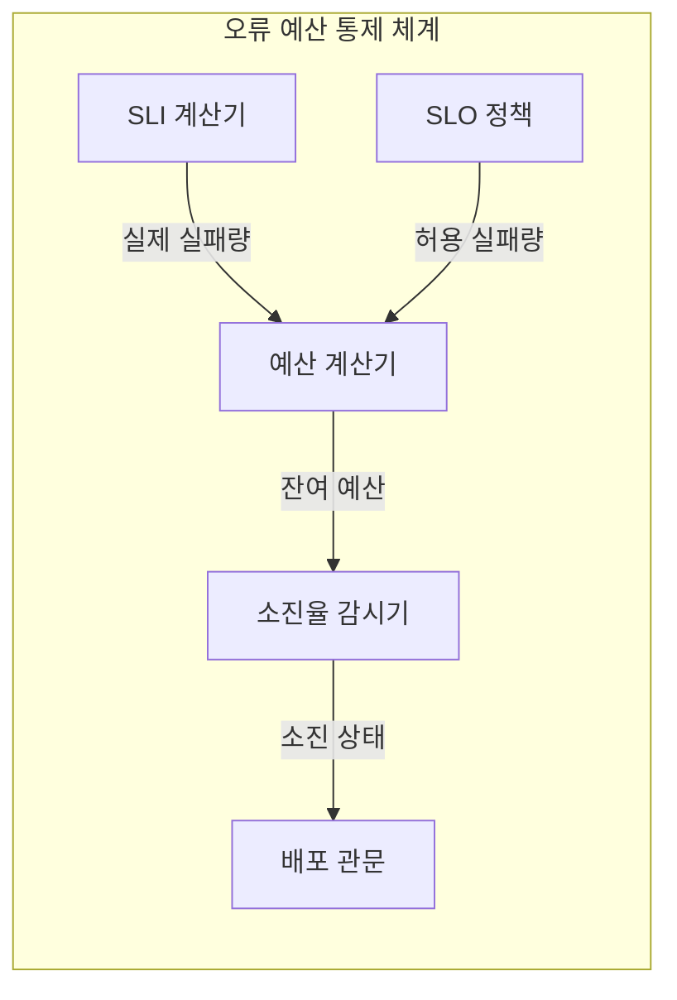
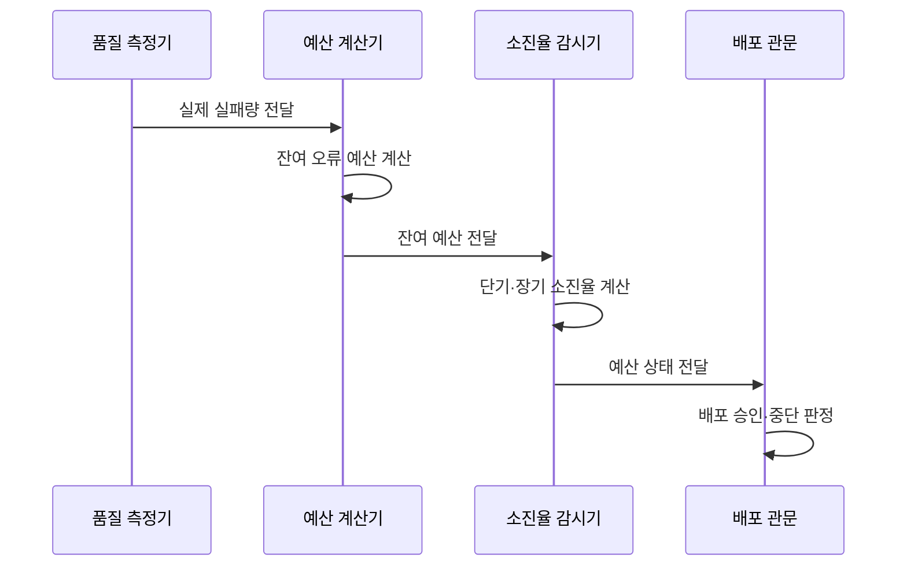

---
sidebar:
  order: 16
  label: "016. 오류 예산 (Error Budget)"
  badge:
    text: "기출 · 50%"
    variant: note
title: "오류 예산 (Error Budget)"
date: "2026-07-27T23:59:59+09:00"
tags:
  - "notes-evaluation"
weight: 16
extra:
  question_no: "016"
  source_status: "기출"
  source_history: "137회, 138회"
  priority: 50
  priority_note: "최근 연속 기출, 배포 속도와 안정성의 통제축"
---

## 미리 알고가기

- **서비스 수준 목표(Service Level Objective, SLO)**: 특정 기간에 달성할 내부 서비스 품질 목표입니다.
- **오류 예산(Error Budget)**: SLO가 허용하는 실패량에서 실제 실패량을 뺀 여유입니다.
- **예산 소진율(Burn Rate)**: 오류 예산이 기준 속도보다 몇 배 빠르게 줄어드는지 나타냅니다.
- **배포 관문(Release Gating)**: 정한 조건에 따라 배포를 승인하거나 중단합니다.
- **이동 측정 창(Rolling Window)**: 현재 시점에서 일정 길이의 과거 구간을 계속 갱신합니다.
- **지속적 통합·지속적 제공(Continuous Integration and Continuous Delivery, CI/CD)**: 변경을 자동 통합·시험·배포하는 체계입니다.
- **서비스 수준 지표(Service Level Indicator, SLI)**: 실제 사용자 요청의 품질을 나타내는 측정값입니다.
- **약어 읽기와 표기**: SLO·SLI·CI/CD는 에스엘오·에스엘아이·씨아이 씨디로 읽고 영문 머리글자를 딴 표기이며, 품질 목표·측정값·자동 통합 배포를 뜻합니다.

## Ⅰ. 개요

- 정의: SLO 허용 실패량에서 실제 실패를 뺀 **여유**
- 기존 한계: 배포 속도·신뢰성의 **객관적 조정 기준 부족**

### 쉽게 이해하기 (학습용)
- 서비스가 완벽할 수는 없으므로, 사용자에게 심각한 피해를 주지 않는 선에서 미리 허용해 둔 실패의 총량입니다.

## Ⅱ. 특징

- $1-SLO$ 기반 **허용 실패량**
- 잔여 예산 기반 **변경·안정화 판단**
- 단기·장기 창의 **예산 소진율 감시**

### 쉽게 이해하기 (학습용)
- 쓸 수 있는 용돈(오류 예산)이 남아 있을 때는 하고 싶은 도전(배포)을 하고, 다 써가면 절약(안정화) 모드로 전환합니다.

## Ⅲ. 아키텍처 및 구성요소

| 설계 요소 | 설명 |
|:---|:---|
| SLI 계산기 | 측정 창의 실제 실패량을 계산함 |
| SLO 정책 | 허용 실패량과 기간을 제공함 |
| 예산 계산기 | 허용량에서 실제량을 차감함 |
| 소진율 감시기 | 단기·장기 고갈 속도를 비교함 |
| 배포 관문 | 예산 상태로 배포 여부를 결정함 |

> 요약: SLO와 소진율로 배포 정책을 자동 전환

### 쉽게 이해하기 (학습용)
- 기준선을 정하고 감시하는 장치를 두어 예산 상황에 따라 배포를 승인하거나 자동으로 차단합니다.

## Ⅳ. 원리 및 절차 흐름도

| 절차 | 설명 |
|:---|:---|
| 실제 실패량 전달 | 측정 창의 오류를 집계함 |
| 잔여 오류 예산 계산 | 허용량에서 실제량을 차감함 |
| 잔여 예산 전달 | 남은 실패 허용량을 보냄 |
| 단기·장기 소진율 계산 | 급격한 고갈과 지속 고갈을 구분함 |
| 예산 상태 전달 | 여유·경고·고갈 상태를 알림 |
| 배포 승인·중단 판정 | 정책에 따라 변경 흐름을 제어함 |

### 쉽게 이해하기 (학습용)
- 실패 여유가 바닥나면 새 기능보다 장애 원인을 먼저 고칩니다.

## Ⅴ. 종류 및 비교

| 오류 예산 상태 | 여유 구간 | 경고 구간 | 고갈 구간 |
|:---|:---|:---|:---|
| 적용 기준 | 잔여 예산 충분 | 예산 소진 가속 | 예산 전량 소진 |
| 핵심 특징 | 허용 실패량 잔여 | 목표 위반 임박 | 허용 실패량 초과 |
| 한계 | 과도한 변경 증가 | 늦은 안정화 전환 | 장기 배포 중단 |

> 요약: 잔량 여유는 배포, 소진은 제한, 고갈은 안정화

### 쉽게 이해하기 (학습용)
- 예산 상태를 세 단계로 나누어 여유로울 때는 활발히 배포하고, 고갈되면 배포를 멈추고 시스템을 안정화합니다.

## Ⅵ. 실무 사례

1. 결제 서비스의 **단기·장기 소진율 경보**

### 쉽게 이해하기 (학습용)
- 짧은 폭주와 오래 이어지는 실패를 서로 다른 시간 창으로 빠르게 찾습니다.

## Ⅶ. 결론

- **잔여 예산·소진율**에 따라 변경·안정화 선택

### 쉽게 이해하기 (학습용)
- 실패 여유가 남으면 변경하고 빠르게 줄면 신뢰성 개선으로 전환합니다.
