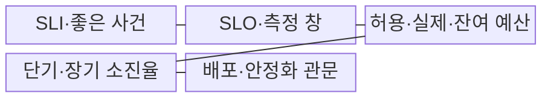
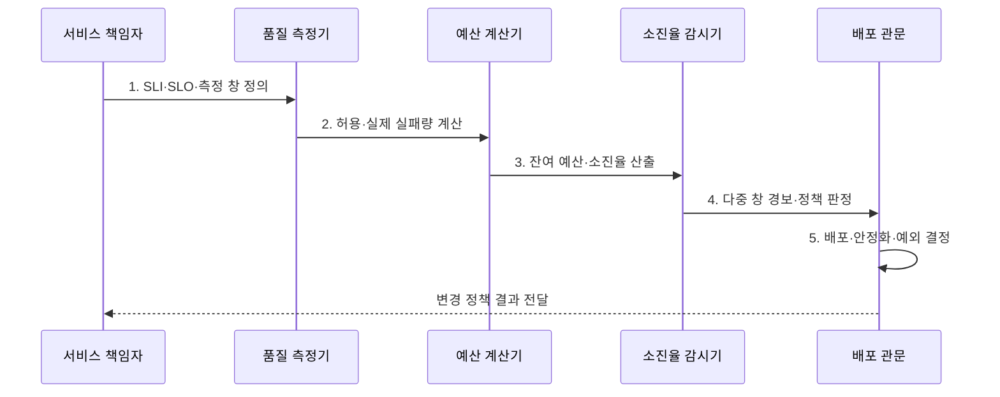

---
sidebar:
  order: 16
  label: "016. 오류 예산 (Error Budget)"
  badge:
    text: "기출 · 50%"
    variant: note
title: "오류 예산 (Error Budget)"
date: "2026-07-31T05:10:14+09:00"
tags:
  - "notes-evaluation"
weight: 16
extra:
  question_no: "016"
  source_status: "기출"
  source_history: "137회, 138회"
  priority: 50
  priority_note: "최근 연속 기출, 배포 속도와 안정성의 통제축"
---

## 미리 알고가기

- **서비스 수준 목표(Service Level Objective, SLO)**: 특정 기간에 달성할 내부 서비스 품질 목표입니다.
- **오류 예산(Error Budget)**: SLO가 허용하는 실패량에서 실제 실패량을 뺀 여유입니다.
- **예산 소진율(Burn Rate)**: 오류 예산이 기준 속도보다 몇 배 빠르게 줄어드는지 나타냅니다.
- **배포 관문(Release Gating)**: 정한 조건에 따라 배포를 승인하거나 중단합니다.
- **이동 측정 창(Rolling Window)**: 현재 시점에서 일정 길이의 과거 구간을 계속 갱신합니다.
- **지속적 통합·지속적 제공(Continuous Integration and Continuous Delivery, CI/CD)**: 변경을 자동 통합·시험·배포하는 체계입니다.
- **서비스 수준 지표(Service Level Indicator, SLI)**: 실제 사용자 요청의 품질을 나타내는 측정값입니다.
- **SLO·SLI·CI/CD**: 서비스의 측정값과 목표를 기준으로 자동 통합·배포의 속도를 조절하는 오류 예산 운영 요소
- **ISO/IEC 20000-1:2018**: 서비스 수준의 합의·감시·보고·검토 요구사항을 규정한 국제표준이다.

## Ⅰ. 개요

- 정의/개념: SLO 허용 실패량에서 실제 실패를 뺀 **여유**
- 배경/필요성: 팀별 감에 의존하면 **배포 속도·신뢰성 투자 합의 불가**

### 쉽게 이해하기 (학습용)
- 서비스가 완벽할 수는 없으므로, 사용자에게 심각한 피해를 주지 않는 선에서 미리 허용해 둔 실패의 총량입니다.

## Ⅱ. 특징

> 30일을 기준으로 파란 선은 99.9% 가용성 SLO에서 약 43.2분의 중단을 허용하며, SLO가 높아질수록 사용 가능한 오류 예산이 급격히 줄어드는 관계를 나타낸다.

- $1-SLO$ 기반 **허용 실패량**
- 잔여 예산 기반 **변경·안정화 판단**
- 단기·장기 창의 **예산 소진율 감시**
- CI/CD 배포 관문의 **자동 승인·중단**

### 쉽게 이해하기 (학습용)
- 쓸 수 있는 용돈(오류 예산)이 남아 있을 때는 하고 싶은 도전(배포)을 하고, 다 써가면 절약(안정화) 모드로 전환합니다.

## Ⅲ. 구조 및 구성요소

| 구성요소 | 책임 |
|:---|:---|
| **SLI·좋은 사건** | 성공·전체 사건의 **분자·분모** |
| **SLO·측정 창** | 목표·이동창·**평가기간** |
| **허용·실제·잔여 예산** | 실패 한도·사용량·**잔량** |
| **단기·장기 소진율** | 급격·지속 **고갈 탐지** |
| **배포·안정화 관문** | 변경 승인·중단·**개선** |

### 쉽게 이해하기 (학습용)
- 기준선을 정하고 감시하는 장치를 두어 예산 상황에 따라 배포를 승인하거나 자동으로 차단합니다.

## Ⅳ. 흐름도

1. **SLI·SLO·측정 창 정의**: 분자·분모·목표 확정
2. **허용·실제 실패량 계산**: 전체·나쁜 사건 집계
3. **잔여 예산·소진율 산출**: 잔량·고갈 속도 계산
4. **다중 창 경보·정책 판정**: 급격·지속 위반 구분
5. **배포·안정화·예외 결정**: 변경속도·복구투자 조정

### 쉽게 이해하기 (학습용)
- 실패 여유가 바닥나면 새 기능보다 장애 원인을 먼저 고칩니다.

## Ⅴ. 종류 및 비교

| 오류 예산 상태 | 여유 구간 | 경고 구간 | 고갈 구간 |
|:---|:---|:---|:---|
| **적용 기준** | **잔여 예산 충분** | **예산 소진 가속** | **예산 전량 소진** |
| **핵심 특징** | **허용 실패량 잔여** | **목표 위반 임박** | **허용 실패량 초과** |
| **한계** | **과도한 변경 증가** | **늦은 안정화 전환** | **장기 배포 중단** |

> 요약: 잔량 여유는 배포, 소진은 제한, 고갈은 안정화

### 쉽게 이해하기 (학습용)
- 예산 상태를 세 단계로 나누어 여유로울 때는 활발히 배포하고, 고갈되면 배포를 멈추고 시스템을 안정화합니다.

## Ⅵ. 실무 고려사항 및 대책

| 고려사항 | 대책 | 효과 |
|:---|:---|:---|
| **서비스 수준 관리** | **ISO/IEC 20000-1:2018 연계** | 목표·감시·**검토 정렬** |
| **단일 창의 늦은 경보** | **단기·장기 소진율 병행** | 급격·지속 장애의 **조기 탐지** |
| **기계적 배포 중단** | **사용자영향·예외 승인 적용** | **업무 위험 기반** 통제 |

### 쉽게 이해하기 (학습용)
- 짧은 폭주와 오래 이어지는 실패를 서로 다른 시간 창으로 빠르게 찾습니다.

## Ⅶ. 결론

- 예산 여유면 **CI/CD 배포**, 급속 소진이면 **중지·안정화**, 예외는 승인

### 쉽게 이해하기 (학습용)
- 실패 여유가 남으면 변경하고 빠르게 줄면 신뢰성 개선으로 전환합니다.
