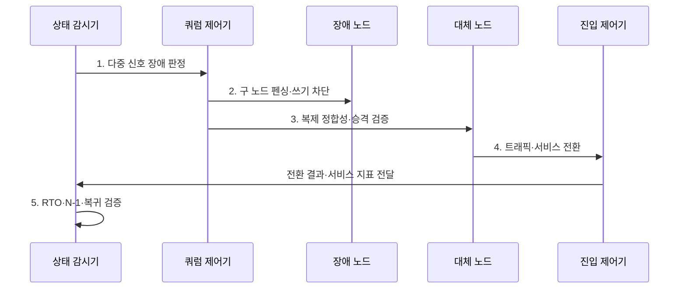

---
sidebar:
  order: 17
  label: "017. 고가용성 설계 - Active-Active·Active-Standby (High Availability Architecture)"
  badge:
    text: "기출 · 70%"
    variant: note
title: "고가용성 설계 - Active-Active·Active-Standby (High Availability Architecture)"
date: "2026-08-02T12:17:00+09:00"
tags:
  - "notes-evaluation"
weight: 17
extra:
  question_no: "017"
  source_status: "기출"
  source_history: "135회, 137회"
  priority: 70
  priority_note: "다중 기출, 이중화 방식 선택의 대표 설계축"
---

## Ⅰ. 개요

핵심 용어

- **고가용성(High Availability, HA)**: 일부 구성요소가 고장 나도 대체 자원으로 서비스를 계속 제공하도록 설계한 구조이다.
- **복구 목표 시간(Recovery Time Objective, RTO)**: 장애 발생 후 서비스를 재개해야 하는 최대 허용 시간이다.
- **자동 전환**: 장애를 탐지한 뒤 정상 대체 자원으로 역할과 트래픽을 넘겨 서비스 중단을 줄이는 처리이다.

- 정의/개념: **고가용성 아키텍처** — 핵심 자원과 경로를 중복 구성하고 장애를 탐지해 정상 자원으로 자동 전환함으로써 서비스 중단을 최소화하는 설계
- 배경/필요성: 단일 자원 구조는 장애 시 **서비스 지속·RTO 달성 불가**

#### 한줄 요약
- 시스템의 일부가 고장 나더라도 예비 부품이나 다른 정상 장비가 즉시 임무를 넘겨받아 서비스가 계속 돌아가게 만드는 설계 방법입니다.

## Ⅱ. 특징

핵심 용어

- **장애 전환**: 장애 노드의 역할과 트래픽을 정상 대체 노드로 넘기는 처리이다.
- **상태 확인**: 노드가 요청을 정상 처리할 수 있는지 주기적으로 검사하는 기능이다.
- **로드밸런서**: 요청을 여러 서버에 분산하고 상태가 나쁜 서버를 전송 대상에서 제외하는 장치이다.
- **정합성 유지**: 상태 복제·쿼럼·펜싱을 이용해 장애 전환 중에도 데이터와 쓰기 권한의 일관성을 보존하는 활동이다.

- 중복 노드·경로 기반 **서비스 연속성**
- 상태 복제·펜싱 기반 **정합성 유지**
- 상태 확인·자동 승계 기반 **RTO 단축**

#### 한줄 요약
- 모든 장비를 동시에 쓰는 방식(Active-Active)과 하나만 쓰고 나머지는 대기시키는 방식(Active-Standby)이 있으며 시스템 성격에 맞게 선택합니다.

## Ⅲ. 구조 및 구성요소

핵심 용어

- **무상태 계층**: 요청 사이에 유지할 세션 상태를 노드 내부에 저장하지 않아 수평 전환이 쉬운 계층이다.
- **상태 저장 계층**: 지속 데이터와 복제 정합성·쓰기 권한을 관리하는 계층이다.
- **쿼럼**: 다수 노드의 동의로 주 노드와 쓰기 권한을 결정하는 기준이다.
- **N-1 용량**: 구성요소 하나가 빠진 상태에서도 나머지 자원으로 목표 부하를 처리할 수 있는 용량 조건이다.

| 구성요소 | 책임 |
|:---|:---|
| 장애 도메인·N-1 용량 | 전원·망·시설·**잔여 처리량** |
| 로드밸런서·이중화 노드 | 동일 기능·**무상태 분산** |
| 복제 데이터·정합성 | 동기·비동기·**복제 지연** |
| 상태 확인·쿼럼·펜싱 | 판정·주 노드·**쓰기 차단** |
| 장애 전환·복구·복귀 | RTO·검증·**정상화** |

#### 한줄 요약
- 정상 노드와 대기 노드, 상태를 감시하는 센서, 그리고 장애가 났을 때 기존 노드가 엉뚱한 데이터를 쓰지 못하게 잠그는 장치들로 구성됩니다.

## Ⅳ. 흐름도

핵심 용어

- **펜싱**: 장애·분리 노드가 공유 데이터에 쓰지 못하도록 전원·스토리지·네트워크 접근을 차단하는 조치이다.
- **스플릿 브레인**: 통신이 분리된 여러 노드가 각각 주 노드라고 판단하여 동시 쓰기가 충돌하는 상태이다.
- **승격 검증**: 대체 노드의 복제 데이터와 처리 권한이 정상인지 확인한 뒤 주 역할을 부여하는 절차이다.

1. **다중 신호 장애 판정**: 응답·의존성·쿼럼 확인
2. **구 노드 펜싱·쓰기 차단**: 스플릿 브레인 방지
3. **복제 정합성·승격 검증**: 데이터·처리권한 확인
4. **트래픽·서비스 전환**: 정상 노드로 경로 변경
5. **RTO·N-1·복귀 검증**: 시간·용량·정상화 확인

#### 한줄 요약
- 시스템이 작동을 멈추거나 이상 증세를 보이면 즉시 격리한 뒤, 트래픽을 예비 노드로 보내고 복구 과정의 데이터 오류를 확인합니다.

## Ⅴ. 종류 및 비교

핵심 용어

- **활성-활성**: 여러 노드가 동시에 요청을 처리하여 무상태 계층의 용량과 가용성을 높이는 방식이다.
- **활성-대기**: 활성 노드 장애 시 대기 노드가 주 역할을 승계하는 이중화 방식이다.
- **구성 선택**: 무상태 계층은 활성-활성, 단일 쓰기와 정합성이 중요한 상태 저장 계층은 활성-대기 방식을 적용하는 구분이다.

| 고가용성 구성 | Active-Active | Active-Standby |
|:---|:---|:---|
| 적용 기준 | 웹 등 **무상태 계층** | DB 등 **상태 저장 계층** |
| 핵심 특징 | 여러 노드 **동시 처리** | 주 노드 처리·**대기 노드 승계** |
| 한계 | **동시 쓰기 충돌** | **승격 지연·유휴 자원** |

> 요약: **무상태 계층** 은 동시 처리, **상태 저장 계층** 은 대기 승격

#### 한줄 요약
- 무상태 웹 계층은 동시 처리가 쉽고, 상태 저장 계층은 쓰기 충돌과 복제 정합성을 고려해 운영 방식을 정합니다.

## Ⅵ. 실무 고려사항 및 대책

핵심 용어

- **공통 원인 장애**: 이중화 자원이 같은 전원·망·시설·배포 원인으로 동시에 실패하는 현상이다.
- **대체 용량**: 한 노드를 제외한 나머지 자원만으로 목표 부하를 처리할 수 있는 여유 능력이다.
- **데이터 정합성**: 장애 전환 전후에도 데이터의 제약·순서·사본 관계가 올바르게 유지되는 성질이다.
- **데이터베이스(Database, DB) 승격**: 대기 데이터베이스의 복제 상태를 확인하고 주 쓰기 역할로 전환하는 처리이다.

| 문제 | 대책 | 효과 |
|:---|:---|:---|
| **가용성 산정·조합** | **IEC 61703:2016 적용** | 구조별 **가용성 정량화** |
| **업무 연속성 목표** | **ISO 22301:2019 연계** | RTO·**우선업무 정렬** |
| **스플릿 브레인·용량** | **쿼럼·펜싱·N-1 검증** | **데이터 충돌·전환 실패** 방지 |

#### 한줄 요약
- 데이터베이스 장애 시 대기 장비가 주 장비로 승격될 때 구 장비의 연결을 확실히 끊어 데이터가 꼬이는 것을 방지합니다.

## Ⅶ. 결론

핵심 용어

- **가용성 시험**: 실제 장애를 주입하여 탐지·제외·승계·복구 시간과 데이터 정합성을 확인하는 시험이다.
- **국제표준화기구 22301(International Organization for Standardization 22301, ISO 22301)**: 중단 상황에서 우선 활동의 연속성과 복구를 관리하는 국제표준이다.
- **계층별 이중화 결정**: 무상태·수평 확장은 활성-활성, 단일 쓰기·정합성은 활성-대기 구성을 선택하는 판단이다.

- 무상태·수평 확장은 **Active-Active**, 단일 쓰기·정합성은 **Active-Standby**

#### 한줄 요약
- 완벽하게 고장 나지 않는 장비는 없으므로, 고장난 장비를 격리하고 예비 장비로 갈아끼우는 자동화 구조를 계층별로 마련해야 합니다.
