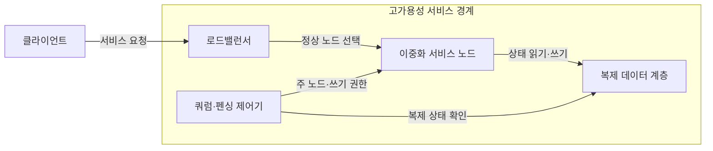
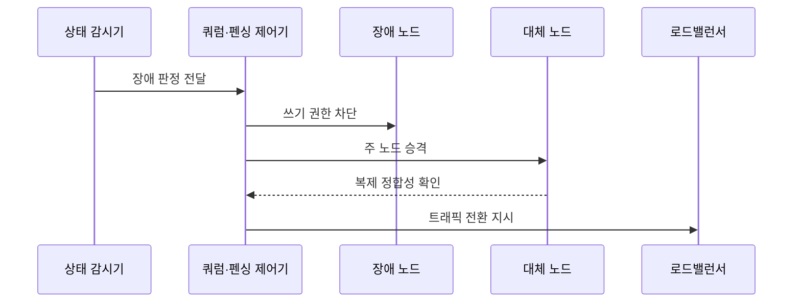

---
sidebar:
  order: 17
  label: "017. 고가용성 설계 - Active-Active·Active-Standby (High Availability Architecture)"
  badge:
    text: "기출 · 70%"
    variant: note
title: "고가용성 설계 - Active-Active·Active-Standby (High Availability Architecture)"
date: "2026-07-27T23:59:59+09:00"
tags:
  - "notes-evaluation"
weight: 17
extra:
  question_no: "017"
  source_status: "기출"
  source_history: "135회, 137회"
  priority: 70
  priority_note: "다중 기출, 이중화 방식 선택의 대표 설계축"
---

## 미리 알고가기

- **고가용성(High Availability, HA)**: 일부 장애에도 대체 자원으로 서비스를 계속 제공하는 설계입니다.
- **활성-활성(Active-Active)**: 여러 노드가 동시에 요청을 처리하는 이중화 방식입니다.
- **활성-대기(Active-Standby)**: 활성 노드 장애 시 대기 노드가 처리를 승계하는 방식입니다.
- **무상태 계층(Stateless Layer)**: 요청 사이의 세션 상태를 노드 내부에 저장하지 않는 계층입니다.
- **상태 저장 계층(Stateful Layer)**: 지속할 데이터와 복제 정합성을 관리하는 계층입니다.
- **장애 전환(Failover)**: 장애 노드의 역할과 트래픽을 정상 노드로 넘기는 처리입니다.
- **스플릿 브레인(Split Brain)**: 분리된 노드가 모두 주 노드라고 판단해 쓰기가 충돌하는 상태입니다.
- **데이터베이스(Database, DB)**: 지속할 상태 데이터를 저장하고 조회하는 시스템입니다.
- **로드밸런서(Load Balancer)**: 요청을 여러 서버에 분산하고 장애 서버를 제외합니다.
- **복구 목표 시간(Recovery Time Objective, RTO)**: 장애 후 서비스를 재개해야 하는 최대 허용 시간입니다.
- **쿼럼(Quorum)**: 다수 노드의 동의로 주 노드와 쓰기 권한을 결정합니다.
- **펜싱(Fencing)**: 장애·분리 노드가 공유 데이터에 쓰지 못하게 차단합니다.
- **상태 확인(Health Check)**: 노드가 요청을 정상 처리하는지 주기적으로 검사합니다.
- **HA·DB·RTO**: 데이터베이스를 포함한 서비스의 고가용성 구조와 목표 복구시간을 나타내는 설계 요소

## Ⅰ. 개요

- 정의: 중복 자원·장애 전환 기반 **중단 최소화 설계**
- 기존 한계: 단일 자원 장애의 **전체 서비스 중단**

### 쉽게 이해하기 (학습용)
- 시스템의 일부가 고장 나더라도 예비 부품이나 다른 정상 장비가 즉시 임무를 넘겨받아 서비스가 계속 돌아가게 만드는 설계 방법입니다.

## Ⅱ. 특징

- 중복 노드·경로 기반 **서비스 연속성**
- 상태 복제·펜싱 기반 **정합성 유지**
- 상태 확인·자동 승계 기반 **RTO 단축**

### 쉽게 이해하기 (학습용)
- 모든 장비를 동시에 쓰는 방식(Active-Active)과 하나만 쓰고 나머지는 대기시키는 방식(Active-Standby)이 있으며 시스템 성격에 맞게 선택합니다.

## Ⅲ. 아키텍처 및 구성요소

| 설계 요소 | 설명 |
|:---|:---|
| 로드밸런서 | 정상 서비스 노드로 요청을 분산함 |
| 이중화 서비스 노드 | 동일 기능을 여러 노드가 제공함 |
| 복제 데이터 계층 | 장애 전후의 지속 상태를 동기화함 |
| 쿼럼·펜싱 제어기 | 주 노드와 쓰기 권한을 단일화함 |

> 요약: 감시, 복제, 펜싱으로 장애 시 자동 전환

### 쉽게 이해하기 (학습용)
- 정상 노드와 대기 노드, 상태를 감시하는 센서, 그리고 장애가 났을 때 기존 노드가 엉뚱한 데이터를 쓰지 못하게 잠그는 장치들로 구성됩니다.

## Ⅳ. 원리 및 절차 흐름도

| 절차 | 설명 |
|:---|:---|
| 장애 판정 전달 | 연속 실패로 장애를 확정함 |
| 쓰기 권한 차단 | 구 노드의 데이터 접근을 끊음 |
| 주 노드 승격 | 대기 노드에 처리 권한을 부여함 |
| 복제 정합성 확인 | 대체 노드의 마지막 반영 위치와 처리 가능 상태를 검사함 |
| 트래픽 전환 지시 | 새 주 노드로 요청을 보냄 |

### 쉽게 이해하기 (학습용)
- 시스템이 작동을 멈추거나 이상 증세를 보이면 즉시 격리한 뒤, 트래픽을 예비 노드로 보내고 복구 과정의 데이터 오류를 확인합니다.

## Ⅴ. 종류 및 비교

| 고가용성 구성 | Active-Active | Active-Standby |
|:---|:---|:---|
| 적용 기준 | 웹 등 무상태 계층 | DB 등 상태 저장 계층 |
| 핵심 특징 | 여러 노드 동시 처리 | 주 노드 처리·대기 노드 승계 |
| 한계 | 동시 쓰기 충돌 | 승격 지연·유휴 자원 |

> 요약: 무상태는 동시 처리, 상태 저장은 대기 승격

### 쉽게 이해하기 (학습용)
- 무상태 웹 계층은 동시 처리가 쉽고, 상태 저장 계층은 쓰기 충돌과 복제 정합성을 고려해 운영 방식을 정합니다.

## Ⅵ. 실무 사례

1. DB 계층의 **Active-Standby·펜싱**

### 쉽게 이해하기 (학습용)
- 데이터베이스 장애 시 대기 장비가 주 장비로 승격될 때 구 장비의 연결을 확실히 끊어 데이터가 꼬이는 것을 방지합니다.

## Ⅶ. 결론

- 구성요소 장애에도 서비스 연속성을 유지하기 위해 **상태 복제·장애 탐지·펜싱·전환시간·N-1 용량**을 검토하고, 목표 RTO를 만족하는 고가용성 구조를 적용해야 한다.

### 쉽게 이해하기 (학습용)
- 완벽하게 고장 나지 않는 장비는 없으므로, 고장난 장비를 격리하고 예비 장비로 갈아끼우는 자동화 구조를 계층별로 마련해야 합니다.
