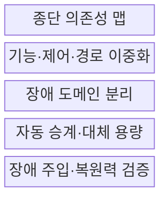
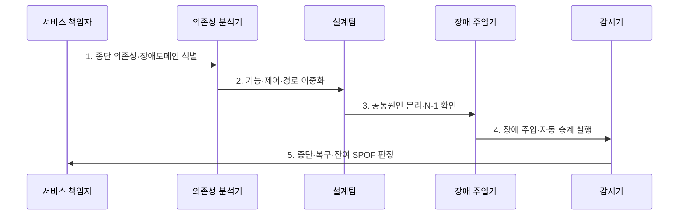

---
sidebar:
  order: 18
  label: "018. 단일 장애점 SPOF 제거 (SPOF Elimination)"
  badge:
    text: "기출 · 50%"
    variant: note
title: "단일 장애점 SPOF 제거 (SPOF Elimination)"
date: "2026-07-30T23:30:00+09:00"
tags:
  - "notes-evaluation"
weight: 18
extra:
  question_no: "018"
  source_status: "기출"
  source_history: "137회"
  priority: 50
  priority_note: "단일 장애점 식별·제거를 묻는 고가용성 기본"
---

## 미리 알고가기

- **SPOF(Single Point of Failure)**: 한 구성요소의 고장만으로 전체 서비스가 중단되는 단일 장애점
- **장애 도메인(Fault Domain)**: 전원·망·시설처럼 하나의 원인으로 함께 고장 날 수 있는 자원의 범위
- **공통 원인 고장(Common-Cause Failure)**: 여러 이중화 자원이 같은 원인을 공유해 동시에 고장 나는 현상
- **이중화(Redundancy)**: 같은 기능을 수행할 대체 자원이나 경로를 추가하는 설계
- **N+1 이중화**: 정상 운영에 필요한 N개 자원에 예비 자원 1개를 더 두는 방식
- **LB(Load Balancer)**: 여러 서버로 요청을 분산하고 장애 서버를 우회하는 장치나 기능
- **DNS(Domain Name System)**: 서비스 이름을 접속 가능한 네트워크 주소로 해석하는 체계
- **DB(Database)**: 구조화된 업무 데이터를 저장·조회하는 데이터베이스
- **AZ(Availability Zone)**: 독립된 전원·네트워크·시설을 갖도록 분리한 클라우드 가용 영역
- **리전(Region)**: 여러 가용 영역을 포함하는 독립된 클라우드 지리 구역
- **ISP(Internet Service Provider)**: 인터넷 연결 회선을 제공하는 사업자
- **장애 승계(Failover)**: 주 자원 장애 때 대기 자원이나 경로로 서비스를 전환하는 처리
- **카오스 엔지니어링(Chaos Engineering)**: 통제된 장애를 주입해 시스템의 복원력 가설을 검증하는 활동
- **종단 의존성(End-to-End Dependency)**: 사용자 요청부터 데이터 저장까지 서비스가 거치는 모든 내부·외부 의존 관계
- **SPOF·LB·DNS·DB·AZ·ISP**: 서비스 중단을 일으킬 수 있는 단일 장애점과 부하분산·이름해석·데이터·가용영역·회선 의존성을 나타내는 점검 요소
- **ISO 22301:2019**: 중단 위험과 우선 활동의 연속성·복구를 관리하는 업무연속성 국제표준이다.
- **IEC 61508-1:2010**: 안전 관련 시스템의 기능안전 수명주기와 독립성 원칙을 규정한 국제표준이다.

## Ⅰ. 개요

- 정의: 단일 고장의 전체 중단을 막는 **의존성 제거**
- 기존 한계: 단일 구성요소의 **서비스 연속성 결정**

### 쉽게 이해하기 (학습)

- 장비를 하나 더 놓는 데서 끝나지 않고 두 장비가 같은 전원이나 회선을 공유하지 않게 해야 한 번의 사고가 전체 중단으로 번지지 않는다.

## Ⅱ. 특징

- 사용자부터 외부 서비스까지 **종단 의존성 식별**
- 기능 이중화와 **장애 도메인 분리**
- 장애 주입 기반 **자동 승계·대체 용량 검증**

### 쉽게 이해하기 (학습)

- 예비 장비가 있어도 자동으로 전환되지 않거나 정상 부하를 감당하지 못하면 운영 중에는 여전히 단일 장애점이다.

## Ⅲ. 구조 및 구성요소

| 구성요소 | 책임 |
|:---|:---|
| 종단 의존성 맵 | DNS·망·앱·DB·외부 경로 식별 |
| 기능·제어·경로 이중화 | 대체 노드·결정권·우회경로 |
| 장애 도메인 분리 | 전원·랙·AZ·리전을 독립 배치 |
| 자동 승계·대체 용량 | 상태판정·전환·N-1 |
| 장애 주입·복원력 검증 | 고장가설·복구·잔여위험 |

### 쉽게 이해하기 (학습)

- 서비스 전체 지도를 만든 뒤 각 단독 의존을 복제하고 서로 다른 장애 영역에 배치하며 승계가 실제 작동하는지 시험한다.

## Ⅳ. 흐름도

### 동작 원리

1. **종단 의존성·장애도메인 식별**: 내부·외부 단독 의존 탐색
2. **기능·제어·경로 이중화**: 대체 자원·결정권 구성
3. **공통원인 분리·N-1 확인**: 전원·망·시설·용량 검증
4. **장애 주입·자동 승계 실행**: 탐지·전환·격리 시험
5. **중단·복구·잔여 SPOF 판정**: 영향·시간·숨은 의존 개선

> 요약: 장애를 판정해 독립된 대체 경로로 전환한다.

### 쉽게 이해하기 (학습)

- 감시기가 주 경로의 실제 실패를 확인하면 진입점이 같은 사고에 영향받지 않은 대기 자원으로 요청을 넘겨 서비스를 이어 간다.

## Ⅴ. 종류 및 비교

| 단일 장애점 대응 | 기능 이중화 | 제어 이중화 | 도메인 분리 |
|:---|:---|:---|:---|
| 적용 기준 | 단독 장비·서비스 | 단독 선출·관리 기능 | 공유 전원·망·시설 |
| 핵심 특징 | 대체 노드·경로 추가 | 쿼럼·결정권 복제 | 독립 장애영역 배치 |
| 한계 | 대체 용량·상태 동기화 | 동시 결정·분할 위험 | 숨은 공통 외부 의존 |

### 쉽게 이해하기 (학습)

- 장비가 하나뿐이면 같은 기능을 추가하고 여러 장비가 한 전원에 묶였으면 전원과 배치 자체를 나눠야 한다.

## Ⅵ. 실무 고려사항 및 대책

| 고려사항 | 대책 | 효과 |
|:---|:---|:---|
| 우선업무·중단 영향 | **ISO 22301:2019 연계** | 제거 우선순위 정렬 |
| 독립성·공통원인 | **IEC 61508-1 독립성 참조** | 동시 장애 가능성 감소 |
| 설계와 실제 승계 차이 | **카오스 시험·N-1 검증** | 잔여 SPOF 식별 |

### 쉽게 이해하기 (학습)

- 사례 1은 한 통신사업자의 회선 장애가 모든 외부 접속을 끊지 않게 한다.

## Ⅶ. 결론

- **종단의존성·공통원인·독립성·N-1·승계**로 SPOF 제거를 결정한다.

### 쉽게 이해하기 (학습)

- SPOF 제거는 장비 수를 늘리는 작업이 아니라 사용자 요청의 모든 의존 경로에서 하나의 고장이 전체 중단으로 이어지지 않음을 검증하는 설계다.
