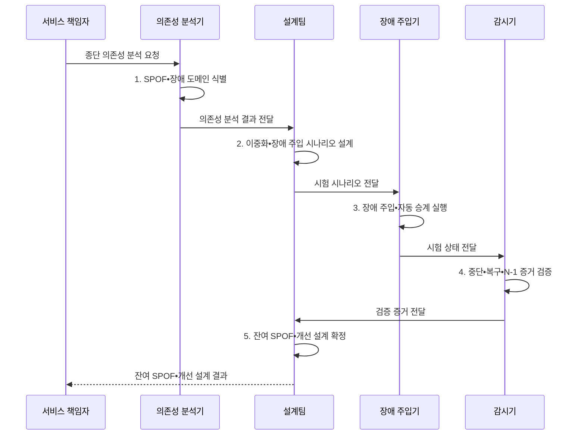

---
sidebar:
  order: 18
  label: "018. 단일 장애점 SPOF 제거 (SPOF Elimination)"
  badge:
    text: "기출 • 50%"
    variant: note
title: "단일 장애점 SPOF 제거 (SPOF Elimination)"
date: "2026-08-05T00:00:00+09:00"
tags:
  - "notes-evaluation"
weight: 18
extra:
  question_no: "018"
  source_status: "기출"
  source_history: "137회"
  priority: 50
  priority_note: "단일 장애점 식별•제거를 묻는 고가용성 기본"
---

## Ⅰ. 개요

핵심 용어

- **SPOF(Single Point of Failure)**: 하나의 고장으로 전체 서비스가 중단되는 의존 지점이다.
- **종단 의존성**: 사용자 요청부터 데이터 저장과 외부 서비스까지 업무가 거치는 모든 의존 관계이다.

- 정의/개념: **SPOF 제거** — 하나의 구성요소•전원•회선•운영 주체 고장이 전체 서비스를 중단시키는 단일 의존성을 찾아 분리•다중화하는 복원력 기법
- 배경/필요성: 장비만 복제하면 공통 전원•회선의 **동시 장애 방지 불가**

#### 한줄 요약

- 장비를 하나 더 놓는 데서 끝나지 않고 두 장비가 같은 전원이나 회선을 공유하지 않게 해야 한 번의 사고가 전체 중단으로 번지지 않는다.

## Ⅱ. 특징

핵심 용어

- **장애 도메인**: 전원•네트워크•시설처럼 하나의 원인으로 함께 고장 날 수 있는 자원 범위이다.
- **공통 원인 고장**: 여러 이중화 자원이 같은 원인을 공유하여 동시에 고장 나는 현상이다.
- **이중화**: 같은 기능을 수행할 대체 자원이나 경로를 추가하는 설계이다.

- **식별 축**: 사용자부터 외부 서비스까지 종단 의존성 추적
- **설계 축**: 기능 이중화와 장애 도메인 분리 병행
- **검증 축**: 장애 주입으로 자동 승계와 대체 용량 확인

#### 한줄 요약

- 예비 장비가 있어도 자동으로 전환되지 않거나 정상 부하를 감당하지 못하면 운영 중에는 여전히 단일 장애점이다.

## Ⅲ. 구조 및 구성요소

핵심 용어

- **N+1 이중화**: 정상 운영에 필요한 N개 자원에 예비 자원 하나를 더 두는 방식이다.
- **AZ(Availability Zone)**: 전원•망•시설을 독립 분리한 클라우드 가용 영역이다.
- **리전**: 여러 가용 영역을 포함하는 독립된 클라우드 지리 구역이다.
- **DNS(Domain Name System)**: 도메인 이름을 네트워크 주소로 변환하는 체계이다.
- **DB(Database)**: 구조화 데이터를 저장•관리하는 데이터베이스이다.
- **종단 의존성 맵**: DNS•망•응용•DB•외부 서비스의 의존 지도이다.

| 구성요소 | 책임 |
|:---|:---|
| 종단 의존성 맵 | **DNS•망•앱•DB•외부 경로** 식별 |
| 기능•제어•경로 이중화 | **대체 노드•결정권•우회 경로** 구성 |
| 장애 도메인 분리 | **전원•랙•AZ•리전** 독립 배치 |
| 자동 승계•대체 용량 | **상태 판정•전환•N-1** 보장 |
| 장애 주입•복원력 검증 | **고장 가설•복구•잔여 위험** 검증 |

#### 한줄 요약

- 서비스 전체 지도를 만든 뒤 각 단독 의존을 복제하고 서로 다른 장애 영역에 배치하며 승계가 실제 작동하는지 시험한다.

## Ⅳ. 흐름도

핵심 용어

- **장애 승계**: 주 자원 장애 때 대기 자원이나 대체 경로로 서비스를 전환하는 처리이다.
- **카오스 엔지니어링**: 통제된 장애를 주입하여 시스템의 복원력 가설과 자동 승계를 검증하는 활동이다.

**동작 원리**

1. **SPOF•장애 도메인 식별**: 내부•외부 단독 의존 식별
2. **이중화•장애 주입 시나리오 설계**: 공통 원인과 N-1 반영
3. **장애 주입•자동 승계 실행**: 탐지•전환•격리 시험
4. **중단•복구•N-1 증거 검증**: 영향•시간•대체 용량 검증
5. **잔여 SPOF•개선 설계 확정**: 미검증 의존성과 보완 구조 결정

#### 한줄 요약

- 감시기가 주 경로의 실제 실패를 확인하면 진입점이 같은 사고에 영향받지 않은 대기 자원으로 요청을 넘겨 서비스를 이어 간다.

## Ⅴ. 종류 및 비교

핵심 용어

- **구성요소 SPOF**: 단독 장비•서비스가 실패하면 대체 인스턴스 없이 전체 기능이 멈추는 장애점이다.
- **제어면 SPOF**: 단독 선출•관리 기능이 실패하여 정상 데이터면까지 운영할 수 없게 되는 장애점이다.
- **장애 도메인 SPOF**: 복제 자원이 공통 전원•망•시설에 있어 함께 중단되는 장애점이다.

| 단일 장애점 대응 | 기능 이중화 | 제어 이중화 | 도메인 분리 |
|:---|:---|:---|:---|
| 적용 기준 | **단독 장비•서비스** | **단독 선출•관리 기능** | **공유 전원•망•시설** |
| 핵심 특징 | **대체 노드•경로** 추가 | **쿼럼•결정권** 복제 | **독립 장애 영역** 배치 |
| 한계 | **대체 용량•상태 동기화** | **동시 결정•분할 위험** | **숨은 공통 외부 의존** |

> 요약: 단독 기능은 **이중화**, 공유 원인은 **도메인 분리** 적용

#### 한줄 요약

- 장비가 하나뿐이면 같은 기능을 추가하고 여러 장비가 한 전원에 묶였으면 전원과 배치 자체를 나눠야 한다.

## Ⅵ. 실무 고려사항 및 대책

핵심 용어

- **N-1 조건**: 자원 하나가 고장 나도 나머지 자원으로 목표 부하를 처리하는 용량 조건이다.
- **숨은 외부 의존성**: DNS•인증•ISP처럼 내부 이중화 밖에서 단일 경로로 남은 의존 요소이다.
- **복구 경로 시험**: 장애 우회뿐 아니라 정상 자원 복귀와 상태 재동기화까지 확인하는 시험이다.
- **ISP(Internet Service Provider)**: 외부 접속 회선을 제공하는 사업자이다.
- **ISO(International Organization for Standardization)**: 국제표준화기구이다.
- **IEC(International Electrotechnical Commission)**: 국제전기기술위원회이다.

| 문제 | 대책 | 효과 |
|:---|:---|:---|
| 업무 영향 없이 장비 수만 보는 **제거 우선순위 왜곡** | **ISO 22301:2019** 와 중단 영향 연계 | SPOF 제거의 **업무 우선순위** 정렬 |
| 예비 자원이 원인을 공유하는 **공통 원인 고장** | **IEC 61508-1 독립성** 원칙 참조 | 자원의 **동시 장애 가능성** 감소 |
| 문서 설계와 실제 승계가 다른 **검증 공백** | **카오스 시험•N-1 검증** 수행 | 숨은 **잔여 SPOF** 식별 |

#### 한줄 요약

- 사례 1은 한 통신사업자의 회선 장애가 모든 외부 접속을 끊지 않게 한다.

## Ⅶ. 결론

핵심 용어

- **독립성**: 대체 자원들이 전원•망•시설•운영 절차를 공유하지 않아 같은 원인으로 함께 실패하지 않는 성질이다.
- **ISO 22301**: 우선 활동의 연속성•복구를 관리하는 표준이다.
- **제거 방식 선택**: 단독 기능은 이중화하고 공통 원인은 장애 도메인을 분리한 뒤 N-1 조건을 검증하는 결정이다.

- 단독 기능은 **이중화**, 공통 원인은 **장애 도메인 분리** 후 N-1 검증

#### 한줄 요약

- SPOF 제거는 장비 수를 늘리는 작업이 아니라 사용자 요청의 모든 의존 경로에서 하나의 고장이 전체 중단으로 이어지지 않음을 검증하는 설계다.
