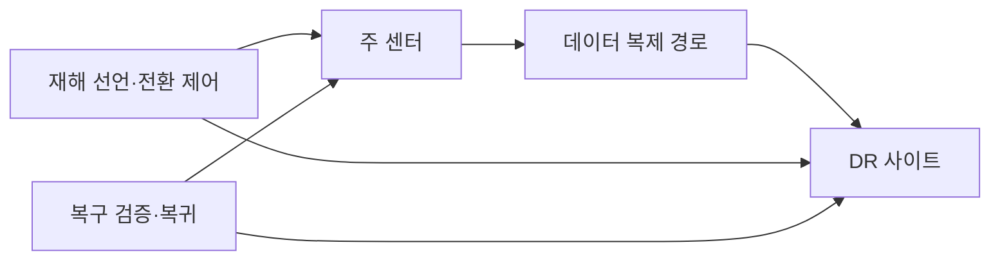
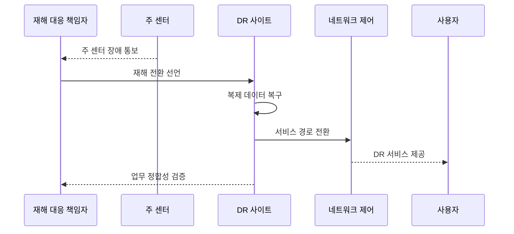

---
sidebar:
  order: 19
  label: "019. 장애 복구 전략 - 핫·웜·콜드 사이트 (Disaster Recovery Site)"
  badge:
    text: "미출제 · 30%"
    variant: note
title: "장애 복구 전략 - 핫·웜·콜드 사이트 (Disaster Recovery Site)"
date: "2026-07-25T22:20:00+09:00"
tags:
  - "notes-evaluation"
weight: 19
extra:
  question_no: "019"
  source_status: "미출제"
  source_history: ""
  priority: 30
  priority_note: "핫·웜·콜드 복구 비용을 비교하는 설계 주제"
---

## 미리 알고가기

- **DR(Disaster Recovery)**: 재해로 중단된 정보시스템과 데이터를 대체 환경에서 복구하는 활동
- **주 센터(Primary Site)**: 평상시 업무 서비스를 운영하는 데이터센터
- **DR 사이트(Disaster Recovery Site)**: 주 센터 재해 때 서비스를 이어받도록 준비한 대체 센터
- **RTO(Recovery Time Objective)**: 업무 중단 뒤 서비스를 재개해야 하는 목표 시간
- **RPO(Recovery Point Objective)**: 복구 시점에서 허용할 수 있는 최대 데이터 손실 시간
- **BIA(Business Impact Analysis)**: 업무 중단의 재무·운영·법적 영향을 분석해 복구 우선순위를 정하는 활동
- **동기 복제(Synchronous Replication)**: 원본과 복제본 저장 완료를 함께 확인한 뒤 처리를 끝내는 복제 방식
- **비동기 복제(Asynchronous Replication)**: 원본 저장을 먼저 끝내고 복제본에 나중에 전달하는 복제 방식
- **핫 사이트(Hot Site)**: 인프라와 데이터를 상시 준비해 짧은 시간에 전환할 수 있는 DR 사이트
- **웜 사이트(Warm Site)**: 일부 인프라와 데이터를 준비하고 사고 뒤 추가 기동·복원이 필요한 DR 사이트
- **콜드 사이트(Cold Site)**: 공간과 기본 설비만 준비하고 사고 뒤 장비·시스템·데이터를 구축하는 DR 사이트
- **재해 선언(Disaster Declaration)**: 정상 복구가 어렵다고 판단해 DR 전환 권한과 절차를 공식 가동하는 결정
- **장애 승계(Failover)**: 주 센터 장애 때 DR 사이트로 서비스를 전환하는 처리
- **장애 복귀(Failback)**: 복구된 주 센터로 서비스를 다시 안전하게 이전하는 처리

## Ⅰ. 개요

- 정의/개념: 센터 재해 때 업무를 재개할 대체 환경
- 기존 한계: 운영센터 내부의 이중화만으로는 지역 단위 재해로 인한 동시 장애에 대응하거나 업무별 복구 시간·시점 목표를 충족하기 어렵다.

### 쉽게 이해하기 (학습용)

- 주 데이터센터 전체가 멈춰도 업무를 다시 시작하도록 멀리 떨어진 곳에 데이터와 장비를 준비하되 필요한 복구 속도에 따라 준비 수준을 달리한다.

## Ⅱ. 특징

- 주 센터와 다른 전원·망·재난 구역에 배치한다.
- 준비 수준이 높을수록 복구는 빠르고 비용은 증가한다.
- 복제 방식이 RPO와 전환 가능성을 좌우한다.
- 정기 훈련으로 복구 시간과 데이터 정합성을 실측한다.

### 쉽게 이해하기 (학습용)

- 예비 센터가 가까워 복제가 쉬워도 같은 재해에 함께 멈추면 소용없으므로 거리·통신 지연·공통 재난 위험을 함께 따져야 한다.

## Ⅲ. 아키텍처 및 구성요소

| 설계 요소 | 설명 |
|:---|:---|
| 주 센터 | 평상시 서비스와 원본 데이터 운영 |
| 데이터 복제 경로 | 동기·비동기 방식으로 상태 전달 |
| DR 사이트 | 유형별 대체 인프라와 복제본 제공 |
| 재해 선언·전환 제어 | 권한·순서·네트워크 승계 관리 |
| 복구 검증·복귀 | 업무 정합성 확인과 주 센터 복귀 |

### 쉽게 이해하기 (학습용)

- 주 센터의 데이터를 대체 센터로 보내고 재해 선언 체계가 전환을 지휘하며 복구 뒤에는 서비스와 데이터를 검증해 원래 센터로 돌린다.

## Ⅳ. 원리 및 절차 흐름도

| 절차 | 설명 |
|:---|:---|
| 주 센터 장애 통보 | 영향·예상 복구 시간 확인 |
| 재해 전환 선언 | 권한자가 DR 절차를 공식 가동 |
| 복제 데이터 복구 | RPO 시점의 일관된 상태 확보 |
| 서비스 경로 전환 | 주소·라우팅·접속 경로 변경 |
| DR 서비스 제공 | 우선 업무부터 대체 환경 가동 |
| 업무 정합성 검증 | 기능·데이터·처리 결과 확인 |

> 요약: 재해를 선언해 복제 상태로 서비스 경로를 전환한다.

### 쉽게 이해하기 (학습용)

- 책임자가 장기 중단을 확인해 DR 전환을 선언하면 대체 센터가 일관된 데이터 상태를 복구하고 사용자 접속 경로를 넘겨 업무를 재개한다.

## Ⅴ. 종류 및 비교

| 비교축 | 핫 사이트 | 웜 사이트 | 콜드 사이트 |
|:---|:---|:---|:---|
| 핵심 특징 | 인프라·데이터 상시 준비 | 일부 자원 준비 후 추가 기동 | 공간 중심으로 사고 뒤 구축 |
| 적용 기준 | 짧은 RTO·RPO의 핵심 업무 | 수시간 복구 허용 업무 | 수일 복구 가능한 저우선 업무 |
| 주요 위험 | 높은 비용·동시 장애 | 복원 절차·용량 부족 | 장비 조달·복구 시간 불확실 |

### 쉽게 이해하기 (학습용)

- 핫은 거의 즉시 전환하고 웜은 준비된 장비를 더 기동하며 콜드는 사고 뒤 장비와 데이터를 처음부터 복원하므로 속도와 비용이 반대로 움직인다.

## Ⅵ. 실무 사례

- **사례 1**: 금융 핵심 거래에 핫 사이트 적용

### 쉽게 이해하기 (학습용)

- 사례 1은 거래 중단과 데이터 손실 허용치가 작아 상시 인프라와 최신 복제본으로 빠르게 승계한다.

## Ⅶ. 결론

- 업무별 RTO·RPO에 맞춰 핫·웜·콜드 사이트를 선택한다.

### 쉽게 이해하기 (학습용)

- 모든 업무에 비싼 핫 사이트를 두지 않고 중단과 데이터 손실의 실제 피해를 기준으로 필요한 준비 수준과 비용을 결정한다.
