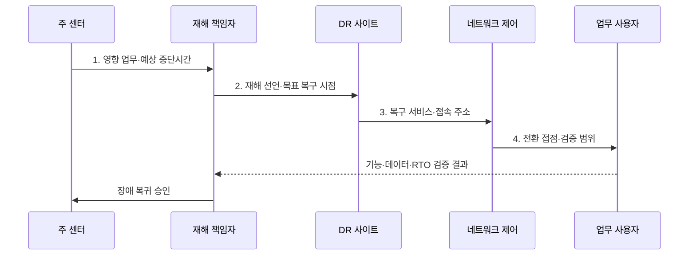

---
sidebar:
  order: 19
  label: "019. 장애 복구 전략 - 핫·웜·콜드 사이트 (Disaster Recovery Site)"
  badge:
    text: "미출 · 30%"
    variant: note
title: "장애 복구 전략 - 핫·웜·콜드 사이트 (Disaster Recovery Site)"
date: "2026-07-31T11:34:08+09:00"
tags:
  - "notes-evaluation"
weight: 19
extra:
  question_no: "019"
  source_status: "미출"
  source_history: ""
  priority: 30
  priority_note: "핫·웜·콜드 복구 비용을 비교하는 설계 주제"
---

## 미리 알고가기

- **DR(Disaster Recovery)**: 재해로 중단된 정보시스템과 데이터를 대체 환경에서 복구하는 활동
- **주 센터(Primary Site)**: 평상시 업무 서비스를 운영하는 데이터센터
- **DR 사이트(Disaster Recovery Site)**: 주 센터 재해 때 서비스를 이어받도록 준비한 대체 센터
- **RTO(Recovery Time Objective)**: 업무 중단 뒤 서비스를 재개해야 하는 목표 시간
- **RPO(Recovery Point Objective)**: 복구 시점에서 허용할 수 있는 최대 데이터 손실 시간
- **BIA(Business Impact Analysis)**: 업무 중단의 재무·운영·법적 영향을 분석해 복구 우선순위를 정하는 활동
- **동기 복제(Synchronous Replication)**: 원본과 복제본 저장 완료를 함께 확인한 뒤 처리를 끝내는 복제 방식
- **비동기 복제(Asynchronous Replication)**: 원본 저장을 먼저 끝내고 복제본에 나중에 전달하는 복제 방식
- **핫 사이트(Hot Site)**: 인프라와 데이터를 상시 준비해 짧은 시간에 전환할 수 있는 DR 사이트
- **웜 사이트(Warm Site)**: 일부 인프라와 데이터를 준비하고 사고 뒤 추가 기동·복원이 필요한 DR 사이트
- **콜드 사이트(Cold Site)**: 공간과 기본 설비만 준비하고 사고 뒤 장비·시스템·데이터를 구축하는 DR 사이트
- **재해 선언(Disaster Declaration)**: 정상 복구가 어렵다고 판단해 DR 전환 권한과 절차를 공식 가동하는 결정
- **장애 승계(Failover)**: 주 센터 장애 때 DR 사이트로 서비스를 전환하는 처리
- **장애 복귀(Failback)**: 복구된 주 센터로 서비스를 다시 안전하게 이전하는 처리
- **ISO 22301:2019/Amd 1:2024**: 업무연속성관리시스템 요구사항과 기후변화 고려를 규정한다.
- **ISO 22313:2020**: ISO 22301 적용 지침이며 2026년 개정 결정된 국제표준이다.

## Ⅰ. 개요

- 정의/개념: 센터 재해 시 업무를 재개하는 **독립 대체 환경**
- 배경/필요성: 단일 센터의 이중화만으로는 **지역 재해 시 업무 재개 불가**

### 쉽게 이해하기 (학습용)

- 주 데이터센터 전체가 멈춰도 업무를 다시 시작하도록 멀리 떨어진 곳에 데이터와 장비를 준비하되 필요한 복구 속도에 따라 준비 수준을 달리한다.

## Ⅱ. 특징

- 장애 도메인 분리의 **지역 재해 독립성**
- 준비 수준이 높을수록 **RTO·RPO 단축**, **비용 증가**
- 전환·복귀 훈련의 **실측 복구 검증**

### 쉽게 이해하기 (학습용)

- 예비 센터가 가까워 복제가 쉬워도 같은 재해에 함께 멈추면 소용없으므로 거리·통신 지연·공통 재난 위험을 함께 따져야 한다.

## Ⅲ. 구조 및 구성요소

| 구성요소 | 책임 |
|:---|:---|
| 주 센터·업무 의존성 | **평상 서비스·우선 업무** 제공 |
| 복제·백업·네트워크 | **동기·비동기 복제·분리 경로** |
| DR 사이트·대체 용량 | **핫·웜·콜드 자원·N-1** 확보 |
| 재해 선언·전환 통제 | **권한·순서·접속 승계** |
| 복구 검증·복귀 | **업무 정합성·주 센터 복귀** 확인 |

### 쉽게 이해하기 (학습용)

- 주 센터의 데이터를 대체 센터로 보내고 재해 선언 체계가 전환을 지휘하며 복구 뒤에는 서비스와 데이터를 검증해 원래 센터로 돌린다.

## Ⅳ. 흐름도

1. **영향 업무·예상 중단시간**: 재해 선언의 범위·우선순위 근거
2. **재해 선언·목표 복구 시점**: 일관된 복제본·백업 선택 기준
3. **복구 서비스·접속 주소**: 기동된 우선 업무와 신규 경로
4. **전환 접점·검증 범위**: 사용자 시험 대상과 RTO 조건

### 쉽게 이해하기 (학습용)

- 책임자가 장기 중단을 확인해 DR 전환을 선언하면 대체 센터가 일관된 데이터 상태를 복구하고 사용자 접속 경로를 넘겨 업무를 재개한다.

## Ⅴ. 종류 및 비교

| DR 사이트 | 핫 사이트 | 웜 사이트 | 콜드 사이트 |
|:---|:---|:---|:---|
| 적용 기준 | 짧은 **RTO·RPO 핵심 업무** | **수시간 복구 허용 업무** | **수일 복구 가능한 저우선 업무** |
| 핵심 특징 | **인프라·데이터 상시 준비** | 일부 자원 뒤 **추가 기동** | 공간 중심의 **사후 구축** |
| 한계 | **높은 비용·동시 장애** | **복원 절차·용량 부족** | **조달·복구시간 불확실** |

### 쉽게 이해하기 (학습용)

- 핫은 거의 즉시 전환하고 웜은 준비된 장비를 더 기동하며 콜드는 사고 뒤 장비와 데이터를 처음부터 복원하므로 속도와 비용이 반대로 움직인다.

## Ⅵ. 실무 고려사항 및 대책

| 고려사항 | 대책 | 효과 |
|:---|:---|:---|
| 지역·기후 재해 누락으로 **양 센터 동시 중단** | **ISO 22301:2019/Amd 1:2024 적용** | **BIA·기후 위험** 정렬 |
| 구현 절차 차이로 **복구 결과 변동** | **ISO 22313:2020 적용·개정 추적** | **절차 적용 편차** 감소 |
| 문서만으로 **실제 복구시간 확인 불가** | **전환·복귀 통합훈련** | **RTO·RPO 실측** 검증 |

### 쉽게 이해하기 (학습용)

- 사례 1은 거래 중단과 데이터 손실 허용치가 작아 상시 인프라와 최신 복제본으로 빠르게 승계한다.

## Ⅶ. 결론

- 분 단위 핵심 업무는 **핫**, 시간 단위는 웜, 수일 허용은 콜드 선택

### 쉽게 이해하기 (학습용)

- 모든 업무에 비싼 핫 사이트를 두지 않고 중단과 데이터 손실의 실제 피해를 기준으로 필요한 준비 수준과 비용을 결정한다.
