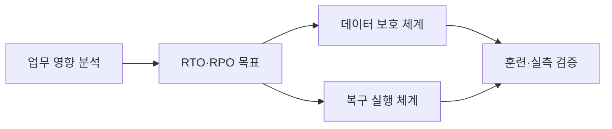
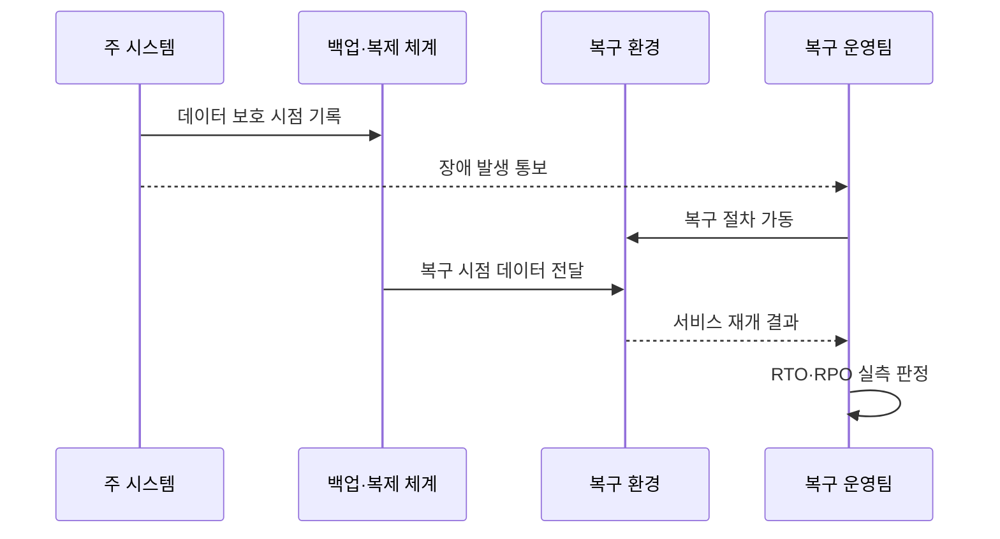

---
sidebar:
  order: 20
  label: "020. RTO·RPO 정의·측정 (RTO RPO)"
  badge:
    text: "미출제 · 50%"
    variant: note
title: "RTO·RPO 정의·측정 (RTO RPO)"
date: "2026-07-25T22:21:00+09:00"
tags:
  - "notes-evaluation"
weight: 20
extra:
  question_no: "020"
  source_status: "미출제"
  source_history: ""
  priority: 50
  priority_note: "복구시간·데이터 손실 허용치를 가르는 핵심축"
---

## 미리 알고가기

- **RTO(Recovery Time Objective)**: 업무 중단 뒤 서비스를 재개해야 하는 목표 시간
- **RPO(Recovery Point Objective)**: 복구 시점에서 허용할 수 있는 최대 데이터 손실 시간
- **BIA(Business Impact Analysis)**: 업무 중단의 재무·운영·법적 영향을 분석해 복구 우선순위를 정하는 활동
- **복구 시점(Recovery Point)**: 백업이나 복제본으로 데이터를 되돌리는 기준 시각
- **다운타임(Downtime)**: 서비스가 정상 업무를 제공하지 못한 중단 시간
- **동기 복제(Synchronous Replication)**: 원본과 복제본 저장 완료를 함께 확인한 뒤 처리를 끝내는 복제 방식
- **비동기 복제(Asynchronous Replication)**: 원본 저장을 먼저 끝내고 복제본에 나중에 전달하는 복제 방식
- **스냅샷(Snapshot)**: 특정 시점의 데이터 상태를 빠르게 복원하도록 저장한 복사본
- **백업(Backup)**: 손실·손상에 대비해 원본과 분리해 보관한 데이터 복사본
- **장애 승계(Failover)**: 주 자원 장애 때 대기 자원이나 복구 환경으로 서비스를 전환하는 처리
- **복구 소요 시간(Actual Recovery Time)**: 장애 발생부터 업무 재개까지 실제 측정된 시간
- **실제 데이터 손실(Actual Data Loss)**: 장애 시점과 복구 시점 사이에서 복구하지 못한 데이터의 시간 범위

## Ⅰ. 개요

- **정의/개념**: RTO는 중단 시간, RPO는 데이터 손실 시간
- **배경/필요성**: 업무 영향에 맞는 복구 기술과 투자 결정

### 쉽게 이해하기 (학습용)

- RTO는 언제까지 서비스를 다시 열 것인지이고 RPO는 장애 직전 데이터 중 몇 분이나 몇 시간까지 잃을 수 있는지를 정한다.

## Ⅱ. 특징

- RTO는 장애 이후의 복구 완료 시간을 제한한다.
- RPO는 장애 이전의 복구 데이터 시점을 제한한다.
- 목표가 짧을수록 자동화·복제·비용 요구가 증가한다.
- 선언 지연과 수동 절차도 RTO 측정에 포함한다.
- 훈련으로 실제 시간과 손실량을 각각 검증한다.

### 쉽게 이해하기 (학습용)

- 빠른 서버만 준비해도 재해 선언이 늦으면 RTO를 넘고 최신 백업이 없으면 서비스가 빨리 켜져도 RPO를 넘는다.

## Ⅲ. 아키텍처 및 구성요소

| 설계 요소 | 설명 |
|:---|:---|
| 업무 영향 분석 | 중단·손실의 업무 한도 산정 |
| RTO·RPO 목표 | 서비스별 시간 목표 승인 |
| 데이터 보호 체계 | 복제·스냅샷·백업으로 RPO 구현 |
| 복구 실행 체계 | 승계·기동·검증으로 RTO 구현 |
| 훈련·실측 검증 | 실제 복구 시간과 손실량 확인 |

### 쉽게 이해하기 (학습용)

- 업무가 견딜 수 있는 중단과 손실을 먼저 정하고 데이터 보호 수단과 복구 절차를 각각 연결한 뒤 실제 장애 훈련으로 두 목표를 확인한다.

## Ⅳ. 원리 및 절차 흐름도

| 절차 | 설명 |
|:---|:---|
| 데이터 보호 시점 기록 | 마지막 정상 복제·백업 시각 저장 |
| 장애 발생 통보 | 서비스 중단 시각 확정 |
| 복구 절차 가동 | 선언·승계·기동 작업 시작 |
| 복구 시점 데이터 전달 | 일관된 복제본·백업 선택 |
| 서비스 재개 결과 | 업무 기능과 데이터 정합성 확인 |
| RTO·RPO 실측 판정 | 중단 시간과 손실 시간을 비교 |

> 요약: 장애 뒤 복구 시간과 장애 전 손실 시간을 따로 잰다.

### 쉽게 이해하기 (학습용)

- 장애 시각부터 서비스 재개까지가 실제 RTO 성과이고 장애 시각과 되살린 마지막 데이터 시각의 차이가 실제 RPO 성과다.

## Ⅴ. 종류 및 비교

| 비교축 | RTO | RPO |
|:---|:---|:---|
| 핵심 특징 | 서비스 재개 시간의 목표 | 데이터 복구 시점의 목표 |
| 적용 기준 | 업무 중단 허용 한도 | 데이터 재처리·손실 허용 한도 |
| 주요 위험 | 선언·기동·검증 지연 | 복제 지연·백업 누락 |

### 쉽게 이해하기 (학습용)

- RTO는 장애 뒤 미래 방향으로 서비스가 열릴 때까지를 재고 RPO는 장애 전 과거 방향으로 데이터가 얼마나 되돌아가는지를 잰다.

## Ⅵ. 실무 사례

- **사례 1**: 실시간 거래에 짧은 RTO·RPO 설정
- **사례 2**: 일일 배치 업무에 긴 RTO·RPO 설정
- **사례 3**: 재해 선언 시간을 RTO 실측에 포함
- **사례 4**: 복구 데이터의 누락 거래를 RPO로 검증

### 쉽게 이해하기 (학습용)

- 사례 1은 중단과 거래 손실 피해가 커서 자동 승계와 동기 또는 짧은 지연 복제를 적용한다.
- 사례 2는 재처리가 가능하고 하루 중단을 견딜 수 있어 저비용 백업과 수동 복구를 선택한다.
- 사례 3은 시스템 기동이 빨라도 승인자가 늦게 전환하면 업무 재개 목표를 놓친다는 사실을 반영한다.
- 사례 4는 백업 성공 표시만 보지 않고 장애 직전 거래가 어느 시점까지 실제 복구됐는지 확인한다.

## Ⅶ. 결론

- 중단·손실 영향에 따라 RTO·RPO와 복구 수단을 결정한다.

### 쉽게 이해하기 (학습용)

- RTO와 RPO는 희망 숫자가 아니라 업무가 견딜 수 있는 손실 한도를 기술·절차·훈련 결과와 연결하는 복구 계약이다.
