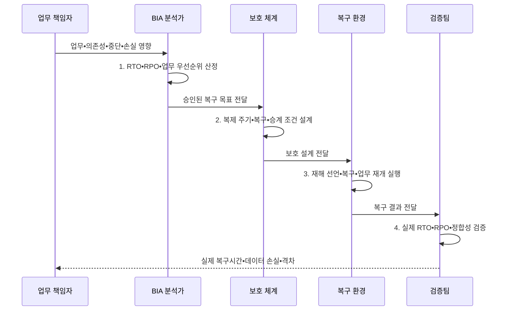

---
sidebar:
  order: 20
  label: "020. RTO•RPO 정의•측정 (RTO RPO)"
  badge:
    text: "미출 • 50%"
    variant: note
title: "RTO•RPO 정의•측정 (RTO RPO)"
date: "2026-08-05T00:00:00+09:00"
tags:
  - "notes-evaluation"
weight: 20
extra:
  question_no: "020"
  source_status: "미출"
  source_history: ""
  priority: 50
  priority_note: "복구시간•데이터 손실 허용치를 가르는 핵심축"
---

## Ⅰ. 개요

핵심 용어

- **RTO(Recovery Time Objective)**: 업무를 재개해야 하는 최대 허용 시간이다.
- **RPO(Recovery Point Objective)**: 허용 가능한 데이터 손실의 기준 시점이다.
- **BIA(Business Impact Analysis)**: 업무 중단 영향을 분석해 복구 순위를 정하는 활동이다.

- 정의/개념: **RTO•RPO** — 업무연속성에서 각각 허용할 최대 서비스 중단시간과 시간으로 표현한 최대 데이터 손실 범위를 정하는 복구 목표
- 배경/필요성: 일률적 복구 목표로는 **업무별 과소 보호•과잉 투자 방지 불가**

#### 한줄 요약

- RTO는 언제까지 서비스를 다시 열 것인지이고 RPO는 장애 직전 데이터 중 몇 분이나 몇 시간까지 잃을 수 있는지를 정한다.

## Ⅱ. 특징

핵심 용어

- **다운타임**: 서비스가 정상 업무를 제공하지 못한 중단 시간이다.
- **복구 시점**: 백업•스냅숏•복제본으로 데이터를 되돌리는 기준 시각이다.
- **비용-목표 상충**: 더 짧은 RTO•RPO를 달성할수록 대기 자원•복제•자동화 비용이 커지는 관계이다.
- **목표•실측 검증**: 업무 영향으로 정한 복구 목표를 실제 훈련의 서비스 재개시간과 데이터 손실 범위로 확인하는 과정이다.

- 장애 이후 서비스 재개의 **RTO 시간축**
- 장애 이전 데이터 손실의 **RPO 시간축**
- BIA•훈련 기반 **목표•실측•비용 검증**

#### 한줄 요약

- 빠른 서버만 준비해도 재해 선언이 늦으면 RTO를 넘고 최신 백업이 없으면 서비스가 빨리 켜져도 RPO를 넘는다.

## Ⅲ. 구조 및 구성요소

핵심 용어

- **동기 복제**: 원본과 복제본의 저장 완료를 함께 확인하여 RPO를 줄이는 복제 방식이다.
- **비동기 복제**: 원본 저장을 먼저 완료하고 복제본에 나중에 전달하여 지연을 줄이는 방식이다.
- **스냅숏•백업**: 특정 시점 상태를 빠르게 복원하거나 원본과 분리된 복사본으로 장기 복구하는 보호 수단이다.

| 구성요소 | 책임 |
|:---|:---|
| BIA•업무 우선순위 | **중단•손실•의존성 영향** 분석 |
| RTO•RPO 목표 | 업무별 **승인 시간 한도** 설정 |
| 복제•백업•복구 시점 | **RPO 구현•데이터 일관성** 보장 |
| 선언•승계•업무 재개 | **RTO 구현•기능 검증** |
| 훈련•실측•개선 | **실제 시간•손실•격차** 측정 |

#### 한줄 요약

- 업무가 견딜 수 있는 중단과 손실을 먼저 정하고 데이터 보호 수단과 복구 절차를 각각 연결한 뒤 실제 장애 훈련으로 두 목표를 확인한다.

## Ⅳ. 흐름도

핵심 용어

- **장애 승계**: 주 자원 장애 때 대기 자원이나 복구 환경으로 서비스를 전환하는 처리이다.
- **복구 검증**: 서비스 기능•성능•데이터 정합성을 확인하여 업무 재개 시점을 확정하는 절차이다.

**동작 원리**

1. **RTO•RPO•업무 우선순위 산정**: 피해와 비용에 따른 시간 한도 결정
2. **복제 주기•복구•승계 조건 설계**: 목표를 구현할 보호 체계 구성
3. **재해 선언•복구•업무 재개 실행**: 훈련에서 복구 결과 생성
4. **실제 RTO•RPO•정합성 검증**: 복구시간•손실구간•기능 확인

#### 한줄 요약

- 장애 시각부터 서비스 재개까지가 실제 RTO 성과이고 장애 시각과 되살린 마지막 데이터 시각의 차이가 실제 RPO 성과다.

## Ⅴ. 종류 및 비교

핵심 용어

- **RTO 적용**: 업무 중단 허용 한도를 서비스 재개시간으로 정한다.
- **RPO 적용**: 데이터 손실 허용 한도를 복구 시점으로 정한다.

| 복구 목표 | RTO | RPO |
|:---|:---|:---|
| 적용 기준 | **업무 중단 허용 한도** | **데이터 재처리•손실 허용 한도** |
| 핵심 특징 | **서비스 재개 시간** 목표 | **데이터 복구 시점** 목표 |
| 한계 | **선언•기동•검증 지연** | **복제 지연•백업 누락** |

#### 한줄 요약

- RTO는 장애 뒤 미래 방향으로 서비스가 열릴 때까지를 재고 RPO는 장애 전 과거 방향으로 데이터가 얼마나 되돌아가는지를 잰다.

## Ⅵ. 실무 고려사항 및 대책

핵심 용어

- **실제 복구 소요 시간**: 장애 발생부터 업무 검증을 마치고 서비스를 재개할 때까지 실측한 시간이다.
- **실제 데이터 손실**: 장애 시점과 최종 복구 시점 사이에서 되살리지 못한 데이터의 시간 범위이다.
- **복구 훈련**: 백업•복제본으로 실제 복원하여 RTO•RPO 달성 여부를 측정하는 시험이다.
- **ISO(International Organization for Standardization)**: 국제표준화기구이다.

| 문제 | 대책 | 효과 |
|:---|:---|:---|
| BIA 없이 정한 **복구 목표의 업무 근거 부족** | **ISO 22301:2019/Amd 1:2024 BIA 적용** | **목표의 업무 근거** 확보 |
| 보호•복구 절차 분리로 **RTO•RPO 목표 충돌** | **ISO 22313:2020 적용•개정 추적** | **보호•복구 수단** 정렬 |
| 문서 목표만으로 **실제 달성 여부 확인 불가** | **전환훈련•실측값 관리** | **복구 격차** 지속 개선 |

#### 한줄 요약

- 사례 1은 중단과 거래 손실 피해가 커서 자동 승계와 동기 또는 짧은 지연 복제를 적용한다.

## Ⅶ. 결론

핵심 용어

- **목표 차등화**: BIA의 업무 영향과 데이터 재처리 가능성에 따라 서비스별 RTO•RPO를 다르게 정하는 원칙이다.
- **ISO 22313**: 업무연속성 전략•복구 우선순위 적용 지침이다.
- **목표 단축 결정**: 중단비용이 크면 복구 목표 시간을, 데이터 손실비용이 크면 복구 목표 시점을 더 짧게 정하는 판단이다.

- 중단비용이 크면 **RTO 단축**, 데이터 손실비용이 크면 **RPO 단축**

#### 한줄 요약

- RTO와 RPO는 희망 숫자가 아니라 업무가 견딜 수 있는 손실 한도를 기술•절차•훈련 결과와 연결하는 복구 계약이다.
