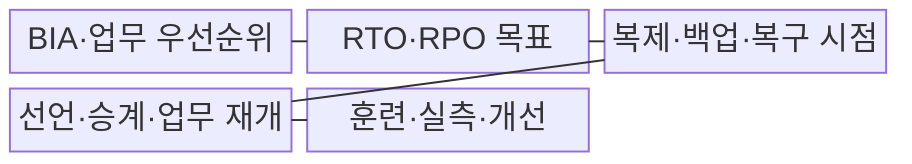
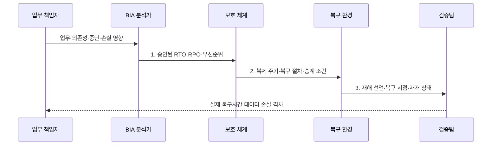

---
sidebar:
  order: 20
  label: "020. RTO·RPO 정의·측정 (RTO RPO)"
  badge:
    text: "미출 · 50%"
    variant: note
title: "RTO·RPO 정의·측정 (RTO RPO)"
date: "2026-07-31T11:34:34+09:00"
tags:
  - "notes-evaluation"
weight: 20
extra:
  question_no: "020"
  source_status: "미출"
  source_history: ""
  priority: 50
  priority_note: "복구시간·데이터 손실 허용치를 가르는 핵심축"
---

## 미리 알고가기

- **RTO(Recovery Time Objective)**: 업무 중단 뒤 서비스를 재개해야 하는 목표 시간
- **RPO(Recovery Point Objective)**: 복구 시점에서 허용할 수 있는 최대 데이터 손실 시간
- **BIA(Business Impact Analysis)**: 업무 중단의 재무·운영·법적 영향을 분석해 복구 우선순위를 정하는 활동
- **복구 시점(Recovery Point)**: 백업이나 복제본으로 데이터를 되돌리는 기준 시각
- **다운타임(Downtime)**: 서비스가 정상 업무를 제공하지 못한 중단 시간
- **동기 복제(Synchronous Replication)**: 원본과 복제본 저장 완료를 함께 확인한 뒤 처리를 끝내는 복제 방식
- **비동기 복제(Asynchronous Replication)**: 원본 저장을 먼저 끝내고 복제본에 나중에 전달하는 복제 방식
- **스냅샷(Snapshot)**: 특정 시점의 데이터 상태를 빠르게 복원하도록 저장한 복사본
- **백업(Backup)**: 손실·손상에 대비해 원본과 분리해 보관한 데이터 복사본
- **장애 승계(Failover)**: 주 자원 장애 때 대기 자원이나 복구 환경으로 서비스를 전환하는 처리
- **복구 소요 시간(Actual Recovery Time)**: 장애 발생부터 업무 재개까지 실제 측정된 시간
- **실제 데이터 손실(Actual Data Loss)**: 장애 시점과 복구 시점 사이에서 복구하지 못한 데이터의 시간 범위
- **ISO 22301:2019/Amd 1:2024**: BIA·업무연속성 요구사항과 기후변화 고려를 규정한다.
- **ISO 22313:2020**: 복구 우선순위·연속성 전략 지침이며 2026년 개정 결정됐다.

## Ⅰ. 개요

- 정의/개념: 업무연속성에서 정한 **서비스 중단시간·데이터 손실시간 목표**
- 배경/필요성: 일률적 복구 목표로는 **업무별 과소 보호·과잉 투자 방지 불가**

### 쉽게 이해하기 (학습용)

- RTO는 언제까지 서비스를 다시 열 것인지이고 RPO는 장애 직전 데이터 중 몇 분이나 몇 시간까지 잃을 수 있는지를 정한다.

## Ⅱ. 특징

- 장애 이후 서비스 재개의 **RTO 시간축**
- 장애 이전 데이터 손실의 **RPO 시간축**
- BIA·훈련 기반 **목표·실측·비용 검증**

### 쉽게 이해하기 (학습용)

- 빠른 서버만 준비해도 재해 선언이 늦으면 RTO를 넘고 최신 백업이 없으면 서비스가 빨리 켜져도 RPO를 넘는다.

## Ⅲ. 구조 및 구성요소

| 구성요소 | 책임 |
|:---|:---|
| BIA·업무 우선순위 | **중단·손실·의존성 영향** 분석 |
| RTO·RPO 목표 | 업무별 **승인 시간 한도** 설정 |
| 복제·백업·복구 시점 | **RPO 구현·데이터 일관성** 보장 |
| 선언·승계·업무 재개 | **RTO 구현·기능 검증** |
| 훈련·실측·개선 | **실제 시간·손실·격차** 측정 |

### 쉽게 이해하기 (학습용)

- 업무가 견딜 수 있는 중단과 손실을 먼저 정하고 데이터 보호 수단과 복구 절차를 각각 연결한 뒤 실제 장애 훈련으로 두 목표를 확인한다.

## Ⅳ. 흐름도

1. **승인된 RTO·RPO·우선순위**: 피해와 비용에 따른 시간 한도
2. **복제 주기·복구 절차·승계 조건**: 목표를 구현할 보호 설계
3. **재해 선언·복구 시점·재개 상태**: 훈련에서 생성된 복구 결과

### 쉽게 이해하기 (학습용)

- 장애 시각부터 서비스 재개까지가 실제 RTO 성과이고 장애 시각과 되살린 마지막 데이터 시각의 차이가 실제 RPO 성과다.

## Ⅴ. 종류 및 비교

| 복구 목표 | RTO | RPO |
|:---|:---|:---|
| 적용 기준 | **업무 중단 허용 한도** | **데이터 재처리·손실 허용 한도** |
| 핵심 특징 | **서비스 재개 시간** 목표 | **데이터 복구 시점** 목표 |
| 한계 | **선언·기동·검증 지연** | **복제 지연·백업 누락** |

### 쉽게 이해하기 (학습용)

- RTO는 장애 뒤 미래 방향으로 서비스가 열릴 때까지를 재고 RPO는 장애 전 과거 방향으로 데이터가 얼마나 되돌아가는지를 잰다.

## Ⅵ. 실무 고려사항 및 대책

| 고려사항 | 대책 | 효과 |
|:---|:---|:---|
| BIA 없이 정한 **복구 목표의 업무 근거 부족** | **ISO 22301:2019/Amd 1:2024 BIA 적용** | **목표의 업무 근거** 확보 |
| 보호·복구 절차 분리로 **RTO·RPO 목표 충돌** | **ISO 22313:2020 적용·개정 추적** | **보호·복구 수단** 정렬 |
| 문서 목표만으로 **실제 달성 여부 확인 불가** | **전환훈련·실측값 관리** | **복구 격차** 지속 개선 |

### 쉽게 이해하기 (학습용)

- 사례 1은 중단과 거래 손실 피해가 커서 자동 승계와 동기 또는 짧은 지연 복제를 적용한다.

## Ⅶ. 결론

- 중단비용이 크면 **RTO 단축**, 데이터 손실비용이 크면 **RPO 단축**

### 쉽게 이해하기 (학습용)

- RTO와 RPO는 희망 숫자가 아니라 업무가 견딜 수 있는 손실 한도를 기술·절차·훈련 결과와 연결하는 복구 계약이다.
