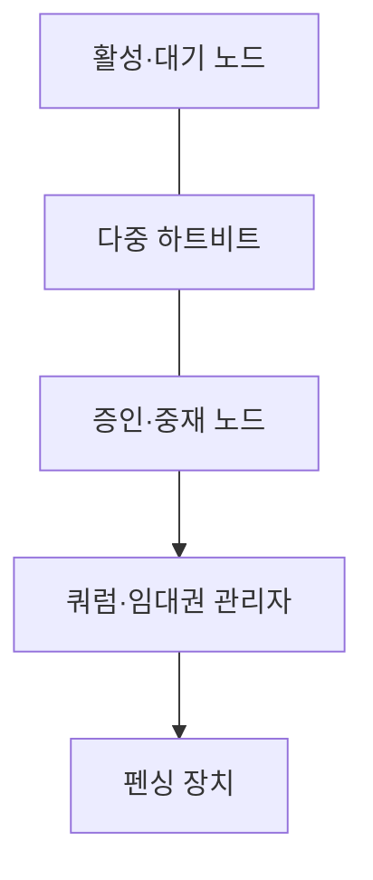
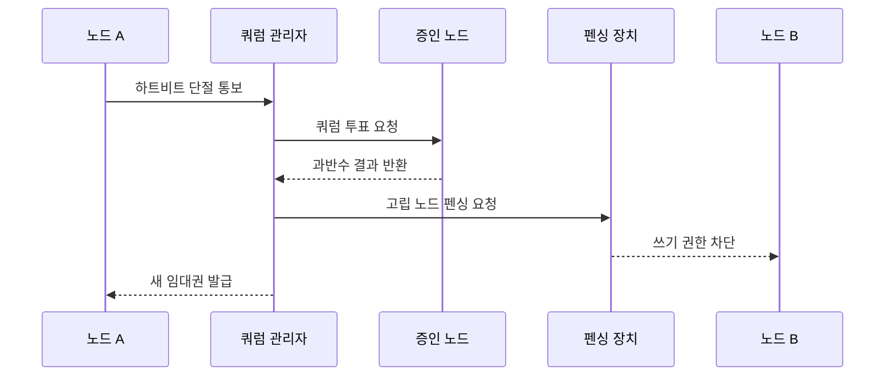

---
sidebar:
  order: 21
  label: "021. Split Brain·쿼럼 (Split Brain Quorum)"
  badge:
    text: "기출 · 30%"
    variant: note
title: "Split Brain·쿼럼 (Split Brain Quorum)"
date: "2026-07-27T23:59:59+09:00"
tags:
  - "notes-evaluation"
weight: 21
extra:
  question_no: "021"
  source_status: "기출"
  source_history: "126회"
  priority: 30
  priority_note: "분할 상황의 과반수 판정을 묻는 합의 기본"
---

## 미리 알고가기

- **스플릿 브레인(Split Brain)**: 스플릿 브레인으로 읽으며, 네트워크 분리 뒤 여러 노드가 자신을 활성 주체로 판단해 동시에 쓰는 장애 상태
- **쿼럼(Quorum)**: 클러스터가 결정·쓰기 권한을 유지하는 데 필요한 최소 투표 수
- **네트워크 분할(Network Partition)**: 노드는 동작하지만 통신 경로가 끊겨 서로의 상태를 확인할 수 없는 장애
- **하트비트(Heartbeat)**: 노드가 생존 상태를 주기적으로 교환하는 신호
- **펜싱(Fencing)**: 고립되거나 이전 세대인 노드의 전원·스토리지·쓰기 권한을 강제로 차단하는 통제
- **증인 노드(Witness)**: 데이터 복제 없이 제3의 투표를 제공해 2노드 동률을 해소하는 구성요소
- **중재 노드(Arbiter)**: 클러스터 결정에 투표권을 제공하는 경량 노드
- **임대권(Lease)**: 정해진 시간과 세대에만 유효한 단일 쓰기 권한
- **세대 번호(Epoch)**: 이전 리더의 오래된 요청과 새 리더의 요청을 구분하는 증가 식별값
- **리더(Leader)**: 클러스터에서 쓰기나 조정 권한을 가진 단일 활성 노드
- **재동기화(Resynchronization)**: 분리됐던 노드가 다시 합류할 때 승인된 데이터 상태로 맞추는 처리
- **과반수(Majority)**: 전체 투표 수의 절반을 초과한 수
- **플랩(Flapping)**: 짧은 장애와 복구가 반복되어 역할 전환이 자주 일어나는 현상

## Ⅰ. 개요

- 정의: 네트워크 분할 뒤 발생하는 **다중 리더·쓰기**
- 기존 한계: 생존 확인만으로 **단일 쓰기 보장 불가**

### 쉽게 이해하기 (학습용)

- 서버끼리 연락이 끊겼을 때 양쪽이 모두 대장처럼 쓰지 못하도록 과반수 표를 얻은 쪽만 계속 일하고 다른 쪽은 강제로 멈춘다.

## Ⅱ. 특징

- 과반수 쿼럼 기반 **단일 리더 선출**
- 펜싱·세대 번호 기반 **이전 쓰기 차단**
- 증인 노드 기반 **2노드 동률 해소**

### 쉽게 이해하기 (학습용)

- 과반수 판정만 하고 고립 노드의 손을 묶지 않으면 그 노드가 저장소에 계속 쓸 수 있으므로 펜싱까지 성공해야 단일 쓰기가 보장된다.

## Ⅲ. 아키텍처 및 구성요소

| 설계 요소 | 설명 |
|:---|:---|
| 활성·대기 노드 | 리더 선출과 역할 전환 대상 |
| 다중 하트비트 | 독립 경로로 생존 상태 교환 |
| 증인·중재 노드 | 제3 투표로 동률 해소 |
| 쿼럼·임대권 관리자 | 과반수와 쓰기 세대 결정 |
| 펜싱 장치 | 전원·스토리지·쓰기 권한 차단 |

### 쉽게 이해하기 (학습용)

- 노드와 증인이 투표해 임대권 관리자가 단일 쓰기 주체를 정하고 펜싱 장치가 탈락한 노드의 실제 접근을 끊는다.

## Ⅳ. 원리 및 절차 흐름도

| 절차 | 설명 |
|:---|:---|
| 하트비트 단절 통보 | 상대 노드의 통신 장애 감지 |
| 쿼럼 투표 요청 | 생존 노드와 증인 표를 집계 |
| 과반수 결과 반환 | 권한 유지 가능한 파티션 결정 |
| 고립 노드 펜싱 요청 | 탈락 쪽의 접근 제거 지시 |
| 쓰기 권한 차단 | 전원·스토리지·세대 요청 거부 |
| 새 임대권 발급 | 과반수 쪽에 단일 쓰기 허용 |

> 요약: 과반수 판정 뒤 고립 노드를 막고 새 쓰기를 연다.

### 쉽게 이해하기 (학습용)

- 통신 단절 뒤 투표에서 이긴 쪽도 곧바로 쓰지 않고 진 쪽의 저장 권한이 실제 차단된 뒤에만 새 리더 권한을 받는다.

## Ⅴ. 종류 및 비교

| 클러스터 분할 대응 | 스플릿 브레인 | 쿼럼 |
|:---|:---|:---|
| 적용 기준 | 중복 쓰기·분기 데이터가 발생할 때 | 분할 상황의 운영 주체를 정할 때 |
| 핵심 특징 | 분할 뒤 여러 노드 동시 활성 | 과반수로 단일 권한 결정 |
| 한계 | 데이터 충돌·복구 곤란 | 투표 손실로 서비스 중단 |

### 쉽게 이해하기 (학습용)

- 스플릿 브레인은 양쪽이 동시에 쓰는 장애이고 쿼럼은 그 상황에서 한쪽만 권한을 갖게 하는 판정 규칙이다.

## Ⅵ. 실무 사례

1. 2노드 DB의 **제3 AZ 증인 배치**

### 쉽게 이해하기 (학습용)

- 사례 1은 두 서버가 1대1로 갈렸을 때 같은 장애 영역 밖의 증인이 어느 쪽이 과반수인지 결정하게 한다.

## Ⅶ. 결론

- 이중 쓰기 방지를 위해 분할·과반을 검토하여 **쿼럼·펜싱** 활용

### 쉽게 이해하기 (학습용)

- 스플릿 브레인 방지는 살아 있는 노드를 고르는 일이 아니라 과반수 없는 쪽을 확실히 멈춘 뒤 한쪽에만 새 쓰기 권한을 주는 일이다.
