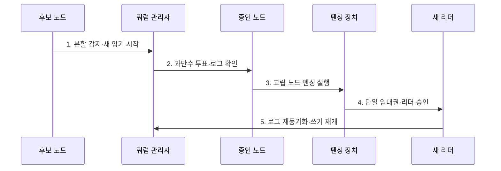

---
sidebar:
  order: 21
  label: "021. Split Brain·쿼럼 (Split Brain Quorum)"
  badge:
    text: "기출 · 30%"
    variant: note
title: "Split Brain·쿼럼 (Split Brain Quorum)"
date: "2026-08-02T12:21:00+09:00"
tags:
  - "notes-evaluation"
weight: 21
extra:
  question_no: "021"
  source_status: "기출"
  source_history: "126회"
  priority: 30
  priority_note: "분할 상황의 과반수 판정을 묻는 합의 기본"
---

## Ⅰ. 개요

핵심 용어

- **스플릿 브레인**: 네트워크 분리 뒤 복수 노드가 자신을 활성 주체로 판단하여 동일 데이터에 동시에 쓰는 일관성 장애이다.
- **네트워크 분할**: 노드는 동작하지만 통신 경로가 끊겨 서로의 상태를 확인할 수 없는 장애이다.

- 정의/개념: 네트워크 분할로 다중 리더가 생기는 **일관성 장애**
- 배경/필요성: 생존 확인만으로는 **단일 쓰기 보장 불가**

### 쉽게 이해하기 (학습용)

- 서버끼리 연락이 끊겼을 때 양쪽이 모두 대장처럼 쓰지 못하도록 과반수 표를 얻은 쪽만 계속 일하고 다른 쪽은 강제로 멈춘다.

## Ⅱ. 특징

핵심 용어

- **쿼럼**: 클러스터가 결정권과 쓰기 권한을 유지하기 위해 확보해야 하는 최소 투표 수이다.
- **과반수**: 전체 투표 수의 절반을 초과한 수로, 서로 다른 두 과반수 집합이 적어도 한 표를 공유하게 한다.
- **하트비트**: 노드가 자신의 생존 상태를 주기적으로 다른 노드에 알리는 신호이다.

- 과반수 쿼럼 기반 **단일 리더 선출**
- 펜싱·세대 번호 기반 **이전 쓰기 차단**
- 증인 노드 기반 **2노드 동률 해소**

### 쉽게 이해하기 (학습용)

- 과반수 판정만 하고 고립 노드의 손을 묶지 않으면 그 노드가 저장소에 계속 쓸 수 있으므로 펜싱까지 성공해야 단일 쓰기가 보장된다.

## Ⅲ. 구조 및 구성요소

핵심 용어

- **증인·중재 노드**: 데이터를 복제하지 않고 제3의 투표를 제공하여 2노드 동률을 해소하는 구성요소이다.
- **임대권**: 정해진 시간과 세대 동안 하나의 노드에만 유효한 쓰기 권한이다.
- **세대 번호**: 이전 리더의 오래된 요청과 새 리더의 요청을 구분하는 단조 증가 식별값이다.

| 구성요소 | 책임 |
|:---|:---|
| **복제 노드·투표권** | 리더 선출·**로그 복제 참여** |
| **다중 하트비트·분할 감지** | 독립 경로·**시간초과 판정** |
| **증인·중재 노드·쿼럼** | 동률 해소·**과반수 교차집합** 형성 |
| **임대권·임기·세대** | 단일 권한·**오래된 쓰기 거부** |
| **펜싱·재동기화** | 고립 차단·**승인 상태 복구** |

### 쉽게 이해하기 (학습용)

- 노드와 증인이 투표해 임대권 관리자가 단일 쓰기 주체를 정하고 펜싱 장치가 탈락한 노드의 실제 접근을 끊는다.

## Ⅳ. 흐름도

핵심 용어

- **펜싱**: 고립되거나 이전 세대인 노드의 전원·스토리지·쓰기 권한을 강제로 차단하는 통제이다.
- **재동기화**: 분리됐던 노드가 재합류할 때 승인된 리더의 데이터 상태로 맞추는 처리이다.

1. **분할 감지·새 임기 시작**: 통신 단절·세대 증가
2. **과반수 투표·로그 확인**: 권한 파티션·최신성 결정
3. **고립 노드 펜싱 실행**: 전원·스토리지·쓰기 차단
4. **단일 임대권·리더 승인**: 한 파티션만 쓰기 허용
5. **로그 재동기화·쓰기 재개**: 분기 방지·합류 상태 복구

### 쉽게 이해하기 (학습용)

- 통신 단절 뒤 투표에서 이긴 쪽도 곧바로 쓰지 않고 진 쪽의 저장 권한이 실제 차단된 뒤에만 새 리더 권한을 받는다.

## Ⅴ. 종류 및 비교

핵심 용어

- **Raft**: 다수결과 임기 번호를 이용하여 단일 리더와 로그 복제를 유지하는 분산 합의 알고리즘이다.
- **Paxos**: 과반수 수락자 집합의 교차 성질을 이용하여 하나의 합의값을 보장하는 알고리즘이다.

| 클러스터 분할 대응 | 스플릿 브레인 | 쿼럼 |
|:---|:---|:---|
| **적용 기준** | 중복 쓰기·**분기 데이터 발생** | 분할 상황의 **운영 주체 결정** |
| **핵심 특징** | 분할 뒤 **여러 노드 동시 활성** | 과반수로 **단일 권한 결정** |
| **한계** | **데이터 충돌·복구 곤란** | **투표 손실·서비스 중단** |

### 쉽게 이해하기 (학습용)

- 스플릿 브레인은 양쪽이 동시에 쓰는 장애이고 쿼럼은 그 상황에서 한쪽만 권한을 갖게 하는 판정 규칙이다.

## Ⅵ. 실무 고려사항 및 대책

핵심 용어

- **거짓 장애 탐지**: 지연·일시적 패킷 손실을 노드 고장으로 오판하여 불필요한 리더 전환을 일으키는 문제이다.
- **쿼럼 손실**: 살아 있는 노드가 있어도 과반수 표를 확보하지 못하여 안전한 쓰기를 중단하는 상태이다.
- **오래된 리더 쓰기**: 새 리더가 선출된 뒤 이전 리더의 지연 요청이 저장소에 반영되는 위험이다.

| 문제 | 대책 | 효과 |
|:---|:---|:---|
| **단일 리더·로그 합의** | **Raft 임기·과반수 원칙 적용** | **오래된 리더 쓰기** 차단 |
| **제안값 단일 합의** | **Paxos 과반수 교차집합 적용** | **상충 합의값 선택** 방지 |
| **2노드 동률·장애영역** | **제3 AZ 증인 배치** | 독립 **과반수 판정** |
| **쿼럼 후 이중 쓰기** | **펜싱 성공 후 임대 발급** | **데이터 분기** 방지 |

### 쉽게 이해하기 (학습용)

- 사례 1은 두 서버가 1대1로 갈렸을 때 같은 장애 영역 밖의 증인이 어느 쪽이 과반수인지 결정하게 한다.

## Ⅶ. 결론

핵심 용어

- **단일 쓰기 보장**: 네트워크 분할 중에도 한 세대의 승인된 리더만 상태를 변경하게 하는 안전성 조건이다.
- **가용성-일관성 절충**: 분할 상황에서 쓰기 중단을 택해 일관성을 지키거나 양쪽 쓰기를 허용해 가용성을 높이는 선택 관계이다.

- 과반수·최신 로그 확보 후 펜싱 성공 시만 **단일 리더 승인**

### 쉽게 이해하기 (학습용)

- 스플릿 브레인 방지는 살아 있는 노드를 고르는 일이 아니라 과반수 없는 쪽을 확실히 멈춘 뒤 한쪽에만 새 쓰기 권한을 주는 일이다.
