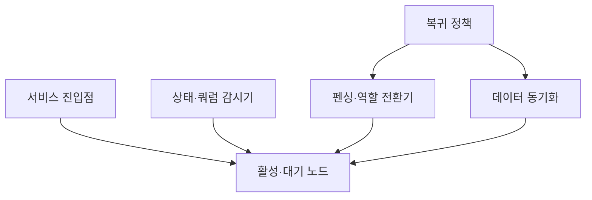
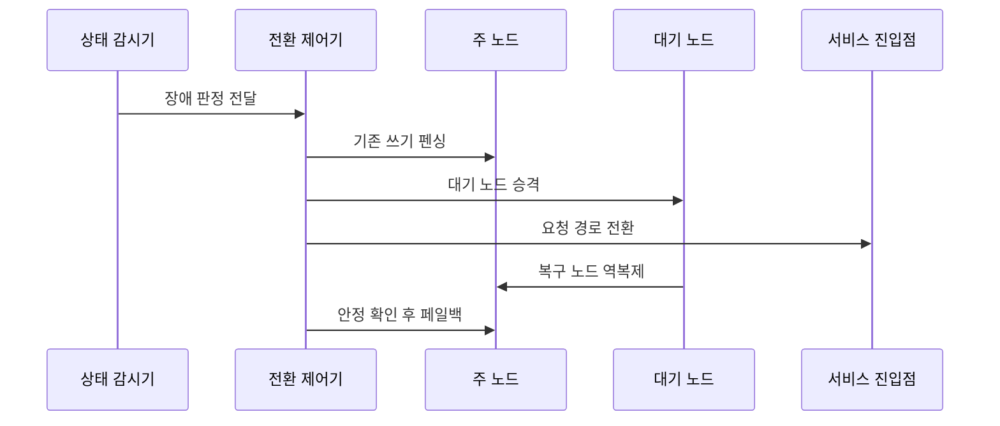

---
sidebar:
  order: 22
  label: "022. 자동 페일오버·페일백 (Auto Failover Failback)"
  badge:
    text: "기출 · 50%"
    variant: note
title: "자동 페일오버·페일백 (Auto Failover Failback)"
date: "2026-07-27T23:59:59+09:00"
tags:
  - "notes-evaluation"
weight: 22
extra:
  question_no: "022"
  source_status: "기출"
  source_history: "137회"
  priority: 50
  priority_note: "장애 전환과 정상 복귀를 잇는 운영 설계축"
---

## 미리 알고가기

- **페일오버(Failover)**: 주 자원 장애 때 대기 자원이 역할과 요청 경로를 승계하는 처리
- **페일백(Failback)**: 복구된 원래 자원이나 정상 구조로 서비스 역할을 다시 이전하는 처리
- **활성 노드(Active Node)**: 현재 요청 처리와 쓰기 권한을 담당하는 노드
- **대기 노드(Standby Node)**: 활성 노드 상태를 복제받고 장애 승계를 준비하는 노드
- **상태 확인(Health Check)**: 응답·기능·의존성을 검사해 서비스 가능 여부를 판단하는 절차
- **하트비트(Heartbeat)**: 노드가 생존 상태를 주기적으로 교환하는 신호
- **펜싱(Fencing)**: 고립되거나 이전 세대인 노드의 전원·스토리지·쓰기 권한을 강제로 차단하는 통제
- **VIP(Virtual IP Address, 브이아이피)**: 영문 머리글자를 딴 가상 주소로, 활성 노드가 바뀌어도 동일 접속점을 제공
- **LB(Load Balancer, 엘비)**: 영문 머리글자를 딴 요청 분산 장치로, 장애 서버를 접속 경로에서 제외
- **DNS(Domain Name System)**: 서비스 이름을 접속 가능한 네트워크 주소로 해석하는 체계
- **역복제(Reverse Replication)**: 페일오버 뒤 새 활성 노드의 변경분을 복구된 원 노드로 반대 방향 복제하는 처리
- **전환 유예 타이머(Hold-Down Timer)**: 복구 직후 재전환하지 않고 안정 상태를 확인하도록 강제하는 대기 시간
- **플래핑(Flapping)**: 짧은 장애와 복구가 반복되어 역할 전환이 자주 일어나는 현상
- **RTO(Recovery Time Objective, 알티오)**: 영문 머리글자를 딴 지표로, 중단 후 서비스를 재개해야 하는 목표 시간
- **스플릿 브레인(Split Brain)**: 네트워크 분리 뒤 여러 노드가 자신을 활성 주체로 판단해 동시에 쓰는 장애 상태

## Ⅰ. 개요

- **정의/개념**: 장애 시 승계하고 복구 뒤 정상 구조로 복귀
- **기존 한계**: 수동 전환은 탐지·승계 지연과 운영 오류 유발
- **배경/필요성**: 신속한 장애 승계와 안전한 정상 복귀

### 쉽게 이해하기 (학습용)

- 장애 때는 예비 서버로 빠르게 업무를 넘기고 원래 서버가 고쳐진 뒤에는 변경된 데이터를 맞춘 다음 안전하게 되돌린다.

## Ⅱ. 특징

- 페일오버는 장애 확정·펜싱 후 대기 자원을 승격한다.
- 페일백은 역복제·안정성 검증 후 원 구조로 복귀한다.
- 임계값·유예 시간으로 오진과 반복 전환을 제한한다.

### 쉽게 이해하기 (학습용)

- 죽은 것으로 오판한 주 서버가 계속 쓰는 상태에서 대기 서버까지 승격하면 데이터가 갈라지므로 기존 쓰기를 먼저 막아야 한다.

## Ⅲ. 아키텍처 및 구성요소

| 설계 요소 | 설명 |
|:---|:---|
| 서비스 진입점 | VIP·LB·DNS로 요청 경로 전환 |
| 활성·대기 노드 | 현재 처리와 승계 대상 제공 |
| 상태·쿼럼 감시기 | 장애와 운영 권한 판정 |
| 펜싱·역할 전환기 | 이전 쓰기 차단과 대기 승격 |
| 데이터 동기화 | 순방향 복제와 역복제 수행 |
| 복귀 정책 | 유예·승인·점진 원복 제어 |

### 쉽게 이해하기 (학습용)

- 감시기가 장애를 판단하면 전환기가 이전 주체를 막고 대기를 승격하며 진입점과 데이터 동기화가 새 운영 방향에 맞춰 바뀐다.

## Ⅳ. 원리 및 절차 흐름도

| 절차 | 설명 |
|:---|:---|
| 장애 판정 전달 | 상태·쿼럼·지속 시간을 확인 |
| 기존 쓰기 펜싱 | 이전 활성 노드의 접근 차단 |
| 대기 노드 승격 | 최신 복제 상태에서 쓰기 허용 |
| 요청 경로 전환 | VIP·LB·DNS를 새 활성로 변경 |
| 복구 노드 역복제 | 장애 중 변경분을 원 노드에 반영 |
| 안정 확인 후 페일백 | 유예·정합성 확인 뒤 역할 복귀 |

> 요약: 이전 쓰기를 막고 승계한 뒤 동기화해 복귀한다.

### 쉽게 이해하기 (학습용)

- 장애 때는 기존 서버의 쓰기를 끊고 예비 서버와 접속 경로를 바꾸며 복구 뒤에는 새 데이터가 원 서버에 모두 반영된 다음에만 되돌린다.

## Ⅴ. 종류 및 비교

| 판단 기준 | 페일오버 | 페일백 |
|:---|:---|:---|
| 적용 기준 | 주 자원의 장애가 확정될 때 | 역복제·안정성 검증이 끝날 때 |
| 핵심 특징 | 대기 자원으로 서비스 승계 | 복구된 정상 구조로 역할 복귀 |
| 한계 | 오진·이중 쓰기·세션 손실 | 데이터 역전·플래핑·재중단 |

### 쉽게 이해하기 (학습용)

- 페일오버는 중단을 줄이기 위해 빠르게 넘기고 페일백은 그동안 바뀐 데이터를 잃지 않도록 더 천천히 되돌린다.

## Ⅵ. 실무 사례

- **사례 1**: 웹 서버 실패를 LB가 감지해 자동 우회
- **사례 2**: DB 주 노드를 펜싱한 뒤 복제본 승격
- **사례 3**: 복구 DB에 역복제 후 쓰기 역할 복귀
- **사례 4**: 유예 타이머로 반복 전환을 방지

### 쉽게 이해하기 (학습용)

- 사례 1은 응답하지 않는 웹 서버를 요청 경로에서 빼고 정상 서버에 새 요청을 보낸다.
- 사례 2는 장애로 보이는 기존 DB가 늦게 살아나 중복 쓰기하지 못하도록 차단한 뒤 대기 DB를 주체로 만든다.
- 사례 3은 장애 중 새 주 DB에 쌓인 변경분을 원 DB에 모두 맞춘 뒤에만 원래 역할로 되돌린다.
- 사례 4는 잠깐 정상으로 보일 때마다 역할이 왕복해 서비스가 더 불안정해지는 플래핑을 줄인다.

## Ⅶ. 결론

- 장애 때 펜싱 후 페일오버하고 동기화 뒤 페일백한다.

### 쉽게 이해하기 (학습용)

- 자동 전환의 완성은 빨리 넘기는 것뿐 아니라 이중 쓰기를 막고 데이터가 맞는 상태에서 정상 구조로 안전하게 돌아오는 데 있다.
