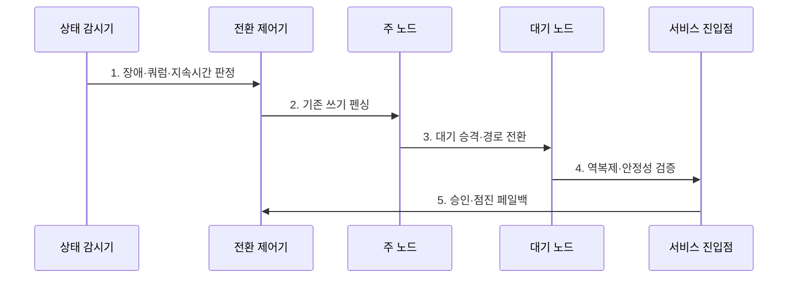

---
sidebar:
  order: 22
  label: "022. 자동 페일오버·페일백 (Auto Failover Failback)"
  badge:
    text: "기출 · 50%"
    variant: note
title: "자동 페일오버·페일백 (Auto Failover Failback)"
date: "2026-07-30T23:30:00+09:00"
tags:
  - "notes-evaluation"
weight: 22
extra:
  question_no: "022"
  source_status: "기출"
  source_history: "137회"
  priority: 50
  priority_note: "장애 전환과 정상 복귀를 잇는 운영 설계축"
---

## 미리 알고가기

- **페일오버(Failover)**: 주 자원 장애 때 대기 자원이 역할과 요청 경로를 승계하는 처리
- **페일백(Failback)**: 복구된 원래 자원이나 정상 구조로 서비스 역할을 다시 이전하는 처리
- **활성 노드(Active Node)**: 현재 요청 처리와 쓰기 권한을 담당하는 노드
- **대기 노드(Standby Node)**: 활성 노드 상태를 복제받고 장애 승계를 준비하는 노드
- **상태 확인(Health Check)**: 응답·기능·의존성을 검사해 서비스 가능 여부를 판단하는 절차
- **하트비트(Heartbeat)**: 노드가 생존 상태를 주기적으로 교환하는 신호
- **펜싱(Fencing)**: 고립되거나 이전 세대인 노드의 전원·스토리지·쓰기 권한을 강제로 차단하는 통제
- **가상 IP 주소(Virtual IP Address, VIP)**: 활성 노드가 변경되어도 클라이언트에 동일한 서비스 접속점을 제공하는 논리 주소다.
- **로드 밸런서(Load Balancer, LB)**: 요청을 여러 서버에 분산하고 장애 서버를 접속 경로에서 제외하는 장치다.
- **DNS(Domain Name System)**: 서비스 이름을 접속 가능한 네트워크 주소로 해석하는 체계
- **역복제(Reverse Replication)**: 페일오버 뒤 새 활성 노드의 변경분을 복구된 원 노드로 반대 방향 복제하는 처리
- **전환 유예 타이머(Hold-Down Timer)**: 복구 직후 재전환하지 않고 안정 상태를 확인하도록 강제하는 대기 시간
- **플래핑(Flapping)**: 짧은 장애와 복구가 반복되어 역할 전환이 자주 일어나는 현상
- **복구 시간 목표(Recovery Time Objective, RTO)**: 서비스 중단 후 업무를 재개해야 하는 목표 시간이다.
- **스플릿 브레인(Split Brain)**: 네트워크 분리 뒤 여러 노드가 자신을 활성 주체로 판단해 동시에 쓰는 장애 상태
- **ISO 22301:2019**: 업무 중단에 대한 대응·복구 절차와 훈련 요구사항을 규정한 국제표준이다.

## Ⅰ. 개요

- 정의/개념: 장애 시 승계하고 안정화 후 복귀하는 **자동화 기법**
- 배경/필요성: 탐지·전환 지연과 **복귀 중 데이터 불일치 방지**

### 쉽게 이해하기 (학습용)

- 장애 때는 예비 서버로 빠르게 업무를 넘기고 원래 서버가 고쳐진 뒤에는 변경된 데이터를 맞춘 다음 안전하게 되돌린다.

## Ⅱ. 특징

- 다중 상태판정·펜싱의 **안전한 승계**
- 역복제·정합성 검증의 **통제된 복귀**
- 유예·승인·롤백의 **플래핑 방지**

### 쉽게 이해하기 (학습용)

- 죽은 것으로 오판한 주 서버가 계속 쓰는 상태에서 대기 서버까지 승격하면 데이터가 갈라지므로 기존 쓰기를 먼저 막아야 한다.

## Ⅲ. 구조 및 구성요소

| 구성요소 | 책임 |
|:---|:---|
| 상태확인·쿼럼 | 기능·의존성·지속시간 판정 |
| 펜싱·역할 전환 | 이전 쓰기 차단·대기 승격 |
| VIP·LB·DNS 진입점 | 사용자 접속 경로 전환 |
| 순방향·역방향 복제 | 승계 전후 데이터 동기화 |
| 유예·승인·복귀 정책 | 안정성·점진 원복·롤백 |

### 쉽게 이해하기 (학습용)

- 감시기가 장애를 판단하면 전환기가 이전 주체를 막고 대기를 승격하며 진입점과 데이터 동기화가 새 운영 방향에 맞춰 바뀐다.

## Ⅳ. 흐름도

1. **장애·쿼럼·지속시간 판정**: 오진·플래핑 조건 확인
2. **기존 쓰기 펜싱**: 이전 활성 접근 차단
3. **대기 승격·경로 전환**: 최신 복제본·접속점 변경
4. **역복제·안정성 검증**: 변경분·용량·정합성 확인
5. **승인·점진 페일백**: 유예·롤백 조건 적용

### 쉽게 이해하기 (학습용)

- 장애 때는 기존 서버의 쓰기를 끊고 예비 서버와 접속 경로를 바꾸며 복구 뒤에는 새 데이터가 원 서버에 모두 반영된 다음에만 되돌린다.

## Ⅴ. 종류 및 비교

| 전환 방식 | 페일오버 | 페일백 |
|:---|:---|:---|
| 적용 기준 | 주 자원의 장애가 확정될 때 | 역복제·안정성 검증이 끝날 때 |
| 핵심 특징 | 대기 자원으로 서비스 승계 | 복구된 정상 구조로 역할 복귀 |
| 한계 | 오진·이중 쓰기·세션 손실 | 데이터 역전·플래핑·재중단 |

### 쉽게 이해하기 (학습용)

- 페일오버는 중단을 줄이기 위해 빠르게 넘기고 페일백은 그동안 바뀐 데이터를 잃지 않도록 더 천천히 되돌린다.

## Ⅵ. 실무 고려사항 및 대책

| 고려사항 | 대책 | 효과 |
|:---|:---|:---|
| 업무 복구 절차·훈련 | **ISO 22301:2019 연계** | RTO·역할·검증 정렬 |
| 이중 쓰기·데이터 역전 | **펜싱·역복제 적용** | 데이터 정합성 확보 |
| 조기 복귀·플래핑 | **유예·승인·점진 전환** | 재중단 위험 감소 |

### 쉽게 이해하기 (학습용)

- 장애로 보이는 기존 DB의 쓰기를 차단한 뒤 대기 DB를 주 노드로 승격해 이중 쓰기를 방지한다.

## Ⅶ. 결론

- **장애 판정·복제 정합성**으로 승계·복귀 자동화 결정

### 쉽게 이해하기 (학습용)

- 자동 전환의 완성은 빨리 넘기는 것뿐 아니라 이중 쓰기를 막고 데이터가 맞는 상태에서 정상 구조로 안전하게 돌아오는 데 있다.
