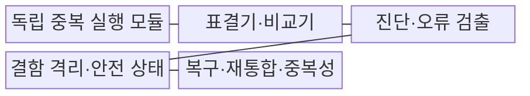
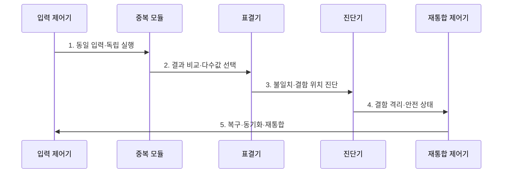

---
sidebar:
  order: 23
  label: "023. 결함 허용 시스템 (Fault-Tolerant System)"
  badge:
    text: "기출 · 50%"
    variant: note
title: "결함 허용 시스템 (Fault-Tolerant System)"
date: "2026-08-02T12:23:00+09:00"
tags:
  - "notes-evaluation"
weight: 23
extra:
  question_no: "023"
  source_status: "기출"
  source_history: "135회"
  priority: 50
  priority_note: "고장 중 서비스 지속 구조를 묻는 기출 주제"
---

## Ⅰ. 개요

핵심 용어

- **결함 허용**: 일부 구성요소에 결함이 발생해도 요구된 서비스를 계속 제공하는 능력이다.
- **결함·오류·고장**: 비정상 원인이 내부 상태 오류로 활성화되고, 그 오류가 서비스 경계를 넘어 요구 기능 실패로 나타나는 인과 단계이다.

- 정의/개념: 일부 결함에도 정상 출력을 유지하는 **내결함 시스템**
- 배경/필요성: 단일 모듈 제어는 고장 순간 **안전 출력 유지 불가**

### 쉽게 이해하기 (학습용)

- 같은 계산을 여러 모듈이 동시에 수행하고 하나가 틀려도 나머지 결과로 즉시 가려 서비스가 끊기지 않게 한다.

## Ⅱ. 특징

핵심 용어

- **결함 마스킹**: 결함 모듈의 잘못된 결과가 외부 서비스에 드러나지 않도록 정상 결과를 선택하는 처리이다.
- **재통합**: 결함 모듈을 교체·복구·동기화한 뒤 중복 구조에 다시 참여시키는 처리이다.

- 중복 처리·표결의 **결함 마스킹**
- 진단·격리·재통합의 **중복성 회복**
- 독립성·다양성의 **공통원인 억제**

### 쉽게 이해하기 (학습용)

- 복제본이 많아도 모두 같은 버그를 갖거나 하나뿐인 표결기가 고장 나면 동시에 틀릴 수 있으므로 독립성과 재통합까지 설계해야 한다.

## Ⅲ. 구조 및 구성요소

핵심 용어

- **삼중 모듈 중복(TMR)**: 동일 연산을 세 모듈에서 수행하고 다수결로 정상 출력을 선택하는 구조이다.
- **표결기**: 중복 모듈들의 출력 중 다수와 일치하는 결과를 선택하는 구성요소이다.
- **ECC**: 저장·전송 데이터의 일부 비트 오류를 검출하고 보정하는 부호이다.

| 구성요소 | 책임 |
|:---|:---|
| **독립 중복 실행 모듈** | **TMR·설계 다양성** 병행 |
| **표결기·비교기** | 다수 출력 선택·**불일치 식별** |
| **진단·오류 검출** | **ECC·록스텝·자가진단** |
| **결함 격리·안전 상태** | 고장 출력 차단·**성능 저하** |
| **복구·재통합·중복성** | 교체·동기화·**여유 회복** |

### 쉽게 이해하기 (학습용)

- 여러 모듈이 같은 일을 하고 표결기가 정상 결과를 고르며 진단 기능이 틀린 모듈을 찾아 격리한 뒤 교체·동기화해 다시 참여시킨다.

## Ⅳ. 흐름도

핵심 용어

- **록스텝**: 중복 처리기가 같은 입력과 명령을 같은 순서로 실행하여 결과 차이로 결함을 탐지하는 방식이다.
- **격리**: 이상 결과를 낸 모듈이 출력·공유 상태에 영향을 주지 못하도록 중복 집합에서 제외하는 처리이다.

1. **동일 입력·독립 실행**: 중복 모듈에 작업 배포
2. **결과 비교·다수값 선택**: 정상 출력 즉시 제공
3. **불일치·결함 위치 진단**: 소수 결과·원인 식별
4. **결함 격리·안전 상태**: 오류 확산·출력 차단
5. **복구·동기화·재통합**: 요구 중복 수준 회복

### 쉽게 이해하기 (학습용)

- 세 모듈 중 하나가 다른 답을 내도 두 모듈의 답을 즉시 서비스하고 틀린 모듈은 격리·교체해 다음 결함을 견딜 여유를 되찾는다.

## Ⅴ. 종류 및 비교

핵심 용어

- **결함 허용 시스템**: 장애 전환 전에 중복 연산·표결로 결함을 마스킹하여 서비스 연속성을 유지하는 구조이다.
- **고가용성 시스템**: 고장 탐지 후 대체 자원으로 전환하여 중단시간을 줄이는 구조이다.

| 연속성 설계 | 결함 허용 FT | 고가용성 HA |
|:---|:---|:---|
| **적용 기준** | 순간 중단 불허 **제어·안전 업무** | 짧은 전환 허용 **일반 서비스** |
| **핵심 특징** | 결함 중에도 **출력 계속 제공** | 장애 뒤 **대체 자원 전환** |
| **한계** | **중복 비용·공통원인 고장** | **승계 지연·세션 손실** |

### 쉽게 이해하기 (학습용)

- FT는 고장 난 순간에도 여러 결과 중 정상값을 골라 계속 일하고 HA는 고장 뒤 예비 장비로 바꾸는 짧은 중단을 허용한다.

## Ⅵ. 실무 고려사항 및 대책

핵심 용어

- **공통 원인 고장**: 여러 중복 모듈이 같은 설계·전원·환경 원인으로 동시에 고장 나는 현상이다.
- **설계 다양성**: 같은 요구를 서로 다른 구현·도구·팀으로 개발하여 공통 설계 결함을 줄이는 방식이다.
- **표결기 단일 장애점**: 중복 모듈이 정상이어도 하나뿐인 표결기 고장으로 전체 출력이 실패하는 위험이다.

| 문제 | 대책 | 효과 |
|:---|:---|:---|
| **기능안전 수명주기** | **IEC 61508-1:2010 적용** | 위험·**무결성 요구 정렬** |
| **하드웨어 결함 허용** | **IEC 61508-2:2010 적용** | **중복·진단 범위** 설계 |
| **표결기 SPOF** | **표결기 중복·독립 전원** | **단일 장애점** 제거 |
| **공통원인 고장** | **설계 다양성·격리 적용** | **동시 실패 가능성** 감소 |

### 쉽게 이해하기 (학습용)

- 한 제어 모듈이 오출력해도 세 결과의 다수값을 사용해 안전 설비의 제어 결과를 유지한다.

## Ⅶ. 결론

핵심 용어

- **안전 출력**: 내부 결함이 발생해도 외부 시스템과 사람에게 허용 불가 위험을 만들지 않는 출력 상태이다.
- **IEC 61508**: 안전 관련 전기·전자·프로그래머블 시스템의 기능안전과 하드웨어 결함 허용 요구를 규정한 국제표준이다.

- 순간 중단 불허·안전 출력 필요 시 **FT**, 짧은 전환 허용 시 **HA**

### 쉽게 이해하기 (학습용)

- 결함 허용 시스템은 예비 장비 보유가 아니라 결함이 발생한 순간 정상 출력을 내고 고장 요소를 격리해 다시 중복성을 회복하는 구조다.
