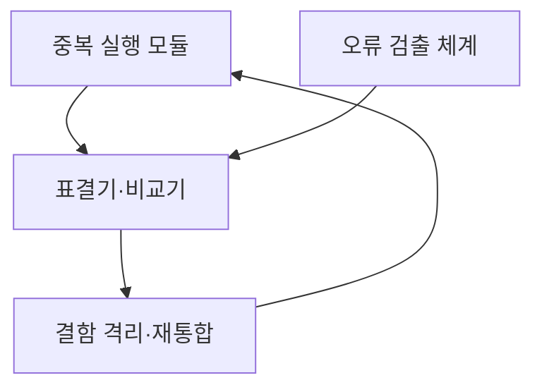
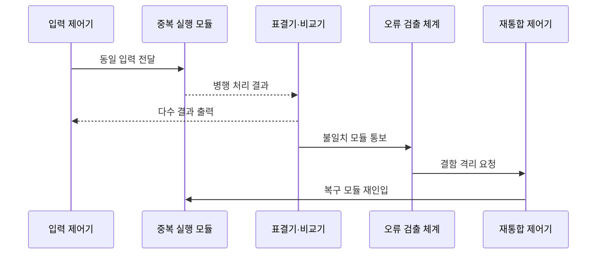

---
sidebar:
  order: 23
  label: "023. 결함 허용 시스템 (Fault-Tolerant System)"
  badge:
    text: "기출 · 50%"
    variant: note
title: "결함 허용 시스템 (Fault-Tolerant System)"
date: "2026-07-27T23:59:59+09:00"
tags:
  - "notes-evaluation"
weight: 23
extra:
  question_no: "023"
  source_status: "기출"
  source_history: "135회"
  priority: 50
  priority_note: "고장 중 서비스 지속 구조를 묻는 기출 주제"
---

## 미리 알고가기

- **결함(Fault)**: 시스템 내부에 존재하지만 아직 외부 실패로 나타나지 않은 비정상 원인
- **오류(Error)**: 결함이 활성화되어 내부 상태가 올바른 값과 달라진 상태
- **고장(Failure)**: 시스템이 요구된 서비스를 외부에 제공하지 못한 상태
- **결함 허용(Fault Tolerance, FT, 에프티)**: 영문 머리글자를 딴 명칭으로, 일부 결함 중에도 요구 서비스를 계속 제공하는 능력
- **결함 마스킹(Fault Masking)**: 결함 모듈의 잘못된 결과가 외부 서비스에 드러나지 않게 가리는 처리
- **TMR(Triple Modular Redundancy, 티엠알)**: 영문 머리글자를 딴 삼중 모듈 중복으로, 세 출력의 다수결 결과를 선택
- **표결기(Voter)**: 여러 중복 모듈의 출력 중 다수 결과를 선택하는 구성요소
- **ECC(Error-Correcting Code)**: 저장·전송 데이터의 일부 비트 오류를 검출하고 보정하는 부호
- **록스텝(Lockstep)**: 중복 처리기가 같은 입력과 명령을 같은 순서로 실행하는 방식
- **재통합(Reintegration)**: 결함 모듈을 교체·복구·동기화한 뒤 중복 구조에 다시 참여시키는 처리
- **설계 다양성(Design Diversity)**: 같은 요구를 서로 다른 구현·도구·팀으로 개발해 공통 설계 결함을 줄이는 방식
- **공통 원인 고장(Common-Cause Failure)**: 여러 중복 자원이 같은 원인을 공유해 동시에 고장 나는 현상
- **HA(High Availability)**: 장애 뒤 대체 자원으로 전환해 서비스 중단 시간을 줄이는 고가용성 설계
- **SPOF(Single Point of Failure)**: 한 구성요소의 고장만으로 전체 서비스가 중단되는 단일 장애점

## Ⅰ. 개요

- **정의/개념**: 일부 결함 중에도 정상 출력을 계속 제공
- **기존 한계**: 단순 복구형 구조는 장애 전환 동안 서비스 중단
- **배경/필요성**: 결함 발생 중에도 연속적인 정상 출력 제공

### 쉽게 이해하기 (학습용)

- 같은 계산을 여러 모듈이 동시에 수행하고 하나가 틀려도 나머지 결과로 즉시 가려 서비스가 끊기지 않게 한다.

## Ⅱ. 특징

- 중복 처리와 표결로 결함 모듈의 출력을 마스킹한다.
- 결함 격리·재통합으로 요구 중복 수준을 복원한다.
- 공통 설계 결함·공유 입력·표결기는 동시 실패를 유발한다.

### 쉽게 이해하기 (학습용)

- 복제본이 많아도 모두 같은 버그를 갖거나 하나뿐인 표결기가 고장 나면 동시에 틀릴 수 있으므로 독립성과 재통합까지 설계해야 한다.

## Ⅲ. 아키텍처 및 구성요소

| 설계 요소 | 설명 |
|:---|:---|
| 중복 실행 모듈 | 동일 입력을 병행 처리 |
| 표결기·비교기 | 다수 출력 선택과 불일치 식별 |
| 오류 검출 체계 | ECC·진단으로 결함 위치 확인 |
| 결함 격리·재통합 | 고장 모듈 배제와 중복성 복구 |

### 쉽게 이해하기 (학습용)

- 여러 모듈이 같은 일을 하고 표결기가 정상 결과를 고르며 진단 기능이 틀린 모듈을 찾아 격리한 뒤 교체·동기화해 다시 참여시킨다.

## Ⅳ. 원리 및 절차 흐름도

| 절차 | 설명 |
|:---|:---|
| 동일 입력 전달 | 중복 모듈에 같은 작업 배포 |
| 병행 처리 결과 | 록스텝 연산 결과 제출 |
| 다수 결과 출력 | 일치하는 다수 값을 즉시 채택 |
| 불일치 모듈 통보 | 소수 결과의 위치와 상태 기록 |
| 결함 격리 요청 | 잘못된 모듈을 출력 경로에서 배제 |
| 복구 모듈 재인입 | 교체·동기화 후 중복 수준 회복 |

> 요약: 다수 결과를 내보내고 결함 모듈은 따로 복구한다.

### 쉽게 이해하기 (학습용)

- 세 모듈 중 하나가 다른 답을 내도 두 모듈의 답을 즉시 서비스하고 틀린 모듈은 격리·교체해 다음 결함을 견딜 여유를 되찾는다.

## Ⅴ. 종류 및 비교

| 판단 기준 | 결함 허용 FT | 고가용성 HA |
|:---|:---|:---|
| 적용 기준 | 순간 중단도 위험한 제어·안전 업무 | 짧은 전환을 허용하는 일반 서비스 |
| 핵심 특징 | 결함 중에도 출력을 계속 제공 | 장애 뒤 대체 자원으로 전환 |
| 한계 | 중복 비용·공통 결함·표결기 고장 | 승계 지연·세션 손실·전환 실패 |

### 쉽게 이해하기 (학습용)

- FT는 고장 난 순간에도 여러 결과 중 정상값을 골라 계속 일하고 HA는 고장 뒤 예비 장비로 바꾸는 짧은 중단을 허용한다.

## Ⅵ. 실무 사례

- **사례 1**: 원전 제어 연산을 TMR로 삼중화
- **사례 2**: 위성 제어 소프트웨어에 설계 다양성 적용
- **사례 3**: 메모리 비트 오류를 ECC로 자동 보정
- **사례 4**: 표결기 자체를 중복해 SPOF 제거

### 쉽게 이해하기 (학습용)

- 사례 1은 한 제어 모듈의 오출력이 안전 설비 동작을 바꾸지 않도록 세 결과의 다수값을 사용한다.
- 사례 2는 같은 요구를 다른 구현으로 만들어 하나의 소프트웨어 버그가 모든 복제본에 동시에 나타날 가능성을 줄인다.
- 사례 3은 우주 방사선이나 하드웨어 결함으로 일부 비트가 바뀌어도 데이터를 읽는 순간 검출·수정한다.
- 사례 4는 모든 모듈이 정상이어도 하나뿐인 표결기 고장으로 출력이 멈추는 구조를 방지한다.

## Ⅶ. 결론

- 중단 불가 업무면 결함 마스킹과 독립 중복을 적용한다.

### 쉽게 이해하기 (학습용)

- 결함 허용 시스템은 예비 장비 보유가 아니라 결함이 발생한 순간 정상 출력을 내고 고장 요소를 격리해 다시 중복성을 회복하는 구조다.
