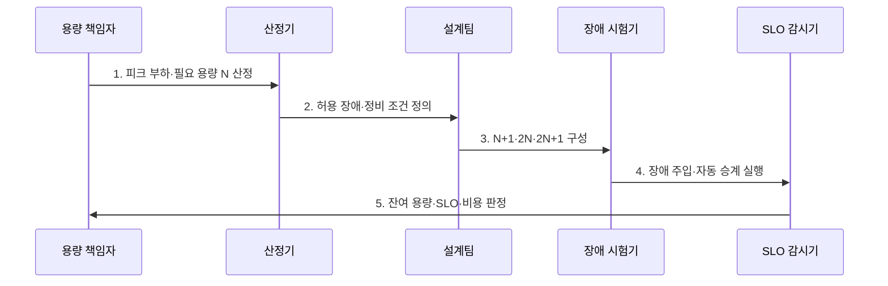

---
sidebar:
  order: 24
  label: "024. 이중화 구성 - N+1·2N·2N+1 (Redundancy Configuration)"
  badge:
    text: "기출 · 70%"
    variant: note
title: "이중화 구성 - N+1·2N·2N+1 (Redundancy Configuration)"
date: "2026-07-27T23:59:59+09:00"
tags:
  - "notes-evaluation"
weight: 24
extra:
  question_no: "024"
  source_status: "기출"
  source_history: "135회, 138회"
  priority: 70
  priority_note: "최근 반복 기출, 비용·가용성 이중화 비교축"
---

## 미리 알고가기

- **N(엔)**: 필요 용량을 나타내는 관례적 변수로, 최대 업무 부하를 처리하는 최소 자원 수·계통 용량
- **N+1 이중화**: 필요한 N에 예비 자원 1개를 추가해 단일 자원 장애를 견디는 구성
- **2N 이중화**: 필요한 N 규모의 전체 계통을 두 벌로 독립 구성해 한 계통 장애를 견디는 방식
- **2N+1 이중화**: 두 벌의 N 계통에 추가 예비 자원 1개를 더한 구성
- **장애 도메인(Fault Domain)**: 전원·망·시설처럼 하나의 원인으로 함께 고장 날 수 있는 자원의 범위
- **공통 원인 고장(Common-Cause Failure)**: 여러 이중화 자원이 같은 원인을 공유해 동시에 고장 나는 현상
- **여유 용량(Headroom)**: 장애나 부하 증가 뒤에도 추가 요청을 처리할 수 있는 남은 용량
- **피크 부하(Peak Load)**: 관측 기간에 발생하는 가장 높은 업무 처리량
- **서비스 수준 목표(Service Level Objective, SLO)**: 가용성·지연·오류율 등 서비스 수준 지표에 대해 달성해야 할 목표값이다.
- **용량 저하 운전(Degraded Operation)**: 일부 자원 장애 뒤 성능이나 기능을 제한해 서비스를 계속하는 상태
- **자동 승계(Failover)**: 주 자원 장애 때 예비 자원이나 독립 계통으로 처리를 전환하는 기능
- **UPS(Uninterruptible Power Supply)**: 입력 전원 장애 때 배터리 등으로 전력을 잠시 공급하는 무정전 전원장치
- **정비 여유(Maintenance Margin)**: 계획 정비 중 추가 장애가 나도 목표 서비스를 유지하도록 확보한 예비 능력
- **IEC 61703:2016**: 신뢰성·가용성·유지보수성 지표의 수학적 표현을 제시한 국제표준이다.

## Ⅰ. 개요

- 정의: 필요 용량 $N$에 **예비 자원·독립 계통 추가**
- 목적: 장애·정비 중에도 **피크 부하·SLO 유지**

### 쉽게 이해하기 (학습)

- 평상시 필요한 장비 수를 N으로 잡고 한 대 예비를 둘지 전체 계통을 복제할지 허용 장애와 비용에 따라 결정한다.

## Ⅱ. 특징

- 예비수준·비용의 **허용 장애 상충**
- 장애·정비 상태의 **잔여 용량 검증**
- 전원·망·냉각의 **장애 도메인 독립**

### 쉽게 이해하기 (학습)

- 장비 수가 공식과 맞아도 고장 뒤 남은 장비가 최대 부하를 못 받거나 같은 전원에 묶이면 목표 이중화가 아니다.

## Ⅲ. 구조 및 구성요소

| 설계 요소 | 설명 |
|:---|:---|
| 필요 용량 N·피크 부하 | 최소 처리량·성장 여유 |
| 예비 자원·독립 계통 | N+1·2N·2N+1 |
| 장애 도메인·공통원인 | 전원·랙·망·냉각 분리 |
| 부하분산·자동 승계 | 감지·투입·재분배 |
| 정비·장애·SLO 검증 | 동시고장·용량·지연 |

### 쉽게 이해하기 (학습)

- 최대 부하에 필요한 N을 계산해 예비를 배치하고 같은 원인에 함께 죽지 않게 나눈 뒤 장애 상태의 실제 처리량을 시험한다.

## Ⅳ. 흐름도

| 절차 | 설명 |
|:---|:---|
| 1. 피크 부하·필요 용량 N 산정 | 처리량·성장·헤드룸 반영 |
| 2. 허용 장애·정비 조건 정의 | 동시고장·계획정비 확정 |
| 3. N+1·2N·2N+1 구성 | 독립 계통·예비 배치 |
| 4. 장애 주입·자동 승계 실행 | 감지·투입·재분배 |
| 5. 잔여 용량·SLO·비용 판정 | 목표·투자 균형 결정 |

> 요약: 자원 장애 뒤 예비 용량으로 피크 부하를 유지한다.

### 쉽게 이해하기 (학습)

- 운영 장비가 빠지면 제어기가 예비 자원을 넣고 부하를 다시 나누며 남은 구성으로도 약속한 처리량이 나오는지 확인한다.

## Ⅴ. 종류 및 비교

| 이중화 구성 | N+1 | 2N | 2N+1 |
|:---|:---|:---|:---|
| 적용 기준 | 단일 자원 장애 허용 | 한 계통 전체 장애 허용 | 계통 장애 중 추가 정비·고장 |
| 핵심 특징 | N에 예비 자원 1개 추가 | N 규모 계통을 두 벌 구성 | 2N에 추가 예비 1개 구성 |
| 한계 | 복수 장애·예비 용량 부족 | 높은 비용·공유 제어기 | 복잡성·유휴 비용·공통 원인 |

### 쉽게 이해하기 (학습)

- N+1은 한 자원 고장, 2N은 한 계통 고장, 2N+1은 계통 하나를 잃은 상태의 추가 자원 고장까지 고려한다.

## Ⅵ. 실무 고려사항 및 대책

| 고려사항 | 대책 | 효과 |
|:---|:---|:---|
| 가용성·중복 산정 | **IEC 61703:2016 적용** | 구성별 효과 정량화 |
| 공통원인·숨은 공유점 | **전원·망·제어 독립 배치** | 동시 장애 위험 감소 |
| 장애 후 용량 부족 | **피크 N·정비 상태 시험** | SLO 유지 검증 |

### 쉽게 이해하기 (학습)

- 컨테이너 하나가 중단돼도 나머지와 예비 인스턴스가 최대 웹 부하를 처리하게 한다.

## Ⅶ. 결론

- **허용장애·피크N·독립성·전환시간·비용**으로 이중화를 결정한다.

### 쉽게 이해하기 (학습)

- 이중화 수준은 장비 개수가 아니라 실제 장애와 정비 조건에서 독립된 남은 자원이 필요한 부하를 감당하는지로 결정한다.
