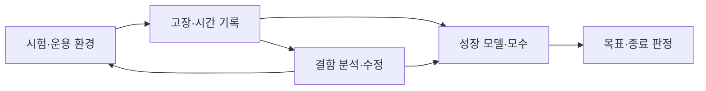
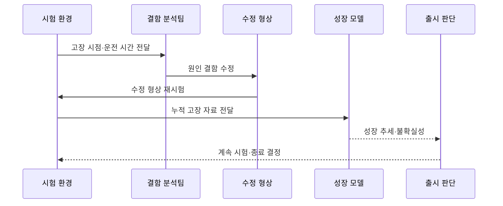

---
sidebar:
  order: 25
  label: "025. 신뢰성 성장 모델 (Reliability Growth Model)"
  badge:
    text: "기출 · 30%"
    variant: note
title: "신뢰성 성장 모델 (Reliability Growth Model)"
date: "2026-07-25T22:26:00+09:00"
tags:
  - "notes-evaluation"
weight: 25
extra:
  question_no: "025"
  source_status: "기출"
  source_history: "122회"
  priority: 30
  priority_note: "과거 기출이나 반복 가능성이 낮은 신뢰성 모형"
---

## 미리 알고가기

- **신뢰성 성장(Reliability Growth)**: 시험에서 발견한 결함을 제거하며 시스템 고장 발생 특성이 개선되는 현상
- **신뢰성 성장 모델(Reliability Growth Model)**: 누적 시험 시간과 고장 기록으로 신뢰성 개선 추세를 추정하는 모델
- **TAAF(Test, Analyze, and Fix)**: 시험·원인 분석·결함 수정·재검증을 반복하는 신뢰성 개선 절차
- **MTBF(Mean Time Between Failures)**: 수리 가능한 시스템에서 고장과 다음 고장 사이의 평균 운전 시간
- **고장 강도(Failure Intensity)**: 단위 운전 시간에 발생할 것으로 기대하는 고장 수
- **운용 프로파일(Operational Profile)**: 실제 사용 환경에서 기능·입력·부하가 나타나는 빈도 분포
- **Duane 모델**: 누적 운전 시간과 누적 MTBF의 로그 관계로 성장 추세를 경험적으로 보는 모델
- **Crow-AMSAA 모델**: 누적 시간의 고장 발생 과정을 NHPP로 표현해 성장 추세를 통계적으로 추정하는 모델
- **NHPP(Non-Homogeneous Poisson Process)**: 시간에 따라 사건 발생률이 달라지는 포아송 과정
- **형상 모수 β(Beta)**: Crow-AMSAA 모델에서 누적 고장 추세의 방향을 나타내는 모수
- **β<1**: Crow-AMSAA 모델에서 고장 강도가 감소하는 성장 상태
- **β=1**: Crow-AMSAA 모델에서 고장 강도가 일정한 상태
- **β>1**: Crow-AMSAA 모델에서 고장 강도가 증가하는 악화 상태
- **신뢰구간(Confidence Interval)**: 추정한 모수가 포함될 것으로 기대하는 통계적 범위
- **형상 기준선(Configuration Baseline)**: 시험 결과를 비교하도록 기능·코드·환경 버전을 고정한 기준

## Ⅰ. 개요

- **정의/개념**: 결함 수정에 따른 고장 추세 개선을 추정
- **배경/필요성**: 목표 신뢰성 도달과 시험 종료 판단

### 쉽게 이해하기 (학습용)

- 시험 시간이 길어져서가 아니라 발견한 결함을 고친 결과로 고장 간격이 실제로 늘어나는지를 추세로 확인한다.

## Ⅱ. 특징

- 고장 수보다 수정 뒤 발생 추세의 변화를 분석한다.
- 결함을 고치지 않으면 시간만으로 신뢰성이 성장하지 않는다.
- 운용 조건과 형상이 바뀌면 같은 곡선으로 보기 어렵다.
- 추정 모수와 불확실성을 함께 출시 판단에 사용한다.

### 쉽게 이해하기 (학습용)

- 새 기능이나 시험 부하가 크게 바뀌면 고장 데이터의 조건이 달라지므로 이전 성장 곡선과 섞으면 개선 여부를 잘못 판단할 수 있다.

## Ⅲ. 아키텍처 및 구성요소

| 설계 요소 | 설명 |
|:---|:---|
| 시험·운용 환경 | 운용 프로파일과 형상 기준 고정 |
| 고장·시간 기록 | 누적 시간과 고장 시점 수집 |
| 결함 분석·수정 | 원인 제거와 재검증 이력 연결 |
| 성장 모델·모수 | Duane·Crow-AMSAA 추세 추정 |
| 목표·종료 판정 | MTBF·고장 강도와 위험 비교 |

### 쉽게 이해하기 (학습용)

- 같은 조건에서 고장 시점을 모으고 원인을 고친 이력을 성장 모델에 함께 넣어 목표 신뢰성에 도달했는지 판단한다.

## Ⅳ. 원리 및 절차 흐름도

| 절차 | 설명 |
|:---|:---|
| 고장 시점·운전 시간 전달 | 동일 프로파일의 고장 자료 수집 |
| 원인 결함 수정 | 재발 원인을 제거하고 이력 기록 |
| 수정 형상 재시험 | 변경 형상에서 같은 조건 검증 |
| 누적 고장 자료 전달 | 시간·고장·수정 구간을 모델에 입력 |
| 성장 추세·불확실성 | 모수·MTBF·신뢰구간 추정 |
| 계속 시험·종료 결정 | 목표와 잔여 위험을 비교 |

> 요약: 결함을 고친 뒤 고장 추세가 개선됐는지 판정한다.

### 쉽게 이해하기 (학습용)

- 고장을 기록하고 원인을 고친 뒤 같은 조건에서 다시 시험해 고장 간격이 목표만큼 늘어났는지 확인한다.

## Ⅴ. 종류 및 비교

| 비교축 | Duane 모델 | Crow-AMSAA 모델 |
|:---|:---|:---|
| 핵심 특징 | 누적 MTBF의 경험적 성장 추세 | NHPP로 누적 고장 과정을 추정 |
| 적용 기준 | 빠른 시각적 성장 경향 확인 | 모수·신뢰구간의 통계 분석 |
| 주요 위험 | 불확실성·적합성 해석 부족 | 모형 가정 위반·구간 혼합 |

### 쉽게 이해하기 (학습용)

- Duane은 누적 그래프로 성장 방향을 빠르게 보고 Crow-AMSAA는 고장 발생 과정의 모수와 불확실성을 더 엄밀하게 추정한다.

## Ⅵ. 실무 사례

- **사례 1**: TAAF 반복으로 항공 전자장비 고장을 감소
- **사례 2**: 대형 기능 변경 전후의 성장 곡선을 분리
- **사례 3**: 실제 운용 부하로 시험 프로파일을 보정
- **사례 4**: β와 신뢰구간으로 추가 시험을 결정

### 쉽게 이해하기 (학습용)

- 사례 1은 고장을 세는 데서 끝내지 않고 원인을 수정한 다음 같은 조건에서 재발 여부를 확인한다.
- 사례 2는 새 기능이 만든 새로운 결함 분포를 이전 형상의 개선 결과와 섞지 않는다.
- 사례 3은 실험실에서 거의 쓰지 않던 기능이 운영에서는 자주 쓰이는 차이를 반영해 모델 대표성을 높인다.
- 사례 4는 β가 1보다 작다는 점만 보지 않고 추정 불확실성이 커 목표 달성을 확신하기 어려우면 시험을 계속한다.

## Ⅶ. 결론

- 결함 수정 뒤 성장 모수·불확실성으로 시험 종료를 판단한다.

### 쉽게 이해하기 (학습용)

- 신뢰성 성장 모델은 버그 수가 줄었다는 인상이 아니라 같은 조건에서 수정 뒤 고장 강도가 목표 수준으로 감소했음을 판단하는 도구다.
