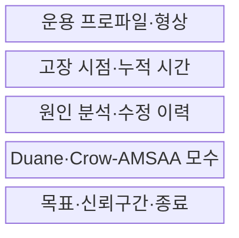
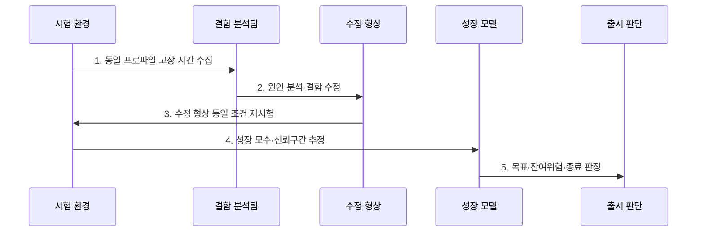

---
sidebar:
  order: 25
  label: "025. 신뢰성 성장 모델 (Reliability Growth Model)"
  badge:
    text: "기출 · 30%"
    variant: note
title: "신뢰성 성장 모델 (Reliability Growth Model)"
date: "2026-07-30T23:30:00+09:00"
tags:
  - "notes-evaluation"
weight: 25
extra:
  question_no: "025"
  source_status: "기출"
  source_history: "122회"
  priority: 30
  priority_note: "과거 기출이나 반복 가능성이 낮은 신뢰성 모형"
---

## 미리 알고가기

- **신뢰성 성장(Reliability Growth)**: 시험에서 발견한 결함을 제거하며 시스템 고장 발생 특성이 개선되는 현상
- **신뢰성 성장 모델(Reliability Growth Model)**: 누적 시험 시간과 고장 기록으로 신뢰성 개선 추세를 추정하는 모델
- **TAAF(Test, Analyze, and Fix, 태프)**: 머리글자를 한 단어처럼 읽으며, 시험·분석·수정·재검증을 반복하는 절차
- **평균 고장 간격(Mean Time Between Failures, MTBF)**: 수리 가능한 시스템에서 한 고장부터 다음 고장까지의 평균 운전 시간이다.
- **고장 강도(Failure Intensity)**: 단위 운전 시간에 발생할 것으로 기대하는 고장 수
- **운용 프로파일(Operational Profile)**: 실제 사용 환경에서 기능·입력·부하가 나타나는 빈도 분포
- **Duane 모델**: 누적 운전 시간과 누적 MTBF의 로그 관계로 성장 추세를 경험적으로 보는 모델
- **Crow-AMSAA 모델**: 누적 시간의 고장 발생 과정을 NHPP로 표현해 성장 추세를 통계적으로 추정하는 모델
- **NHPP(Non-Homogeneous Poisson Process, 엔에이치피피)**: 시간에 따라 사건 발생률이 달라지는 비동질 포아송 과정
- **형상 모수 β(Beta, 베타)**: 그리스 문자로 형상 모수를 표기하며, Crow-AMSAA 누적 고장 추세의 방향을 결정
- **β<1**: Crow-AMSAA 모델에서 고장 강도가 감소하는 성장 상태
- **β=1**: Crow-AMSAA 모델에서 고장 강도가 일정한 상태
- **β>1**: Crow-AMSAA 모델에서 고장 강도가 증가하는 악화 상태
- **신뢰구간(Confidence Interval)**: 추정한 모수가 포함될 것으로 기대하는 통계적 범위
- **형상 기준선(Configuration Baseline)**: 시험 결과를 비교하도록 기능·코드·환경 버전을 고정한 기준
- **IEC 61164:2004**: 신뢰성 성장의 통계적 시험·추정 방법을 규정한 국제표준이다.
- **IEC 61014:2003**: 신뢰성 성장 프로그램의 요구사항과 지침을 제시한 국제표준이다.

## Ⅰ. 개요

- 정의: 결함 수정에 따른 **고장 강도·MTBF 개선 추정**
- 목적: 수정 효과와 **시험 계속·종료 시점 판단**

### 쉽게 이해하기 (학습)

- 시험 시간이 길어져서가 아니라 발견한 결함을 고친 결과로 고장 간격이 실제로 늘어나는지를 추세로 확인한다.

## Ⅱ. 특징

- TAAF 반복의 **고장 강도 감소 추정**
- 형상·운용 프로파일의 **비교 조건 통제**
- 모수·신뢰구간의 **불확실성 판정**

### 쉽게 이해하기 (학습)

- 새 기능이나 시험 부하가 크게 바뀌면 고장 데이터의 조건이 달라지므로 이전 성장 곡선과 섞으면 개선 여부를 잘못 판단할 수 있다.

## Ⅲ. 구조 및 구성요소

| 구성요소 | 책임 |
|:---|:---|
| 운용 프로파일·형상 | 부하·기능·버전 기준 |
| 고장 시점·누적 시간 | 사건·운전시간·중단 |
| 원인 분석·수정 이력 | TAAF·변경 구간 |
| Duane·Crow-AMSAA 모수 | 성장률·형상모수 $\beta$ |
| 목표·신뢰구간·종료 | MTBF·강도·잔여위험 |

### 쉽게 이해하기 (학습)

- 같은 조건에서 고장 시점을 모으고 원인을 고친 이력을 성장 모델에 함께 넣어 목표 신뢰성에 도달했는지 판단한다.

## Ⅳ. 흐름도

### 동작 원리

1. **동일 프로파일 고장·시간 수집**: 형상·부하·사건 기준 고정
2. **원인 분석·결함 수정**: 재발 원인·변경 이력 기록
3. **수정 형상 동일 조건 재시험**: 수정 효과·회귀 확인
4. **성장 모수·신뢰구간 추정**: $\beta$·MTBF·강도 계산
5. **목표·잔여위험·종료 판정**: 출시·계속시험 결정

> 요약: 결함을 고친 뒤 고장 추세가 개선됐는지 판정한다.

### 쉽게 이해하기 (학습)

- 고장을 기록하고 원인을 고친 뒤 같은 조건에서 다시 시험해 고장 간격이 목표만큼 늘어났는지 확인한다.

## Ⅴ. 종류 및 비교

| 성장 모델 | Duane 모델 | Crow-AMSAA 모델 |
|:---|:---|:---|
| 적용 기준 | 빠른 시각적 성장 경향 확인 | 모수·신뢰구간의 통계 분석 |
| 핵심 특징 | 누적 MTBF의 경험적 성장 추세 | NHPP로 누적 고장 과정 추정 |
| 한계 | 불확실성·적합성 해석 부족 | 모형 가정 위반·구간 혼합 |

### 쉽게 이해하기 (학습)

- Duane은 누적 그래프로 성장 방향을 빠르게 보고 Crow-AMSAA는 고장 발생 과정의 모수와 불확실성을 더 엄밀하게 추정한다.

## Ⅵ. 실무 고려사항 및 대책

| 고려사항 | 대책 | 효과 |
|:---|:---|:---|
| 통계적 성장 시험 | **IEC 61164:2004 적용** | 모수·적합도 근거 확보 |
| 성장 프로그램 운영 | **IEC 61014:2003 적용** | TAAF 역할·절차 정렬 |
| 형상·프로파일 혼합 | **기준선·변경 구간 분리** | 거짓 성장 방지 |

### 쉽게 이해하기 (학습)

- 고장 원인을 수정한 뒤 같은 조건에서 재시험해 고장률이 실제로 감소하는지 확인한다.

## Ⅶ. 결론

- **고장추세·수정효과·적합도·신뢰구간·잔여위험**으로 종료를 결정한다.

### 쉽게 이해하기 (학습)

- 신뢰성 성장 모델은 버그 수가 줄었다는 인상이 아니라 같은 조건에서 수정 뒤 고장 강도가 목표 수준으로 감소했음을 판단하는 도구다.
