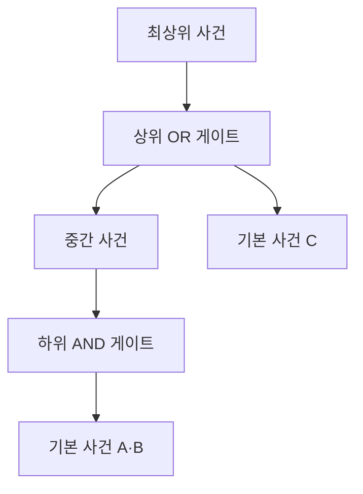
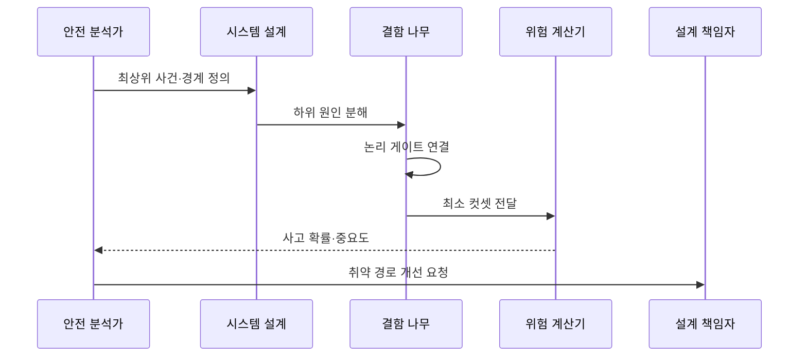

---
sidebar:
  order: 26
  label: "026. FTA 결함 나무 분석 (Fault Tree Analysis)"
  badge:
    text: "기출 · 30%"
    variant: note
title: "FTA 결함 나무 분석 (Fault Tree Analysis)"
date: "2026-07-27T23:59:59+09:00"
tags:
  - "notes-evaluation"
weight: 26
extra:
  question_no: "026"
  source_status: "기출"
  source_history: "128회"
  priority: 30
  priority_note: "원인 조합을 역추적하는 위험 분석 기출법"
---

## 미리 알고가기

- **결함수 분석(Fault Tree Analysis, FTA)**: 최상위 사고를 논리 게이트로 연결된 원인 사건의 조합으로 분해하는 하향식 분석 기법이다.
- **최상위 사건(Top Event)**: FTA가 원인을 밝히려는 시스템 수준의 사고나 고장
- **중간 사건(Intermediate Event)**: 여러 하위 원인의 논리 조합으로 발생하는 중간 결과
- **기본 사건(Basic Event)**: 분석 범위에서 더 분해하지 않는 최하위 원인
- **AND 게이트**: 모든 입력 사건이 함께 발생해야 출력 사건이 발생하는 논리 관계
- **OR 게이트**: 입력 사건 중 하나 이상이 발생하면 출력 사건이 발생하는 논리 관계
- **컷셋(Cut Set)**: 최상위 사건을 발생시키기에 충분한 기본 사건의 조합
- **최소 컷셋(Minimal Cut Set)**: 구성 사건을 하나라도 빼면 최상위 사건이 발생하지 않는 최소 원인 조합
- **정성 분석(Qualitative Analysis)**: 최소 컷셋과 구조적 취약 경로를 식별하는 분석
- **정량 분석(Quantitative Analysis)**: 기본 사건 확률로 최상위 사건의 발생 가능성을 계산하는 분석
- **독립 사건(Independent Event)**: 한 사건의 발생이 다른 사건의 발생 가능성에 영향을 주지 않는 사건
- **공통 원인 고장(Common-Cause Failure)**: 여러 구성요소가 같은 원인을 공유해 동시에 고장 나는 현상
- **고장 형태 및 영향 분석(Failure Mode and Effects Analysis, FMEA)**: 개별 구성요소의 고장 모드에서 출발하여 시스템 영향을 분석하는 상향식 기법이다.

## Ⅰ. 개요

- 정의/개념: 사고 결과에서 원인 조합을 하향 분석
- 기존 한계: 단일 고장 목록은 복합 원인 조합 파악 곤란
- 기존 한계: 개별 고장만 나열하면 여러 원인이 결합하여 최상위 사고를 일으키는 경로와 핵심 원인 조합을 식별하기 어렵다.

### 쉽게 이해하기 (학습용)

- 막아야 할 큰 사고를 맨 위에 두고 어떤 작은 고장들이 하나씩 또는 함께 일어나야 그 사고가 되는지 나무로 푼다.

## Ⅱ. 특징

- 최상위 사건에서 기본 사건으로 하향식 분해한다.
- AND·OR 게이트로 복합 원인 조합을 표현한다.
- 최소 컷셋과 기본 사건 확률로 취약 경로를 평가한다.

### 쉽게 이해하기 (학습용)

- 두 장비가 같은 전원을 쓰는데 서로 독립이라고 계산하면 동시 고장 가능성을 지나치게 낮게 보므로 공통 원인을 따로 반영해야 한다.

## Ⅲ. 아키텍처 및 구성요소

| 설계 요소 | 설명 |
|:---|:---|
| 최상위 사건 | 분석할 시스템 사고와 경계 정의 |
| 상위 OR 게이트 | 중간 사건 또는 C의 발생을 연결 |
| 중간 사건 | 하위 원인 조합의 결과 |
| 기본 사건 C | 단독으로 최상위 사건을 유발 |
| 하위 AND 게이트 | A와 B의 동시 발생을 연결 |
| 기본 사건 A·B | 함께 사고를 만드는 최소 원인 |

### 쉽게 이해하기 (학습용)

- 예시 트리의 최소 컷셋은 C 하나와 A·B 조합이므로 C를 막거나 A와 B 중 하나의 경로를 끊으면 최상위 사고를 방지할 수 있다.

## Ⅳ. 원리 및 절차 흐름도

| 절차 | 설명 |
|:---|:---|
| 최상위 사건·경계 정의 | 사고 상태와 분석 범위 명시 |
| 하위 원인 분해 | 기능·부품 원인을 기본 사건까지 탐색 |
| 논리 게이트 연결 | 동시·선택 발생 관계를 표현 |
| 최소 컷셋 전달 | 사고에 충분한 최소 조합 도출 |
| 사고 확률·중요도 | 의존성을 반영해 위험 계산 |
| 취약 경로 개선 요청 | 고위험 컷셋을 제거·완화 |

> 요약: 사고를 원인 조합으로 분해해 최소 경로를 통제한다.

### 쉽게 이해하기 (학습용)

- 큰 사고를 작은 원인까지 내려가며 분해한 뒤 사고를 일으키는 가장 짧은 조합을 찾아 그 경로부터 설계를 보강한다.

## Ⅴ. 종류 및 비교

| 판단 기준 | FTA | FMEA |
|:---|:---|:---|
| 적용 기준 | 복합 사고 경로·확률을 분석할 때 | 부품별 고장 영향과 예방을 점검할 때 |
| 핵심 특징 | 사고 결과에서 원인 조합 분석 | 고장 모드에서 영향 분석 |
| 한계 | 트리 경계·독립성 가정 오류 | 복합 원인 상호작용 누락 |

### 쉽게 이해하기 (학습용)

- FTA는 사고가 왜 생기는지 위에서 아래로 파고들고 FMEA는 각 부품이 고장 나면 무엇이 생기는지 아래에서 위로 살핀다.

## Ⅵ. 실무 사례

1. 항공기 제어 상실은 **최소 컷셋**으로 원인 분석

### 쉽게 이해하기 (학습용)

- 센서·연산·전원·통신 고장 중 제어 상실을 일으키는 최소 조합을 찾아 우선 제거한다.

## Ⅶ. 결론

- 중대 사고를 유발하는 원인 조합을 제거하기 위해 **최상위 사건·논리 게이트·최소 컷셋·공통 원인**을 검토하고, 하향식 위험 분석에 FTA를 활용해야 한다.

### 쉽게 이해하기 (학습용)

- FTA의 목적은 나무를 그리는 데 있지 않고 사고를 만들기에 충분한 최소 원인 조합을 찾아 설계에서 끊는 데 있다.
