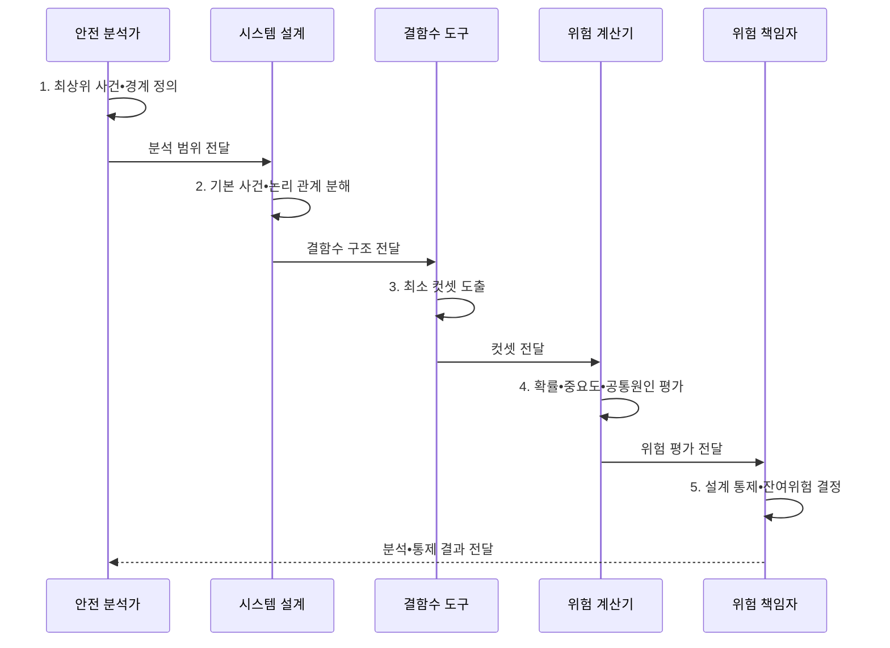

---
sidebar:
  order: 26
  label: "026. FTA 결함 나무 분석 (Fault Tree Analysis)"
  badge:
    text: "기출 • 30%"
    variant: note
title: "FTA 결함 나무 분석 (Fault Tree Analysis)"
date: "2026-08-05T01:54:30+09:00"
tags:
  - "notes-evaluation"
weight: 26
extra:
  question_no: "026"
  source_status: "기출"
  source_history: "128회"
  priority: 30
  priority_note: "원인 조합을 역추적하는 위험 분석 기출법"
---

## Ⅰ. 개요

<details><summary>핵심 용어</summary>

- **결함수 분석(Fault Tree Analysis, FTA)**: 원하지 않는 최상위 사건에서 출발하여 그 원인 사건 조합을 논리 게이트로 분해하는 하향식 연역 분석이다.
- **최상위 사건**: FTA가 발생 원인과 가능성을 밝히려는 시스템 수준의 사고나 고장이다.

</details>

- 정의/개념: 최상위 사고를 원인 조합으로 분해하는 **연역 분석**
- 배경/필요성: 단일 원인 목록만으로는 **복합 사고 최소 조합 식별 불가**

#### 한줄 요약

- 막아야 할 큰 사고를 맨 위에 두고 어떤 작은 고장들이 하나씩 또는 함께 일어나야 그 사고가 되는지 나무로 푼다.

## Ⅱ. 특징

<details><summary>핵심 용어</summary>

- **하향식 분석**: 시스템 결과에서 시작하여 그 결과가 발생하는 하위 원인 조합으로 내려가는 분석 방향이다.
- **정성•정량 분석**: 최소 컷셋으로 취약 구조를 찾고 기본 사건 확률로 최상위 사건 가능성을 계산하는 두 분석 단계이다.
- **공통 원인 반영**: 여러 기본 사건이 같은 원인으로 함께 발생할 수 있음을 논리와 확률 계산에 포함하는 조치이다.

</details>

- 최상위 사건의 **하향식 원인 분해**
- AND•OR 게이트의 **복합 원인 논리**
- 최소 컷셋•중요도의 **정성•정량 평가**

#### 한줄 요약

- 두 장비가 같은 전원을 쓰는데 서로 독립이라고 계산하면 동시 고장 가능성을 지나치게 낮게 보므로 공통 원인을 따로 반영해야 한다.

## Ⅲ. 구조 및 구성요소

<details><summary>핵심 용어</summary>

- **기본 사건**: 분석 범위에서 더 분해하지 않는 최하위 원인 사건이다.
- **논리곱(AND) 게이트**: 모든 입력 사건이 함께 발생해야 출력 사건이 발생하는 논리 관계이다.
- **논리합(OR) 게이트**: 입력 사건 중 하나 이상이 발생하면 출력 사건이 발생하는 논리 관계이다.
- **중간 사건**: 하위 기본 사건과 논리 게이트의 조합으로 발생하는 중간 수준의 고장 상태이다.

</details>

```text
              [최상위 사건•경계]
                       |
          [AND•OR 논리 게이트]---[중간 사건]
                       |                |
             [기본 사건•공통원인]---[최소 컷셋•사고 확률]
```

선의 의미: 최상위 사건 경계 아래 논리 게이트, 중간 사건, 기본 사건•공통원인, 최소 컷셋이 계층적으로 결합되는 결함 나무 구조를 나타낸다.

| 구성요소 | 책임 |
|:---|:---|
| **최상위 사건•경계** | 사고 상태•범위•**가정 정의** |
| **AND•OR 논리 게이트** | 동시•선택 **원인 관계 표현** |
| **중간 사건** | 하위 조합의 **중간 결과 표현** |
| **기본 사건•공통원인** | 최하위 원인•**의존성 식별** |
| **최소 컷셋•사고 확률** | 최소 조합•**중요도•가능성 산출** |

#### 한줄 요약

- 예시 트리의 최소 컷셋은 C 하나와 A•B 조합이므로 C를 막거나 A와 B 중 하나의 경로를 끊으면 최상위 사고를 방지할 수 있다.

## Ⅳ. 흐름도

<details><summary>핵심 용어</summary>

- **컷셋**: 최상위 사건을 발생시키기에 충분한 기본 사건의 조합이다.
- **최소 컷셋**: 구성 사건을 하나라도 빼면 최상위 사건이 발생하지 않는 최소 원인 조합이다.
- **중요도 평가**: 기본 사건이나 최소 컷셋이 최상위 사건 확률에 미치는 영향을 비교하는 분석이다.

</details>



**동작 원리**

1. **최상위 사건•경계 정의**: 사고 상태•범위•가정 확정
2. **기본 사건•논리 관계 분해**: 원인•AND•OR 구조화
3. **최소 컷셋 도출**: 충분한 최소 원인조합 계산
4. **확률•중요도•공통원인 평가**: 의존성•민감도 반영
5. **설계 통제•잔여위험 결정**: 경로 차단•재평가

#### 한줄 요약

- 큰 사고를 작은 원인까지 내려가며 분해한 뒤 사고를 일으키는 가장 짧은 조합과 영향이 큰 원인을 찾는다.

## Ⅴ. 종류 및 비교

<details><summary>핵심 용어</summary>

- **FTA 적용**: 복합 사고의 원인 조합과 발생 확률을 하향식으로 분석하는 방법이다.
- **고장 형태 및 영향 분석(Failure Mode and Effects Analysis, FMEA)**: 개별 구성요소의 고장 모드에서 출발하여 상위 시스템 영향을 추적하는 상향식 분석이다.

</details>

| 위험 분석법 | FTA | FMEA |
|:---|:---|:---|
| **적용 기준** | 복합 사고 **경로•확률 분석** | 부품별 **고장 영향•예방 점검** |
| **핵심 특징** | 사고 결과에서 **원인 조합 분석** | 고장 모드에서 **영향 분석** |
| **한계** | **트리 경계•독립성 가정 오류** | **복합 원인 상호작용 누락** |

#### 한줄 요약

- FTA는 사고가 왜 생기는지 위에서 아래로 파고들고 FMEA는 각 부품이 고장 나면 무엇이 생기는지 아래에서 위로 살핀다.

## Ⅵ. 실무 고려사항 및 대책

<details><summary>핵심 용어</summary>

- **독립 사건 가정**: 한 기본 사건의 발생이 다른 사건의 발생 가능성에 영향을 주지 않는다고 보는 계산 가정이다.
- **공통 원인 고장**: 여러 기본 사건이 같은 환경•전원•설계 원인 때문에 동시에 발생하는 현상이다.
- **분석 경계**: 외부 사건•운영자 조치•소프트웨어 고장을 어디까지 결함수에 포함할지 정한 범위이다.
- **조건부 확률**: 한 사건의 발생 여부가 다른 사건의 발생 가능성을 바꾸는 의존 관계를 반영한 확률이다.
- **국제전기기술위원회 61025(International Electrotechnical Commission 61025, IEC 61025)**: FTA의 기호•절차•정성•정량 분석 지침을 규정한 국제표준이다.

</details>

| 문제 | 대책 | 효과 |
|:---|:---|:---|
| **분석 절차•논리 표기** | **IEC 61025:2006 적용** | 모델 **일관성•검증성** 확보 |
| **사건 독립성 과신** | **공통원인•조건부확률 반영** | **사고확률 과소평가** 방지 |
| **거대 트리•누락** | **모듈화•경계•검토 이력 관리** | **추적성•유지보수성** 향상 |

#### 한줄 요약

- 센서•연산•전원•통신 고장 중 제어 상실을 일으키는 최소 조합을 찾아 우선 제거한다.

## Ⅶ. 결론

<details><summary>핵심 용어</summary>

- **위험 감소 우선순위**: 빈도와 컷셋 구조를 함께 보아 최상위 사건 확률을 가장 크게 낮추는 기본 사건부터 개선하는 순서이다.
- **개선 순위 결정**: 확률과 중요도가 높은 최소 컷셋의 경로를 먼저 차단하고 공통 원인을 분리하는 판단이다.

</details>

- 확률•중요도 높은 **최소 컷셋**부터 경로 차단, **공통원인** 분리

#### 한줄 요약

- FTA의 목적은 나무를 그리는 데 있지 않고 사고를 만들기에 충분한 최소 원인 조합을 찾아 설계에서 끊는 데 있다.
