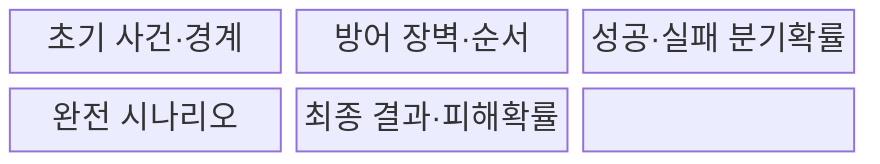
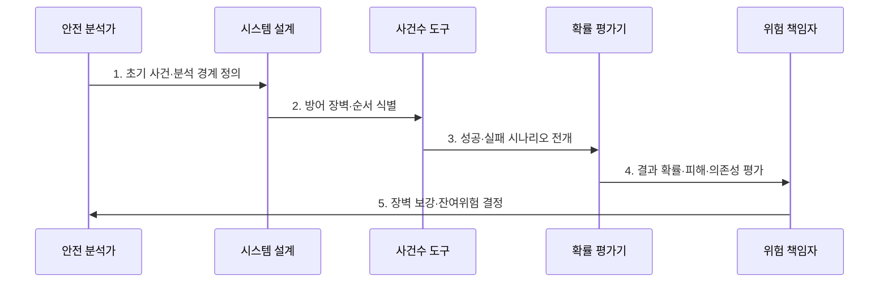

---
sidebar:
  order: 27
  label: "027. ETA 이벤트 나무 분석 (Event Tree Analysis)"
  badge:
    text: "기출 · 30%"
    variant: note
title: "ETA 이벤트 나무 분석 (Event Tree Analysis)"
date: "2026-07-30T19:30:00+09:00"
tags:
  - "notes-evaluation"
weight: 27
extra:
  question_no: "027"
  source_status: "기출"
  source_history: "128회"
  priority: 30
  priority_note: "초기 사건의 결과 경로를 전개하는 보조 분석법"
---

## 미리 알고가기

- **사건수 분석(Event Tree Analysis, ETA)**: 초기 사건 이후 안전 장벽의 성공·실패 조합을 순방향으로 전개하여 사고 결과와 확률을 분석하는 기법이다.
- **초기 사건(Initiating Event)**: 이벤트 나무의 출발점이 되는 고장·누출·화재 같은 사건
- **방어 장벽(Barrier)**: 사고의 진행을 감지·차단·완화·복구하는 장치나 절차
- **분기(Branch)**: 각 방어 장벽의 성공과 실패에 따라 나뉘는 시나리오 경로
- **최종 결과(Consequence)**: 분기 경로 끝에 도달한 정상 복구·제한 피해·대형 사고 등의 상태
- **시나리오(Scenario)**: 초기 사건과 장벽 결과가 이어진 하나의 완전한 사고 전개 경로
- **분기 확률(Branch Probability)**: 특정 방어 장벽이 성공하거나 실패할 가능성
- **결과 확률(Consequence Probability)**: 초기 사건 확률과 경로의 분기 확률을 결합한 최종 상태의 가능성
- **조건부 확률(Conditional Probability)**: 앞 사건이나 장벽 결과가 주어진 상태에서 다음 사건이 발생할 확률
- **독립성 가정(Independence Assumption)**: 한 장벽의 성공·실패가 다른 장벽 확률에 영향을 주지 않는다는 가정
- **공통 원인 고장(Common-Cause Failure)**: 여러 방어 장벽이 같은 원인을 공유해 동시에 고장 나는 현상
- **FTA(Fault Tree Analysis, 에프티에이)**: 최상위 사건에서 원인 조합을 역방향으로 분해하는 하향식 분석
- **IEC 62502:2010**: 사건수 분석의 절차·표현·정성·정량 평가 지침을 규정한 국제표준이다.

## Ⅰ. 개요

- 정의/개념: 초기 사건 뒤 **장벽 성공·실패 결과를 순방향 전개**
- 배경/필요성: 사고 확산 경로와 **피해·완화 효과 정량화**

### 쉽게 이해하기 (학습용)

- 사고가 시작된 뒤 감지기와 차단 밸브가 차례로 성공하거나 실패할 때 최종 피해가 어떻게 달라지는지 가지로 펼쳐 본다.

## Ⅱ. 특징

- 초기 사건의 **순방향 결과 전개**
- 장벽 순서·성공·실패의 **시나리오 분기**
- 조건부 확률의 **결과 위험 정량화**

### 쉽게 이해하기 (학습용)

- 같은 전원을 쓰는 감지기와 차단기가 함께 꺼질 수 있는데 독립 장벽처럼 곱하면 대형 사고 확률을 지나치게 낮게 계산한다.

## Ⅲ. 구조 및 구성요소

| 구성요소 | 책임 |
|:---|:---|
| 초기 사건·경계 | 출발 사건·분석 범위 |
| 방어 장벽·순서 | 감지·차단·완화·복구 |
| 성공·실패 분기확률 | 조건부확률·의존성 |
| 완전 시나리오 | 초기부터 결과까지 경로 |
| 최종 결과·피해확률 | 상태·빈도·영향 |

### 쉽게 이해하기 (학습용)

- 초기 사고에서 감지와 차단 장벽의 성공·실패를 순서대로 따라가면 각 조합이 정상 복구인지 제한 피해인지 대형 사고인지 드러난다.

## Ⅳ. 흐름도

- **1. 초기 사건·분석 경계 정의**: 출발 사건·범위 확정
- **2. 방어 장벽·순서 식별**: 감지·차단·완화 배열
- **3. 성공·실패 시나리오 전개**: 조건부 분기·완전경로 생성
- **4. 결과 확률·피해·의존성 평가**: 공통원인·영향 결합
- **5. 장벽 보강·잔여위험 결정**: 취약경로 차단·재평가

### 쉽게 이해하기 (학습용)

- 사고가 난 조건에서 안전 장치가 실제 작동하는 순서를 따라 모든 결과 경로와 피해 가능성을 계산한다.

## Ⅴ. 종류 및 비교

| 위험 분석법 | ETA | FTA |
|:---|:---|:---|
| 적용 기준 | 장벽 성공·실패와 피해를 분석할 때 | 복합 원인 조합과 컷셋을 찾을 때 |
| 핵심 특징 | 초기 사건에서 결과 순방향 전개 | 최상위 사고에서 원인 역방향 분해 |
| 한계 | 분기 폭증·장벽 의존성 누락 | 트리 경계·사건 독립성 오류 |

### 쉽게 이해하기 (학습용)

- ETA는 사고가 시작되면 어디까지 번지는지 앞으로 보고 FTA는 이미 정한 큰 사고가 무엇 때문에 생기는지 뒤로 추적한다.

## Ⅵ. 실무 고려사항 및 대책

| 고려사항 | 대책 | 효과 |
|:---|:---|:---|
| 분석 절차·표현 | **IEC 62502:2010 적용** | 시나리오 재현성 확보 |
| 장벽 독립성 과신 | **공통원인·조건부확률 반영** | 결과위험 과소평가 방지 |
| 분기 폭증·희귀경로 | **중요 결과 중심 가지치기** | 분석 집중도 향상 |

### 쉽게 이해하기 (학습용)

- 사례 1은 가스 누출 뒤 감지기·밸브·소화 설비의 성공 조합마다 화재와 폭발 피해가 어떻게 달라지는지 계산한다.

## Ⅶ. 결론

- **초기사건·장벽순서·조건부확률·피해·의존성**으로 보강을 결정한다.

### 쉽게 이해하기 (학습용)

- ETA의 목적은 가지 수를 늘리는 것이 아니라 사고가 큰 피해로 진행되는 실제 경로와 그 경로를 끊을 방어 장벽을 찾는 것이다.
