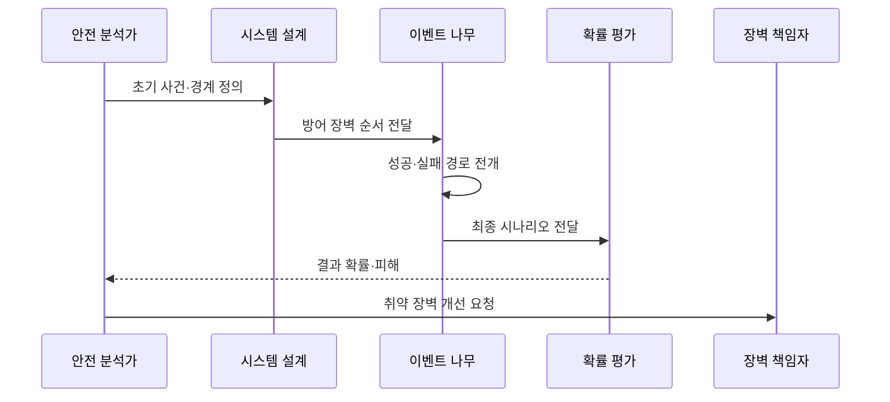

---
sidebar:
  order: 27
  label: "027. ETA 이벤트 나무 분석 (Event Tree Analysis)"
  badge:
    text: "기출 · 30%"
    variant: note
title: "ETA 이벤트 나무 분석 (Event Tree Analysis)"
date: "2026-07-27T23:59:59+09:00"
tags:
  - "notes-evaluation"
weight: 27
extra:
  question_no: "027"
  source_status: "기출"
  source_history: "128회"
  priority: 30
  priority_note: "초기 사건의 결과 경로를 전개하는 보조 분석법"
---

## 미리 알고가기

- **ETA(Event Tree Analysis, 이티에이)**: 영문 머리글자를 딴 명칭으로, 초기 사건 뒤 장벽의 성공·실패 결과를 순방향 전개
- **초기 사건(Initiating Event)**: 이벤트 나무의 출발점이 되는 고장·누출·화재 같은 사건
- **방어 장벽(Barrier)**: 사고의 진행을 감지·차단·완화·복구하는 장치나 절차
- **분기(Branch)**: 각 방어 장벽의 성공과 실패에 따라 나뉘는 시나리오 경로
- **최종 결과(Consequence)**: 분기 경로 끝에 도달한 정상 복구·제한 피해·대형 사고 등의 상태
- **시나리오(Scenario)**: 초기 사건과 장벽 결과가 이어진 하나의 완전한 사고 전개 경로
- **분기 확률(Branch Probability)**: 특정 방어 장벽이 성공하거나 실패할 가능성
- **결과 확률(Consequence Probability)**: 초기 사건 확률과 경로의 분기 확률을 결합한 최종 상태의 가능성
- **조건부 확률(Conditional Probability)**: 앞 사건이나 장벽 결과가 주어진 상태에서 다음 사건이 발생할 확률
- **독립성 가정(Independence Assumption)**: 한 장벽의 성공·실패가 다른 장벽 확률에 영향을 주지 않는다는 가정
- **공통 원인 고장(Common-Cause Failure)**: 여러 방어 장벽이 같은 원인을 공유해 동시에 고장 나는 현상
- **FTA(Fault Tree Analysis, 에프티에이)**: 최상위 사건에서 원인 조합을 역방향으로 분해하는 하향식 분석

## Ⅰ. 개요

- **정의/개념**: 초기 사건 뒤 장벽 결과를 순방향으로 전개한다
- **기존 한계**: 원인 분석만으로 사고 후 장벽별 결과 예측 곤란
- **배경/필요성**: 사고 전개 경로와 취약 장벽의 정량 평가

### 쉽게 이해하기 (학습용)

- 사고가 시작된 뒤 감지기와 차단 밸브가 차례로 성공하거나 실패할 때 최종 피해가 어떻게 달라지는지 가지로 펼쳐 본다.

## Ⅱ. 특징

- 초기 사건에서 최종 결과까지 순방향으로 전개한다
- 장벽의 순서와 성공·실패가 시나리오를 분기한다
- 초기 사건·조건부 분기 확률로 결과 확률을 계산한다

### 쉽게 이해하기 (학습용)

- 같은 전원을 쓰는 감지기와 차단기가 함께 꺼질 수 있는데 독립 장벽처럼 곱하면 대형 사고 확률을 지나치게 낮게 계산한다.

## Ⅲ. 아키텍처 및 구성요소

| 설계 요소 | 설명 |
|:---|:---|
| 초기 사건 | 분석 출발점과 시나리오 경계 정의 |
| 감지 장벽 | 사고 인지의 성공·실패 분기 |
| 차단 장벽 | 사고 확산 억제의 성공·실패 분기 |
| 최종 결과 | 경로별 피해 상태와 확률 표시 |

> 요약: 초기 사건과 장벽 분기로 최종 결과를 구성한다

### 쉽게 이해하기 (학습용)

- 초기 사고에서 감지와 차단 장벽의 성공·실패를 순서대로 따라가면 각 조합이 정상 복구인지 제한 피해인지 대형 사고인지 드러난다.

## Ⅳ. 원리 및 절차 흐름도

| 절차 | 설명 |
|:---|:---|
| 초기 사건·경계 정의 | 출발 사건과 분석 범위 확정 |
| 방어 장벽 순서 전달 | 감지·차단·완화 순서 배열 |
| 성공·실패 경로 전개 | 장벽별 조건부 분기 생성 |
| 최종 시나리오 전달 | 완전한 경로와 결과 상태 분류 |
| 결과 확률·피해 | 분기 확률과 결과 영향을 결합 |
| 취약 장벽 개선 요청 | 고위험 경로의 장벽을 보강 |

> 요약: 초기 사건 뒤 장벽 분기로 최종 피해를 계산한다.

### 쉽게 이해하기 (학습용)

- 사고가 난 조건에서 안전 장치가 실제 작동하는 순서를 따라 모든 결과 경로를 만들고 피해 가능성이 큰 경로의 약한 장벽부터 고친다.

## Ⅴ. 종류 및 비교

| 판단 기준 | ETA | FTA |
|:---|:---|:---|
| 적용 기준 | 장벽 성공·실패와 피해를 분석할 때 | 복합 원인 조합과 컷셋을 찾을 때 |
| 핵심 특징 | 초기 사건에서 결과 순방향 전개 | 최상위 사고에서 원인 역방향 분해 |
| 한계 | 분기 폭증·장벽 의존성 누락 | 트리 경계·사건 독립성 오류 |

> 요약: ETA는 결과를 전개하고 FTA는 원인을 분해한다

### 쉽게 이해하기 (학습용)

- ETA는 사고가 시작되면 어디까지 번지는지 앞으로 보고 FTA는 이미 정한 큰 사고가 무엇 때문에 생기는지 뒤로 추적한다.

## Ⅵ. 실무 사례

1. 가스 누출 뒤 감지·차단·소화 경로를 분석한다
2. 훈련 실적으로 장벽 성공 확률을 보정한다
3. 공통 전원 장벽의 동시 실패를 반영한다
4. 대형 피해 경로의 차단 장벽을 이중화한다

### 쉽게 이해하기 (학습용)

- 사례 1은 가스 누출 뒤 감지기·밸브·소화 설비의 성공 조합마다 화재와 폭발 피해가 어떻게 달라지는지 계산한다.
- 사례 2는 설계 명세의 이상적 신뢰도 대신 실제 훈련에서 장비와 사람이 성공한 비율을 사용한다.
- 사례 3은 감지기와 차단 밸브가 같은 전원 장애로 함께 실패하는 경로를 독립 확률로 과소평가하지 않는다.
- 사례 4는 결과 확률과 피해가 큰 경로를 만드는 단일 장벽에 독립된 대체 수단을 추가한다.

## Ⅶ. 결론

- 초기 사고 뒤 고위험 결과 경로의 취약 장벽을 보강한다.

### 쉽게 이해하기 (학습용)

- ETA의 목적은 가지 수를 늘리는 것이 아니라 사고가 큰 피해로 진행되는 실제 경로와 그 경로를 끊을 방어 장벽을 찾는 것이다.
