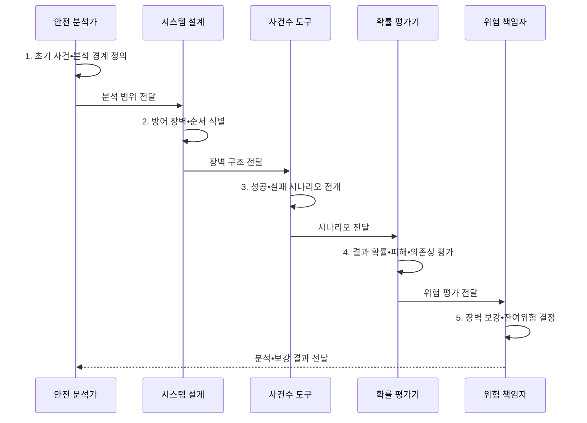

---
sidebar:
  order: 27
  label: "027. ETA 이벤트 나무 분석 (Event Tree Analysis)"
  badge:
    text: "기출 • 30%"
    variant: note
title: "ETA 이벤트 나무 분석 (Event Tree Analysis)"
date: "2026-08-04T14:45:49+09:00"
tags:
  - "notes-evaluation"
weight: 27
extra:
  question_no: "027"
  source_status: "기출"
  source_history: "128회"
  priority: 30
  priority_note: "초기 사건의 결과 경로를 전개하는 보조 분석법"
---

## Ⅰ. 개요

핵심 용어

- **사건수 분석(Event Tree Analysis, ETA)**: 초기 사건 이후 방어 장벽의 성공•실패 조합을 순방향으로 전개하여 결과 시나리오와 확률을 분석하는 기법이다.
- **초기 사건**: 사건수의 출발점이 되는 고장•누출•화재 같은 사건이다.

- 정의/개념: 초기 사건 뒤 **장벽 성공•실패 결과를 순방향 전개**
- 배경/필요성: 단일 사고 확률만으로는 **장벽 조합별 피해 경로 판단 불가**

#### 한줄 요약

- 사고가 시작된 뒤 감지기와 차단 밸브가 차례로 성공하거나 실패할 때 최종 피해가 어떻게 달라지는지 가지로 펼쳐 본다.

## Ⅱ. 특징

핵심 용어

- **순방향 귀납 분석**: 하나의 시작 사건에서 후속 장벽의 결과를 따라 가능한 최종 상태로 나아가는 분석 방향이다.
- **조건부 확률**: 앞 사건이나 장벽 결과가 주어진 상태에서 다음 사건이 발생할 확률이다.
- **장벽 의존성**: 앞 장벽의 결과나 공통 전원•제어 원인이 다음 장벽의 성공 가능성에 영향을 주는 관계이다.

- 초기 사건의 **순방향 결과 전개**
- 장벽 순서•성공•실패의 **시나리오 분기**
- 조건부 확률의 **결과 위험 정량화**

#### 한줄 요약

- 같은 전원을 쓰는 감지기와 차단기가 함께 꺼질 수 있는데 독립 장벽처럼 곱하면 대형 사고 확률을 지나치게 낮게 계산한다.

## Ⅲ. 구조 및 구성요소

핵심 용어

- **방어 장벽**: 사고 진행을 감지•차단•완화•복구하는 장치나 절차이다.
- **분기**: 각 방어 장벽의 성공과 실패에 따라 나뉘는 시나리오 경로이다.
- **최종 결과**: 분기 경로 끝에 도달한 정상 복구•제한 피해•대형 사고 등의 상태이다.
- **완전 시나리오**: 초기 사건부터 모든 장벽 분기를 거쳐 하나의 최종 결과에 도달하는 전체 경로이다.

| 구성요소 | 책임 |
|:---|:---|
| **초기 사건•경계** | 출발 사건•**분석 범위** |
| **방어 장벽•순서** | **감지•차단•완화•복구** |
| **성공•실패 분기확률** | **조건부확률•의존성** |
| **완전 시나리오** | 초기부터 결과까지 **경로** |
| **최종 결과•피해확률** | 상태•빈도•**영향** |

#### 한줄 요약

- 초기 사고에서 감지와 차단 장벽의 성공•실패를 순서대로 따라가면 각 조합이 정상 복구인지 제한 피해인지 대형 사고인지 드러난다.

## Ⅳ. 흐름도

핵심 용어

- **시나리오**: 초기 사건과 각 장벽의 성공•실패 결과가 이어진 하나의 완전한 사고 전개 경로이다.
- **결과 확률**: 초기 사건 확률과 경로별 조건부 분기 확률을 결합한 최종 상태의 가능성이다.
- **취약 경로**: 발생 가능성과 피해가 커서 방어 장벽을 우선 보강해야 하는 사고 전개 경로이다.

**동작 원리**

- **1. 초기 사건•분석 경계 정의**: 출발 사건•범위 확정
- **2. 방어 장벽•순서 식별**: 감지•차단•완화 배열
- **3. 성공•실패 시나리오 전개**: 조건부 분기•완전경로 생성
- **4. 결과 확률•피해•의존성 평가**: 공통원인•영향 결합
- **5. 장벽 보강•잔여위험 결정**: 취약경로 차단•재평가

#### 한줄 요약

- 사고가 난 조건에서 안전 장치가 실제 작동하는 순서를 따라 모든 결과 경로와 피해 가능성을 계산한다.

## Ⅴ. 종류 및 비교

핵심 용어

- **ETA 적용**: 초기 사건 이후 장벽별 결과와 피해 경로를 순방향으로 분석하는 방법이다.
- **결함수 분석(Fault Tree Analysis, FTA)**: 최상위 사건에서 필요한 원인 조합을 역방향으로 분해하는 연역 분석이다.

| 위험 분석법 | ETA | FTA |
|:---|:---|:---|
| **적용 기준** | 장벽 **성공•실패와 피해 분석** | 복합 **원인 조합•컷셋 식별** |
| **핵심 특징** | 초기 사건에서 결과 **순방향 전개** | 최상위 사고에서 원인 **역방향 분해** |
| **한계** | **분기 폭증•장벽 의존성 누락** | **트리 경계•사건 독립성 오류** |

#### 한줄 요약

- ETA는 사고가 시작되면 어디까지 번지는지 앞으로 보고 FTA는 이미 정한 큰 사고가 무엇 때문에 생기는지 뒤로 추적한다.

## Ⅵ. 실무 고려사항 및 대책

핵심 용어

- **독립성 가정**: 한 장벽의 성공•실패가 다른 장벽의 확률에 영향을 주지 않는다고 보는 가정이다.
- **공통 원인 고장**: 여러 방어 장벽이 같은 전원•환경•제어 원인으로 동시에 실패하는 현상이다.
- **장벽 순서**: 실제 사고 진행과 다른 순서로 분기하면 불가능한 시나리오와 잘못된 확률이 생기는 문제이다.
- **중요 결과 중심 가지치기**: 저영향•중복 경로를 합리적 근거로 줄여 고위험 시나리오 분석에 집중하는 방법이다.
- **국제전기기술위원회 62502(International Electrotechnical Commission 62502, IEC 62502)**: ETA의 절차•표현•정성•정량 평가 지침을 규정한 국제표준이다.

| 문제 | 대책 | 효과 |
|:---|:---|:---|
| **분석 절차•표현** | **IEC 62502:2010 적용** | 시나리오 **재현성** 확보 |
| **장벽 독립성 과신** | **공통원인•조건부확률 반영** | **결과위험 과소평가** 방지 |
| **분기 폭증•희귀경로** | **중요 결과 중심 가지치기** | **분석 집중도** 향상 |

#### 한줄 요약

- 사례 1은 가스 누출 뒤 감지기•밸브•소화 설비의 성공 조합마다 화재와 폭발 피해가 어떻게 달라지는지 계산한다.

## Ⅶ. 결론

핵심 용어

- **잔여 위험**: 장벽 보강과 위험 감소 조치를 적용한 뒤에도 남아 있는 사고 가능성과 피해이다.
- **장벽 보강 결정**: 고확률•고피해 경로의 취약 장벽을 먼저 개선하고 공통 원인은 독립화하는 판단이다.

- 고확률•고피해 경로의 **취약 장벽**부터 보강, 공통원인은 **독립화**

#### 한줄 요약

- ETA의 목적은 가지 수를 늘리는 것이 아니라 사고가 큰 피해로 진행되는 실제 경로와 그 경로를 끊을 방어 장벽을 찾는 것이다.
