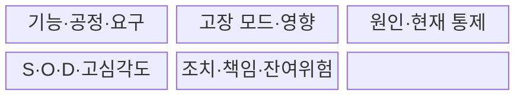
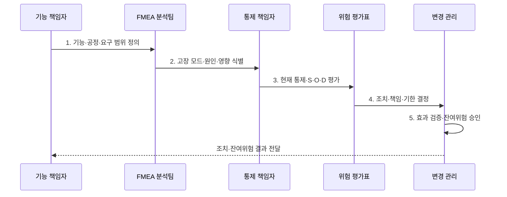

---
sidebar:
  order: 28
  label: "028. FMEA 고장 모드 영향 분석 (FMEA Failure Mode Effect Analysis)"
  badge:
    text: "미출 · 30%"
    variant: note
title: "FMEA 고장 모드 영향 분석 (FMEA Failure Mode Effect Analysis)"
date: 2026-07-31T05:06:59+09:00
tags:
  - "notes-evaluation"
weight: 28
extra:
  question_no: "028"
  source_status: "미출"
  source_history: ""
  priority: 30
  priority_note: "고장 모드별 심각도·발생도·검출도를 평가"
---

## 미리 알고가기

- **FMEA(Failure Mode and Effects Analysis)**: 기능·부품·공정의 잠재 고장 모드에서 시작해 원인·영향·통제를 분석하는 상향식 위험 기법
- **고장 모드(Failure Mode)**: 요구 기능이 수행되지 않거나 잘못 수행되는 구체적인 실패 형태
- **영향(Effect)**: 고장 모드가 상위 기능·시스템·사용자에게 만드는 결과
- **원인(Cause)**: 고장 모드를 발생시키는 설계·재료·공정·운영 요인
- **현재 통제(Current Control)**: 고장 원인을 예방하거나 고장 모드를 검출하기 위해 이미 적용한 조치
- **심각도 S(Severity)**: 고장 영향이 안전·업무·고객에 미치는 피해 수준
- **발생도 O(Occurrence)**: 고장 원인이 발생할 가능성이나 빈도 수준
- **검출도 D(Detection)**: 고장이 고객에게 도달하기 전에 현재 통제가 발견하지 못할 가능성
- **RPN(Risk Priority Number)**: 심각도·발생도·검출도 점수를 곱한 위험 우선순위 수치
- **잔여 위험(Residual Risk)**: 개선 조치를 적용한 뒤에도 남아 있는 위험
- **DFMEA(Design FMEA)**: 제품·시스템의 설계 기능과 구조를 대상으로 수행하는 FMEA
- **PFMEA(Process FMEA)**: 생산·서비스 공정의 단계와 작업을 대상으로 수행하는 FMEA
- **FTA(Fault Tree Analysis)**: 원하지 않는 최상위 사건에서 시작해 원인 조합을 논리 게이트로 분해하는 하향식 위험 분석
- **현장 결함(Field Failure)**: 제품이나 서비스가 실제 운영·사용 환경에서 발생시킨 고장
- **IEC 60812:2018**: FMEA와 FMECA의 계획·수행·문서화 지침을 규정한 국제표준이다.

## Ⅰ. 개요

- 정의/개념: 잠재 고장 모드에서 **원인·영향을 상향 분석**
- 배경/필요성: RPN 곱셈만으로는 **고심각도 저빈도 위험 순위 왜곡**

### 쉽게 이해하기 (학습용)

- 각 기능이 어떻게 실패할 수 있는지 먼저 적고 그 실패가 얼마나 심각하고 자주 생기며 놓치기 쉬운지를 평가해 먼저 고칠 대상을 정한다.

## Ⅱ. 특징

- 기능·부품·공정의 **상향식 잠재고장 분석**
- 모드·원인·영향·통제의 **양방향 추적**
- S·O·D·고심각도의 **위험 기반 조치**
- FMECA의 **고장모드·영향·치명도 결합**

### 쉽게 이해하기 (학습용)

- 낮은 발생도 때문에 RPN이 작아도 인명 피해처럼 심각도가 큰 고장은 점수 곱만 믿지 말고 우선 조치해야 한다.

## Ⅲ. 구조 및 구성요소

| 구성요소 | 책임 |
|:---|:---|
| **기능·공정·요구** | 대상·경계·**의도 기능** |
| **고장 모드·영향** | 실패 형태·**상위 파급** |
| **원인·현재 통제** | 발생원인·**예방·검출** |
| **S·O·D·고심각도** | 점수·**특별 우선순위** |
| **조치·책임·잔여위험** | 담당·기한·**효과·승인** |

### 쉽게 이해하기 (학습용)

- 요구 기능에서 실패 형태와 영향을 찾고 그 원인과 기존 방어를 확인한 뒤 위험이 큰 항목에 조치를 배정해 남은 위험을 다시 평가한다.

## Ⅳ. 흐름도

- **1. 기능·공정·요구 범위 정의**: 대상·경계·의도 확정
- **2. 고장 모드·원인·영향 식별**: 실패형태·파급 연결
- **3. 현재 통제·S·O·D 평가**: 예방·검출·고심각도 판정
- **4. 조치·책임·기한 결정**: 제거·감소·검증 배정
- **5. 효과 검증·잔여위험 승인**: 재평가·수용근거 기록

### 쉽게 이해하기 (학습용)

- 위험표를 채우는 데서 끝내지 않고 담당자가 설계를 바꾼 뒤 원인과 검출 가능성이 실제로 줄었는지 증거로 확인한다.

## Ⅴ. 종류 및 비교

| FMEA 유형 | DFMEA | PFMEA |
|:---|:---|:---|
| **적용 기준** | 설계 초기와 **변경 검토** | 생산 준비·**운영 절차 검토** |
| **핵심 특징** | 설계 기능·구조의 **고장 분석** | 작업·생산 공정의 **실패 분석** |
| **한계** | **공정 변동·작업 오류 누락** | **설계 결함의 공정 전가** |

### 쉽게 이해하기 (학습용)

- DFMEA는 도면과 기능이 잘못될 가능성을 보고 PFMEA는 그 설계를 만들고 운영하는 과정에서 작업이 실패할 가능성을 본다.

## Ⅵ. 실무 고려사항 및 대책

| 고려사항 | 대책 | 효과 |
|:---|:---|:---|
| **FMEA 계획·수행 기준** | **IEC 60812:2018 적용** | 분석·문서화 **일관성** 확보 |
| **RPN 동일값의 위험 차이** | **고심각도·조치우선순위 병행** | **치명위험 누락** 방지 |
| **현장 결함 환류** | **현장 결함으로 원인·발생도 재평가** | **운용 조건** 반영 |
| **조치 후 방치** | **증거 기반 재평가·승인** | **잔여위험 추적** |

### 쉽게 이해하기 (학습용)

- 사례 1은 센서·제어기·구동부 실패가 제동 거리와 운전자 안전에 미치는 영향을 설계 단계에서 줄인다.

## Ⅶ. 결론

- **고심각도**는 RPN과 무관하게 우선 조치, 이후 **발생도·검출도** 개선

### 쉽게 이해하기 (학습용)

- FMEA의 성과는 RPN 표를 완성하는 것이 아니라 고장 원인을 제거하고 검출 통제를 강화해 잔여 위험을 실제로 낮추는 데 있다.
