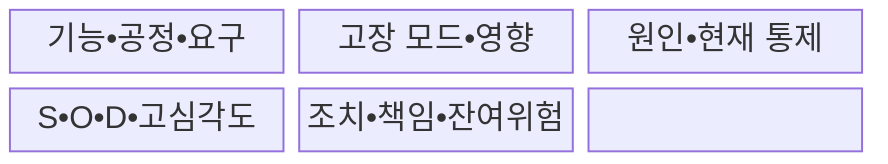
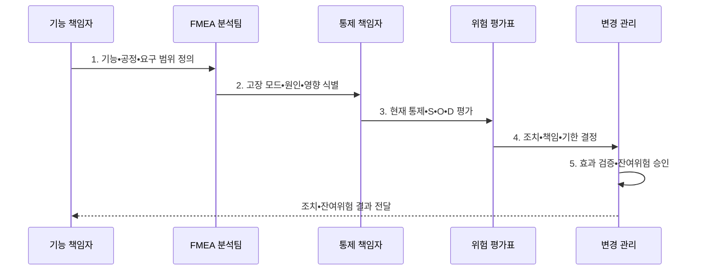

---
sidebar:
  order: 28
  label: "028. FMEA 고장 모드 영향 분석 (FMEA Failure Mode Effect Analysis)"
  badge:
    text: "미출 • 30%"
    variant: note
title: "FMEA 고장 모드 영향 분석 (FMEA Failure Mode Effect Analysis)"
date: "2026-08-04T21:46:00+09:00"
tags:
  - "notes-evaluation"
weight: 28
extra:
  question_no: "028"
  source_status: "미출"
  source_history: ""
  priority: 30
  priority_note: "고장 모드별 심각도•발생도•검출도를 평가"
---

## Ⅰ. 개요

핵심 용어

- **고장 형태 및 영향 분석(Failure Mode and Effects Analysis, FMEA)**: 기능•부품•공정의 잠재 고장 모드에서 출발하여 원인•영향•현재 통제를 연결하는 상향식 위험 분석 기법이다.
- **고장 모드**: 요구 기능이 수행되지 않거나 의도와 다르게 수행되는 구체적인 실패 형태이다.

- 정의/개념: 잠재 **고장 모드**에서 원인•영향•통제를 분석하는 **FMEA**
- 배경/필요성: 사고가 발생한 뒤 결과만 분석하면 잠재 고장 모드별 원인과 영향을 사전에 찾아 예방•검출 우선순위를 정하기 어려움

#### 한줄 요약

- 기능별 실패 형태와 심각도•발생도•검출도에 따른 개선 우선순위 결정

## Ⅱ. 특징

핵심 용어

- **원인-고장 모드-영향 관계**: 원인이 특정 실패 형태를 만들고 그 실패가 상위 기능•시스템•사용자 결과로 전파되는 인과 구조이다.
- **현재 통제**: 고장 원인을 예방하거나 고장 모드가 고객에게 도달하기 전에 검출하도록 이미 적용한 조치이다.
- **잔여 위험**: 개선 조치를 적용하고 재평가한 뒤에도 남아 있는 위험이다.
- **위험 기반 조치**: 점수 곱만 따르지 않고 고심각도•법규•안전 위험을 우선 처리하는 개선 결정이다.
- **고장 형태•영향 및 치명도 분석(Failure Modes, Effects and Criticality Analysis, FMECA)**: FMEA에 고장 치명도 평가를 결합한 위험 분석 기법이다.

- 기능•부품•공정의 **상향식 잠재고장 분석**
- 모드•원인•영향•통제의 **양방향 추적**
- S•O•D•고심각도의 **위험 기반 조치**
- FMECA의 **고장모드•영향•치명도 결합**

#### 한줄 요약

- 낮은 발생도에도 고심각도 고장을 우선 조치하는 위험 기반 판단

## Ⅲ. 구조 및 구성요소

핵심 용어

- **심각도(Severity, S)**: 고장 영향이 안전•업무•고객에 미치는 피해 수준이다.
- **발생도(Occurrence, O)**: 고장 원인이 발생할 가능성이나 빈도 수준이다.
- **검출도(Detection, D)**: 현재 통제가 고장을 고객 도달 전에 발견하지 못할 가능성이다.

| 구성요소 | 책임 |
|:---|:---|
| **기능•공정•요구** | 대상•경계•**의도 기능** |
| **고장 모드•영향** | 실패 형태•**상위 파급** |
| **원인•현재 통제** | 발생원인•**예방•검출** |
| **S•O•D•고심각도** | 점수•**특별 우선순위** |
| **조치•책임•잔여위험** | 담당•기한•**효과•승인** |

#### 한줄 요약

- 기능•고장 모드•원인•영향•현재 통제•개선 조치의 추적 구조

## Ⅳ. 흐름도

핵심 용어

- **위험 우선순위 수(Risk Priority Number, RPN)**: 심각도•발생도•검출도 점수를 곱하여 조치 후보의 상대 우선순위를 보조하는 수치이다.
- **조치 효과 검증**: 개선 조치 완료 후 원인 제거•발생 감소•검출 향상을 증거로 확인하고 S•O•D를 재평가하는 절차이다.

- **1. 기능•공정•요구 범위 정의**: 대상•경계•의도 확정
- **2. 고장 모드•원인•영향 식별**: 실패형태•파급 연결
- **3. 현재 통제•S•O•D 평가**: 예방•검출•고심각도 판정
- **4. 조치•책임•기한 결정**: 제거•감소•검증 배정
- **5. 효과 검증•잔여위험 승인**: 재평가•수용근거 기록

#### 한줄 요약

- 개선 조치 후 원인 제거와 검출 가능성 변화를 확인하는 재평가

## Ⅴ. 종류 및 비교

핵심 용어

- **설계 고장 형태 및 영향 분석(Design Failure Mode and Effects Analysis, DFMEA)**: 제품•시스템의 설계 기능과 구조를 대상으로 잠재 고장 모드를 분석하는 FMEA이다.
- **공정 고장 형태 및 영향 분석(Process Failure Mode and Effects Analysis, PFMEA)**: 생산•서비스 공정의 단계와 작업을 대상으로 잠재 고장 모드를 분석하는 FMEA이다.

| 고장 형태 및 영향 분석 유형 | 적용 기준 | 분석 대상•한계 |
|:---|:---|:---|
| DFMEA | 설계 초기•변경 검토 | 설계 기능•구조의 고장 분석, 공정 변동•작업 오류 누락 가능 |
| PFMEA | 생산 준비•운영 절차 검토 | 작업•생산 공정의 실패 분석, 설계 결함의 공정 전가 주의 |

#### 한줄 요약

- 설계 기능을 보는 DFMEA와 생산•운영 작업을 보는 PFMEA의 대상 구분

## Ⅵ. 실무 고려사항 및 대책

핵심 용어

- **고심각도 저빈도 위험**: 발생도가 낮아 RPN은 작아도 피해가 커서 별도 우선조치가 필요한 위험이다.
- **점수 곱의 왜곡**: 서로 다른 S•O•D 조합이 같은 RPN을 만들고 심각도 차이를 숨기는 한계이다.
- **현장 결함 환류**: 실제 운영에서 발생한 고장 데이터를 FMEA 원인•발생도•통제 평가에 다시 반영하는 활동이다.
- **증거 기반 재평가**: 조치 후 원인 제거•발생 감소•검출 향상을 자료로 확인하고 점수와 잔여위험을 다시 승인하는 절차이다.
- **국제전기기술위원회 60812(International Electrotechnical Commission 60812, IEC 60812)**: FMEA와 FMECA의 계획•수행•문서화 지침을 규정한 국제표준이다.

| 문제 | 대책 | 효과 |
|:---|:---|:---|
| **FMEA 계획•수행 기준** | **IEC 60812:2018 적용** | 분석•문서화 **일관성** 확보 |
| **RPN 동일값의 위험 차이** | **고심각도•조치우선순위 병행** | **치명위험 누락** 방지 |
| **현장 결함 환류** | **현장 결함으로 원인•발생도 재평가** | **운용 조건** 반영 |
| **조치 후 방치** | **증거 기반 재평가•승인** | **잔여위험 추적** |

#### 한줄 요약

- 센서•제어기•구동부 실패의 제동•안전 영향을 설계 단계에서 저감

## Ⅶ. 결론

핵심 용어

- **위험 기반 우선순위**: RPN만으로 정렬하지 않고 고심각도•법규•안전 위험을 먼저 처리한 뒤 발생도와 검출도를 개선하는 원칙이다.
- **우선조치 결정**: 고심각도 위험은 위험 우선순위 수와 무관하게 먼저 처리하고 이후 발생도와 검출도를 개선하는 판단이다.

- **고심각도** 는 RPN과 무관하게 우선 조치, 이후 **발생도•검출도** 개선

#### 한줄 요약

- 고장 원인 제거와 검출 통제 강화로 잔여 위험을 낮추는 FMEA 성과
