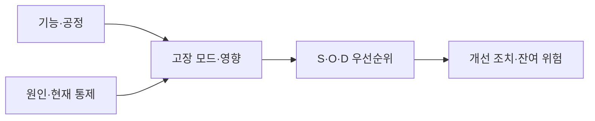
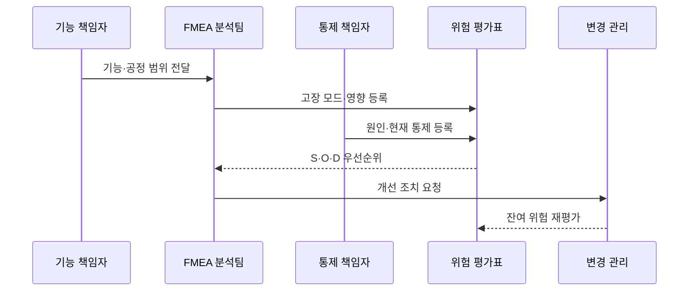

---
sidebar:
  order: 28
  label: "028. FMEA 고장 모드 영향 분석 (FMEA Failure Mode Effect Analysis)"
  badge:
    text: "미출제 · 30%"
    variant: note
title: "FMEA 고장 모드 영향 분석 (FMEA Failure Mode Effect Analysis)"
date: "2026-07-25T14:02:00+09:00"
tags:
  - "notes-evaluation"
weight: 28
extra:
  question_no: "028"
  source_status: "미출제"
  source_history: ""
  priority: 30
  priority_note: "고장 모드별 심각도·발생도·검출도를 평가"
---

## 미리 알고가기

- **FMEA(Failure Mode and Effects Analysis)**: 기능·부품·공정의 잠재 고장 모드에서 시작해 원인·영향·통제를 분석하는 상향식 위험 기법
- **고장 모드(Failure Mode)**: 요구 기능이 수행되지 않거나 잘못 수행되는 구체적인 실패 형태
- **영향(Effect)**: 고장 모드가 상위 기능·시스템·사용자에게 만드는 결과
- **원인(Cause)**: 고장 모드를 발생시키는 설계·재료·공정·운영 요인
- **현재 통제(Current Control)**: 고장 원인을 예방하거나 고장 모드를 검출하기 위해 이미 적용한 조치
- **심각도 S(Severity)**: 고장 영향이 안전·업무·고객에 미치는 피해 수준
- **발생도 O(Occurrence)**: 고장 원인이 발생할 가능성이나 빈도 수준
- **검출도 D(Detection)**: 고장이 고객에게 도달하기 전에 현재 통제가 발견하지 못할 가능성
- **RPN(Risk Priority Number)**: 심각도·발생도·검출도 점수를 곱한 위험 우선순위 수치
- **잔여 위험(Residual Risk)**: 개선 조치를 적용한 뒤에도 남아 있는 위험
- **DFMEA(Design FMEA)**: 제품·시스템의 설계 기능과 구조를 대상으로 수행하는 FMEA
- **PFMEA(Process FMEA)**: 생산·서비스 공정의 단계와 작업을 대상으로 수행하는 FMEA
- **FTA(Fault Tree Analysis)**: 원하지 않는 최상위 사건에서 시작해 원인 조합을 논리 게이트로 분해하는 하향식 위험 분석
- **현장 결함(Field Failure)**: 제품이나 서비스가 실제 운영·사용 환경에서 발생시킨 고장

## Ⅰ. 개요

- 정의/개념: 고장 모드에서 원인·영향을 상향 분석한다
- 기존 한계: 발생한 장애만 분석하면 제품·공정의 잠재 고장 모드와 그 영향, 예방 조치의 우선순위를 사전에 판단하기 어렵다.

### 쉽게 이해하기 (학습용)

- 각 기능이 어떻게 실패할 수 있는지 먼저 적고 그 실패가 얼마나 심각하고 자주 생기며 놓치기 쉬운지를 평가해 먼저 고칠 대상을 정한다.

## Ⅱ. 특징

- 기능·부품·공정별 분석은 잠재 고장을 구체화한다
- 고장 모드와 원인·영향·통제를 한 흐름으로 잇는다
- 같은 RPN도 심각도 차이로 조치 순위가 달라진다
- 단일 고장 중심이라 복합 원인 분석은 제한된다
- 조치 뒤 재평가는 잔여 위험의 방치를 막는다

### 쉽게 이해하기 (학습용)

- 낮은 발생도 때문에 RPN이 작아도 인명 피해처럼 심각도가 큰 고장은 점수 곱만 믿지 말고 우선 조치해야 한다.

## Ⅲ. 아키텍처 및 구성요소

| 설계 요소 | 설명 |
|:---|:---|
| 기능·공정 | 분석 대상과 요구 기능 정의 |
| 고장 모드·영향 | 실패 형태와 파급 결과 연결 |
| 원인·현재 통제 | 발생 원인과 예방·검출 수단 정리 |
| S·O·D 우선순위 | 심각도·발생도·검출도로 평가 |
| 개선 조치·잔여 위험 | 담당·기한·재평가 결과 관리 |

> 요약: 고장 모드와 원인·영향·통제로 위험을 평가한다

### 쉽게 이해하기 (학습용)

- 요구 기능에서 실패 형태와 영향을 찾고 그 원인과 기존 방어를 확인한 뒤 위험이 큰 항목에 조치를 배정해 남은 위험을 다시 평가한다.

## Ⅳ. 원리 및 절차 흐름도

| 절차 | 설명 |
|:---|:---|
| 기능·공정 범위 전달 | 요구 기능과 분석 경계를 확정 |
| 고장 모드·영향 등록 | 실패 형태와 상위 파급을 기록 |
| 원인·현재 통제 등록 | 예방·검출 수단과 근거 연결 |
| S·O·D 우선순위 | 점수와 고심각도 항목을 판정 |
| 개선 조치 요청 | 담당자·기한·검증 방법 지정 |
| 잔여 위험 재평가 | 변경 뒤 통제 효과와 점수 갱신 |

> 요약: 고장 모드를 평가해 조치하고 남은 위험을 다시 본다.

### 쉽게 이해하기 (학습용)

- 위험표를 채우는 데서 끝내지 않고 담당자가 설계를 바꾼 뒤 원인과 검출 가능성이 실제로 줄었는지 증거로 확인한다.

## Ⅴ. 종류 및 비교

| 비교축 | DFMEA | PFMEA |
|:---|:---|:---|
| 핵심 특징 | 설계 기능·구조의 고장 분석 | 작업·생산 공정의 실패 분석 |
| 적용 기준 | 설계 초기와 변경 검토 | 생산 준비·운영 절차 검토 |
| 주요 위험 | 공정 변동·작업 오류 누락 | 근본 설계 결함을 공정으로 전가 |

> 요약: DFMEA는 설계, PFMEA는 공정 실패를 분석한다

### 쉽게 이해하기 (학습용)

- DFMEA는 도면과 기능이 잘못될 가능성을 보고 PFMEA는 그 설계를 만들고 운영하는 과정에서 작업이 실패할 가능성을 본다.

## Ⅵ. 실무 사례

1. 자동차 제동 고장 모드를 DFMEA로 분석한다

### 쉽게 이해하기 (학습용)

- 사례 1은 센서·제어기·구동부 실패가 제동 거리와 운전자 안전에 미치는 영향을 설계 단계에서 줄인다.

## Ⅶ. 결론

- 잠재 고장 모드면 S·O·D와 고심각도로 조치 순위를 정한다.

### 쉽게 이해하기 (학습용)

- FMEA의 성과는 RPN 표를 완성하는 것이 아니라 고장 원인을 제거하고 검출 통제를 강화해 잔여 위험을 실제로 낮추는 데 있다.
