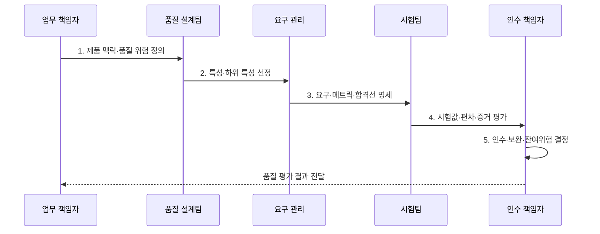

---
sidebar:
  order: 29
  label: "029. 소프트웨어 품질 모델 ISO/IEC 25010 (ISO 25010)"
  badge:
    text: "기출 · 30%"
    variant: note
title: "소프트웨어 품질 모델 ISO/IEC 25010 (ISO 25010)"
date: "2026-07-31T05:07:38+09:00"
tags:
  - "notes-evaluation"
weight: 29
extra:
  question_no: "029"
  source_status: "기출"
  source_history: "120회, 128회"
  priority: 30
  priority_note: "품질 특성 체계를 묻는 전통 표준 기출"
---

## 미리 알고가기

- **국제표준화기구(International Organization for Standardization, ISO)**: 산업·기술 분야 국제표준을 제정하는 국제기구이다.
- **국제전기기술위원회(International Electrotechnical Commission, IEC)**: 전기·전자·정보기술 국제표준을 제정하는 국제기구이다.
- **ISO/IEC 25010:2023**: ICT·소프트웨어 제품의 품질을 9개 특성과 하위 특성으로 정의한 국제 표준
- **시스템·소프트웨어 품질 요구사항 및 평가(Systems and Software Quality Requirements and Evaluation, SQuaRE)**: 품질 모델·요구·측정·평가를 연결한 표준 체계이다.
- **ICT(Information and Communication Technology)**: 정보 처리와 통신을 결합한 제품·서비스·기술
- **제품 품질 모델(Product Quality Model)**: 제품 자체의 품질 속성을 특성과 하위 특성으로 분류한 참조 모델
- **기능 적합성(Functional Suitability)**: 제공 기능이 명시·암묵적 요구를 충족하는 정도
- **성능 효율성(Performance Efficiency)**: 사용 자원과 시간에 비해 요구 성능을 제공하는 정도
- **호환성(Compatibility)**: 다른 제품과 자원·정보를 공유하며 함께 동작하는 정도
- **상호작용 역량(Interaction Capability)**: 사용자가 제품과 효과적·효율적으로 상호작용할 수 있는 정도
- **신뢰성(Reliability)**: 정해진 조건과 기간에 요구 기능을 일관되게 수행하는 정도
- **보안성(Security)**: 정보와 기능을 무단 접근·변경·노출로부터 보호하는 정도
- **유지보수성(Maintainability)**: 제품을 분석·수정·시험하기 쉬운 정도
- **유연성(Flexibility)**: 변화한 요구·환경·용량에 맞게 적응·확장하기 쉬운 정도
- **안전성(Safety)**: 제품이 사람·재산·환경에 허용 불가 위험을 만들지 않는 정도
- **제안요청서(Request for Proposal, RFP)**: 발주 범위·요구사항·평가 기준을 공급자에게 제시하는 문서다.
- **수용 기준(Acceptance Criteria)**: 제품을 인수할 수 있는지 판단하는 측정 가능한 합격 조건
- **메트릭(Metric)**: 품질 특성을 정량 또는 등급으로 측정하는 기준과 값

> **키워드:** 소프트웨어 품질 모델 ISO/IEC 25010 (ISO 25010)

## Ⅰ. 개요

- 정의/개념: ICT 제품 품질을 **9개 특성·하위 특성으로 분류**
- 배경/필요성: 모호한 품질 표현만으로는 **시험 메트릭·인수 판정 합의 불가**

### 쉽게 이해하기 (학습용)

- “좋은 시스템”이라는 모호한 말을 기능·성능·보안·안전 같은 합의된 항목으로 나눠 무엇을 어떻게 시험할지 정하게 한다.

## Ⅱ. 특징

- **9개 특성·하위 특성 계층** 기반 제품 품질 범위 분류
- 공통 용어 기반 품질 요구·측정·평가의 **추적성 향상**
- 표준의 분류와 제품 맥락별 **메트릭·합격선 분리**
- **SQuaRE 품질 요구·측정·평가 연계**

### 쉽게 이해하기 (학습용)

- 표준이 합격 숫자를 대신 정해 주는 것은 아니므로 조직이 제품 위험에 맞는 특성과 메트릭 및 합격선을 구체화해야 한다.

## Ⅲ. 구조 및 구성요소

| 구성요소 | 책임 |
|:---|:---|
| **제품 품질 모델** | ICT 제품의 **평가 관점 제공** |
| **9개 품질 특성** | 기능·성능·호환·상호작용·**신뢰 분류** |
| **하위 특성** | 보안·유지보수·유연·**안전 세분** |
| **품질 요구·메트릭** | 특성을 **측정 가능 조건**으로 변환 |
| **검증·수용 증거** | 시험값·**인수 판정 근거 연결** |

### 쉽게 이해하기 (학습용)

- 제품 품질을 9개 큰 특성과 세부 특성으로 나누고 프로젝트는 필요한 항목을 구체적인 요구와 측정값으로 바꿔 인수 증거를 만든다.

## Ⅳ. 흐름도

- **1. 제품 맥락·품질 위험 정의**: 사용자·환경·피해조건 확정
- **2. 특성·하위 특성 선정**: 중요도·상충관계 결정
- **3. 요구·메트릭·합격선 명세**: 조건·수치·시험법 작성
- **4. 시험값·편차·증거 평가**: 충족·불충족 근거 수집
- **5. 인수·보완·잔여위험 결정**: 수용·개선·예외 승인

### 쉽게 이해하기 (학습용)

- 업무 위험에 중요한 품질을 골라 합격 조건으로 바꾸고 실제 시험값이 그 조건을 충족하는지 확인해 인수 여부를 정한다.

## Ⅴ. 종류 및 비교

| ISO/IEC 25010 판본 | 2023 | 2011 |
|:---|:---|:---|
| **적용 기준** | 신규 ICT 제품 **요구·평가** | 기존 **계약·평가 기준 유지** |
| **핵심 특징** | ICT 제품 품질 **9개 특성** | 제품 8개·사용 품질 **5개 특성** |
| **한계** | 특성만 선택하고 **메트릭 미정** | 철회 판본의 **신규 기준 사용** |

### 쉽게 이해하기 (학습용)

- 2023판은 현재 제품 품질 모델이고 2011판은 철회됐으므로 신규 사업은 판본을 명시하고 기존 계약은 전환 영향을 확인해야 한다.

## Ⅵ. 실무 고려사항 및 대책

| 고려사항 | 대책 | 효과 |
|:---|:---|:---|
| **신규 제품 품질 분류** | **ISO/IEC 25010:2023 적용** | 9개 **특성 기준 정렬** |
| **특성만 있고 측정 부재** | **ISO/IEC 25023:2016 연계** | **정량 메트릭 구체화** |
| **구판 계약·평가 혼용** | **판본·전환 영향 명시** | **요구·평가 분쟁** 방지 |

### 쉽게 이해하기 (학습용)

- 사례 1은 “성능이 좋을 것” 대신 부하 조건과 목표 처리량 및 응답 시간을 계약에 적는다.

## Ⅶ. 결론

- 업무 위험별 **품질 특성·메트릭** 합격 시 인수, 미달은 **보완·재평가**

### 쉽게 이해하기 (학습용)

- ISO/IEC 25010은 품질을 대신 보장하지 않으며 중요한 특성을 측정 가능한 요구와 실제 시험 증거로 연결할 때 평가 기준이 된다.
