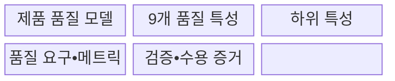
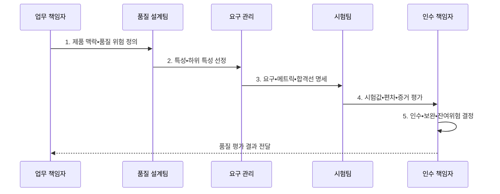

---
sidebar:
  order: 29
  label: "029. 소프트웨어 품질 모델 ISO/IEC 25010 (ISO 25010)"
  badge:
    text: "기출 • 30%"
    variant: note
title: "소프트웨어 품질 모델 ISO/IEC 25010 (ISO 25010)"
date: "2026-08-04T21:53:00+09:00"
tags:
  - "notes-evaluation"
weight: 29
extra:
  question_no: "029"
  source_status: "기출"
  source_history: "120회, 128회"
  priority: 30
  priority_note: "품질 특성 체계를 묻는 전통 표준 기출"
---

## Ⅰ. 개요

핵심 용어

- **국제표준화기구•국제전기기술위원회 25010(International Organization for Standardization/International Electrotechnical Commission 25010, ISO/IEC 25010:2023)**: 정보통신기술•소프트웨어 제품의 품질을 9개 특성과 하위 특성으로 정의한 국제표준이다.
- **시스템•소프트웨어 품질 요구사항 및 평가(Systems and software Quality Requirements and Evaluation, SQuaRE)**: 시스템•소프트웨어의 품질 모델•요구사항•측정•평가를 연결한 표준 체계이다.
- **정보통신기술(Information and Communication Technology, ICT) 제품 품질**: 소프트웨어를 포함한 정보통신 제품의 특성을 제품 관점에서 분류•평가한 품질이다.

- 정의/개념: ICT 제품 품질을 **9개 특성•하위 특성으로 분류**
- 배경/필요성: 모호한 품질 표현만으로는 **시험 메트릭과 인수 판정 기준을 합의하기 어려움**

#### 한줄 요약

- “좋은 시스템”이라는 모호한 말을 기능•성능•보안•안전 같은 합의된 항목으로 나눠 무엇을 어떻게 시험할지 정하게 한다.

## Ⅱ. 특징

핵심 용어

- **제품 품질 모델**: 제품 자체의 품질 속성을 특성과 하위 특성의 계층으로 분류한 참조 모델이다.
- **품질 상충관계**: 한 특성의 개선이 다른 특성의 비용이나 수준을 악화시킬 수 있는 관계이다.
- **추적성**: 품질 특성과 하위 특성을 요구사항•메트릭•시험•인수 증거까지 연결해 확인할 수 있는 성질이다.

- **9개 특성•하위 특성 계층•SQuaRE 연계** 기반 제품 품질 범위와 요구•측정•평가 분류
- 공통 용어 기반 요구사항•메트릭•시험•인수 증거의 **추적성 향상**
- 표준의 분류와 제품 맥락별 **메트릭•합격선 분리**

#### 한줄 요약

- 표준이 합격 숫자를 대신 정해 주는 것은 아니므로 조직이 제품 위험에 맞는 특성과 메트릭 및 합격선을 구체화해야 한다.

## Ⅲ. 구조 및 구성요소

핵심 용어

- **기능 적합성**: 명시되거나 내재된 요구를 충족하는 기능의 정도이다.
- **성능 효율성**: 사용 자원량에 비례해 요구 성능을 제공하는 정도이다.
- **호환성**: 다른 제품과 공존하며 정보를 교환할 수 있는 정도이다.
- **상호작용 역량**: 사용자가 제품과 상호작용해 목표를 달성할 수 있는 정도이다.
- **신뢰성**: 정해진 조건과 기간에 요구 기능을 수행하는 정도이다.
- **보안성**: 정보와 데이터가 허가된 접근과 변경만 허용하는 정도이다.
- **유지보수성**: 제품을 분석•수정•시험하기 쉬운 정도이다.
- **유연성**: 요구•환경•사용 맥락 변화에 적응할 수 있는 정도이다.
- **안전성**: 사람•재산•환경에 대한 위험을 허용 수준으로 제한하는 정도이다.
- **측정 가능 조건**: 품질 특성을 사용 환경•측정 단위•목표값•허용 오차가 있는 검증 가능한 요구로 바꾼 조건이다.

| 구성요소 | 책임 |
|:---|:---|
| **제품 품질 모델** | ICT 제품의 **평가 관점 제공** |
| **9개 품질 특성** | 기능 적합성•성능 효율성•호환성•상호작용 역량•신뢰성•보안성•유지보수성•유연성•안전성 **분류** |
| **하위 특성** | 각 상위 특성의 **세부 평가 항목** 분류 |
| **품질 요구•메트릭** | 특성을 **측정 가능 조건** 으로 변환 |
| **검증•수용 증거** | 시험값•**인수 판정 근거 연결** |

#### 한줄 요약

- 제품 품질을 9개 큰 특성과 세부 특성으로 나누고 프로젝트는 필요한 항목을 구체적인 요구와 측정값으로 바꿔 인수 증거를 만든다.

## Ⅳ. 흐름도

핵심 용어

- **품질 요구사항**: 선정한 특성을 사용 조건•측정 단위•목표값•허용 오차와 함께 명세한 요구이다.
- **수용 기준**: 시험 결과로 제품을 인수할 수 있는지 판단하는 측정 가능한 합격 조건이다.
- **잔여위험 결정**: 품질 미달이나 예외가 남은 경우 피해와 보완 근거를 검토해 인수•개선 여부를 정하는 판단이다.

- **1. 제품 맥락•품질 위험 정의**: 사용자•환경•피해조건 확정
- **2. 특성•하위 특성 선정**: 중요도•상충관계 결정
- **3. 요구•메트릭•합격선 명세**: 조건•수치•시험법 작성
- **4. 시험값•편차•증거 평가**: 충족•불충족 근거 수집
- **5. 인수•보완•잔여위험 결정**: 수용•개선•예외 승인

#### 한줄 요약

- 업무 위험에 중요한 품질을 골라 합격 조건으로 바꾸고 실제 시험값이 그 조건을 충족하는지 확인해 인수 여부를 정한다.

## Ⅴ. 종류 및 비교

핵심 용어

- **품질 특성**: 제품 품질을 포괄적으로 분류하는 상위 평가 관점이다.
- **하위 특성**: 상위 품질 특성을 더 구체적이고 측정 가능한 관점으로 분해한 속성이다.
- **판본 선택**: 신규 제품은 2023판을 적용하고 기존 계약은 2011판에서 전환할 때 요구•평가 영향을 확인하는 결정이다.

| ISO/IEC 25010 판본 | 2023 | 2011 |
|:---|:---|:---|
| **적용 기준** | 신규 ICT 제품 **요구•평가** | 기존 **계약•평가 기준 유지** |
| **핵심 특징** | ICT 제품 품질 **9개 특성** | 제품 8개•사용 품질 **5개 특성** |
| **한계** | 특성만 선택하고 **메트릭 미정** | 철회 판본의 **신규 기준 사용** |

#### 한줄 요약

- 2023판은 현재 제품 품질 모델이고 2011판은 철회됐으므로 신규 사업은 판본을 명시하고 기존 계약은 전환 영향을 확인해야 한다.

## Ⅵ. 실무 고려사항 및 대책

핵심 용어

- **메트릭**: 품질 특성을 정량값이나 등급으로 측정하는 정의•방법•결과이다.
- **제안요청서(Request for Proposal, RFP)**: 발주 범위•품질 요구사항•평가 기준을 공급자에게 제시하는 문서이다.
- **특성 누락**: 기능•성능 중심으로 요구를 작성하여 보안•안전•유지보수 위험을 평가하지 못하는 문제이다.
- **ISO/IEC 25023**: 제품 품질 특성의 정량 측정 방법을 제시하는 국제표준이다.

| 문제 | 대책 | 효과 |
|:---|:---|:---|
| **신규 제품 품질 분류** | **ISO/IEC 25010:2023 적용** | 9개 **특성 기준 정렬** |
| **특성만 있고 측정 부재** | **ISO/IEC 25023:2016 연계** | **정량 메트릭 구체화** |
| **구판 계약•평가 혼용** | **판본•전환 영향 명시** | **요구•평가 분쟁** 방지 |

#### 한줄 요약

- 사례 1은 “성능이 좋을 것” 대신 부하 조건과 목표 처리량 및 응답 시간을 계약에 적는다.

## Ⅶ. 결론

핵심 용어

- **위험 기반 선정**: 제품 맥락과 실패 피해를 기준으로 중요한 품질 특성과 하위 특성에 우선순위를 부여하는 원칙이다.
- **인수 결정**: 업무 위험별 품질 특성과 메트릭이 합격하면 인수하고 미달하면 보완 뒤 재평가하는 판단이다.

- 업무 위험별 **품질 특성•메트릭** 합격 시 인수, 미달은 **보완•재평가**

#### 한줄 요약

- ISO/IEC 25010은 품질을 대신 보장하지 않으며 중요한 특성을 측정 가능한 요구와 실제 시험 증거로 연결할 때 평가 기준이 된다.
