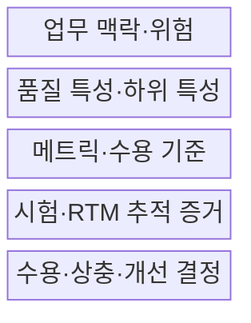
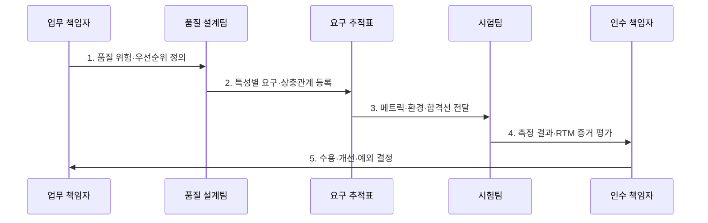

---
sidebar:
  order: 30
  label: "030. 품질 특성 (기능 적합성, 성능 효율성, 호환성, 보안성)"
  badge:
    text: "기출 · 30%"
    variant: note
title: "품질 특성 (기능 적합성, 성능 효율성, 호환성, 보안성)"
date: "2026-07-27T23:59:59+09:00"
tags:
  - "notes-evaluation"
weight: 30
extra:
  question_no: "030"
  source_status: "기출"
  source_history: "120회"
  priority: 30
  priority_note: "ISO 25010에 통합되는 품질 특성 세부축"
---

## 미리 알고가기

- **품질 특성(Quality Characteristic)**: 제품 품질을 평가 가능한 관점으로 분류한 상위 속성
- **기능 적합성(Functional Suitability)**: 제공 기능이 명시·암묵적 요구를 충족하는 정도
- **기능 완전성(Functional Completeness)**: 요구된 기능 집합이 빠짐없이 제공되는 정도
- **기능 정확성(Functional Correctness)**: 기능이 필요한 정밀도로 올바른 결과를 제공하는 정도
- **성능 효율성(Performance Efficiency)**: 사용 자원과 시간에 비해 요구 성능을 제공하는 정도
- **시간 반응성(Time Behaviour)**: 정해진 조건에서 응답·처리 시간이 요구를 충족하는 정도
- **자원 이용성(Resource Utilization)**: 기능 수행에 쓰는 CPU·메모리·망 자원의 양이 요구에 맞는 정도
- **용량성(Capacity)**: 제품이 처리할 수 있는 사용자·데이터·거래의 최대 한도
- **호환성(Compatibility)**: 다른 제품과 자원·정보를 공유하며 함께 동작하는 정도
- **공존성(Co-existence)**: 같은 환경과 자원을 공유하면서 다른 제품에 해로운 영향을 주지 않는 정도
- **상호운용성(Interoperability)**: 둘 이상의 시스템이 정보를 교환하고 그 정보를 사용할 수 있는 정도
- **보안성(Security)**: 정보와 기능을 무단 접근·변경·노출로부터 보호하는 정도
- **기밀성(Confidentiality)**: 승인된 주체만 정보에 접근하게 하는 성질
- **무결성(Integrity)**: 데이터와 기능의 무단 변경·훼손을 방지하는 성질
- **p95 지연시간(피 구십오 지연시간)**: `p`는 백분위수를 뜻하며, 전체 요청 95%가 완료되는 최대 응답 시간
- **TPS(Transactions Per Second, 티피에스)**: 초당 거래 수를 뜻하는 머리글자 지표
- **RTM(Requirements Traceability Matrix, 알티엠)**: 요구사항과 설계·시험·결과를 연결한 추적표
- **ISO/IEC 25010:2023**: ICT·소프트웨어 제품 품질을 9개 특성과 하위 특성으로 정의한 국제표준이다.
- **ISO/IEC 25023:2016**: 제품 품질 특성의 정량 측정 방법을 제시한 국제표준이다.

## Ⅰ. 개요

- 정의: 제품 품질을 **독립 특성·하위 특성으로 분해**
- 목적: 기능·성능·호환·보안의 **상충·수용 기준 명확화**

### 쉽게 이해하기 (학습)

- 기능이 맞는지와 빠른지 및 다른 시스템과 잘 연결되는지와 정보를 지키는지를 서로 다른 시험으로 확인한다.

## Ⅱ. 특징

- 각 품질 특성은 독립된 평가 관점과 하위 특성을 갖는다
- 특성별 메트릭·시험·합격선을 요구사항과 추적한다
- 업무 위험에 따라 특성 간 상충과 수용 우선순위를 조정한다

### 쉽게 이해하기 (학습)

- 한 특성이 좋아도 다른 특성을 대신하지 못하므로 정확하지만 느리거나 빠르지만 정보를 노출하는 제품은 전체 품질 요구를 충족하지 못한다.

## Ⅲ. 구조 및 구성요소

| 설계 요소 | 설명 |
|:---|:---|
| 업무 맥락·위험 | 사용자·부하·연계·피해 조건 정의 |
| 품질 특성·하위 특성 | 필요한 평가 관점과 범위 선정 |
| 메트릭·수용 기준 | 측정값·환경·합격선 명시 |
| 시험·RTM 추적 증거 | 요구·시험·결과 연결 |
| 수용·상충·개선 결정 | 편차·절충·잔여위험 |

> 요약: 품질 특성을 메트릭·시험·수용 증거로 연결한다

### 쉽게 이해하기 (학습)

- 업무 위험에서 중요한 품질을 고르고 측정 조건과 합격선을 만든 뒤 시험 결과를 요구사항에 연결해 인수 여부를 판단한다.

## Ⅳ. 흐름도

| 절차 | 설명 |
|:---|:---|
| 1. 품질 위험·우선순위 정의 | 업무피해·사용조건 분석 |
| 2. 특성별 요구·상충관계 등록 | 기능·성능·호환·보안 분리 |
| 3. 메트릭·환경·합격선 전달 | 부하·데이터·수치 명시 |
| 4. 측정 결과·RTM 증거 평가 | 충족·편차·추적 확인 |
| 5. 수용·개선·예외 결정 | 절충·보완·잔여위험 승인 |

> 요약: 품질 특성을 독립 요구와 시험 증거로 검증한다.

### 쉽게 이해하기 (학습)

- 각 품질 특성을 별도 합격 조건으로 만들고 같은 환경에서 측정한 결과를 요구와 연결해야 무엇이 부족한지 설명할 수 있다.

## Ⅴ. 종류 및 비교

| 품질 특성 | 기능 적합성 | 성능 효율성 | 호환성 | 보안성 |
|:---|:---|:---|:---|:---|
| 적용 기준 | 요구 결과의 누락·오류 검증 | 부하와 자원 한계 검증 | 제품 간 연계·공유 검증 | 접근·변경·추적 위험 검증 |
| 핵심 특징 | 기능 완전성·정확성 | 시간·자원·용량 효율 | 공존·정보 상호운용 | 정보·행위 보호 |
| 한계 | 기능 누락·오계산 | 지연·포화·자원 낭비 | 연계 실패·자원 충돌 | 유출·변조·부인 |

> 요약: 기능·성능·호환·보안은 서로 다른 실패를 평가한다

### 쉽게 이해하기 (학습)

- 기능 적합성은 무엇을 맞게 하는지, 성능은 얼마나 효율적으로 하는지, 호환성은 함께 쓸 수 있는지, 보안성은 누가 안전하게 할 수 있는지를 본다.

## Ⅵ. 실무 고려사항 및 대책

| 고려사항 | 대책 | 효과 |
|:---|:---|:---|
| 특성·하위 특성 분류 | **ISO/IEC 25010:2023 적용** | 품질 범위·용어 정렬 |
| 추상 요구의 정량화 | **ISO/IEC 25023:2016 연계** | 측정·합격선 구체화 |
| 특성 간 상충·누락 | **위험 우선순위·RTM 적용** | 균형·추적성 확보 |

### 쉽게 이해하기 (학습)

- 사례 1은 기능 목록 존재만 보지 않고 할인·세금·환율 조건에서 실제 결제 금액이 맞는지 확인한다.

## Ⅶ. 결론

- **업무위험·특성·메트릭·상충·추적증거**로 품질 수용을 결정한다.

### 쉽게 이해하기 (학습)

- 품질 특성은 표준 용어를 나열하는 것이 아니라 서로 다른 실패를 측정 가능한 조건과 실제 시험으로 분리해 검증하는 기준이다.
