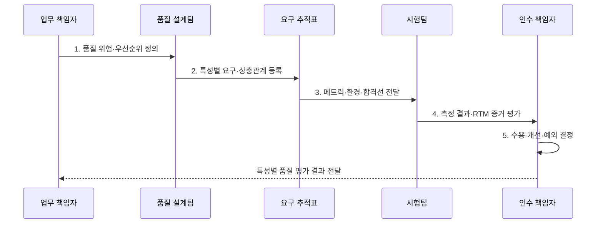

---
sidebar:
  order: 30
  label: "030. 품질 특성 (기능 적합성, 성능 효율성, 호환성, 보안성)"
  badge:
    text: "기출 · 30%"
    variant: note
title: "품질 특성 (기능 적합성, 성능 효율성, 호환성, 보안성)"
date: "2026-08-02T12:30:00+09:00"
tags:
  - "notes-evaluation"
weight: 30
extra:
  question_no: "030"
  source_status: "기출"
  source_history: "120회"
  priority: 30
  priority_note: "ISO 25010에 통합되는 품질 특성 세부축"
---

## Ⅰ. 개요

핵심 용어

- **품질 특성**: 제품 품질을 평가 가능한 관점으로 분류한 상위 속성이다.
- **하위 특성**: 상위 품질 특성을 구체적인 요구와 측정 대상으로 세분화한 속성이다.

- 정의/개념: 제품 품질을 평가 관점별 **특성·하위 특성으로 구조화**
- 배경/필요성: 단일 품질 요구만으로는 **특성 간 상충과 수용 기준을 판단하기 어려움**

### 쉽게 이해하기 (학습용)

- 기능이 맞는지와 빠른지 및 다른 시스템과 잘 연결되는지와 정보를 지키는지를 서로 다른 시험으로 확인한다.

## Ⅱ. 특징

핵심 용어

- **기능 적합성**: 제공 기능이 명시적·암묵적 요구를 충족하는 정도이다.
- **성능 효율성**: 사용 자원과 시간에 비해 요구 성능을 제공하는 정도이다.
- **호환성·보안성**: 다른 제품과 함께 동작하는 능력과 정보·기능을 무단 접근·변경·노출에서 보호하는 정도이다.

- 품질 특성별 **독립 평가 관점·하위 특성**
- 요구사항과 특성별 **메트릭·시험·합격선 추적**
- 업무 위험 기반 특성 간 **상충·수용 우선순위 조정**

### 쉽게 이해하기 (학습용)

- 한 특성이 좋아도 다른 특성을 대신하지 못하므로 정확하지만 느리거나 빠르지만 정보를 노출하는 제품은 전체 품질 요구를 충족하지 못한다.

## Ⅲ. 구조 및 구성요소

핵심 용어

- **기능 완전성·정확성**: 요구 기능 집합을 빠짐없이 제공하고 필요한 정밀도로 올바른 결과를 내는 정도이다.
- **시간 반응성·자원 이용성·용량성**: 응답시간, 자원 소비량, 최대 사용자·데이터·거래 한도를 평가하는 성능 하위 특성이다.
- **공존성·상호운용성**: 같은 환경을 해치지 않고 공유하며 시스템 간 정보를 교환·사용하는 정도이다.

| 구성요소 | 책임 |
|:---|:---|
| **업무 맥락·위험** | 사용자·부하·연계·**피해 조건 정의** |
| **품질 특성·하위 특성** | 필요한 **평가 관점·범위 선정** |
| **메트릭·수용 기준** | 측정값·환경·**합격선 명시** |
| **시험·RTM 추적 증거** | 요구·시험·**결과 연결** |
| **수용·상충·개선 결정** | 편차·절충·**잔여위험** |

### 쉽게 이해하기 (학습용)

- 업무 위험에서 중요한 품질을 고르고 측정 조건과 합격선을 만든 뒤 시험 결과를 요구사항에 연결해 인수 여부를 판단한다.

## Ⅳ. 흐름도

핵심 용어

- **요구사항 추적 매트릭스(RTM)**: 품질 요구사항과 설계·시험·측정 결과를 연결한 추적표이다.
- **합격선**: 측정 결과가 품질 요구를 충족했다고 판정할 최소·최대 기준값이다.

- **1. 품질 위험·우선순위 정의**: 업무피해·사용조건 분석
- **2. 특성별 요구·상충관계 등록**: 기능·성능·호환·보안 분리
- **3. 메트릭·환경·합격선 전달**: 부하·데이터·수치 명시
- **4. 측정 결과·RTM 증거 평가**: 충족·편차·추적 확인
- **5. 수용·개선·예외 결정**: 절충·보완·잔여위험 승인

### 쉽게 이해하기 (학습용)

- 각 품질 특성을 별도 합격 조건으로 만들고 같은 환경에서 측정한 결과를 요구와 연결해야 무엇이 부족한지 설명할 수 있다.

## Ⅴ. 종류 및 비교

핵심 용어

- **p95 지연시간**: 전체 요청의 95%가 해당 값 이하에서 완료되는 백분위 응답시간이다.
- **초당 트랜잭션 처리 건수(TPS)**: 시스템이 1초 동안 성공적으로 완료한 업무 거래 수이다.
- **기밀성·무결성**: 승인된 주체만 정보에 접근하게 하고 데이터·기능의 무단 변경을 방지하는 보안 하위 특성이다.

| 품질 특성 | 기능 적합성 | 성능 효율성 | 호환성 | 보안성 |
|:---|:---|:---|:---|:---|
| **적용 기준** | 요구 결과의 **누락·오류 검증** | 부하·**자원 한계 검증** | 제품 간 **연계·공유 검증** | 접근·변경·**추적 위험 검증** |
| **핵심 특징** | **기능 완전성·정확성** | **시간 반응성·자원 이용성**, 용량성 | **공존성·상호운용성** | **기밀성·무결성** |
| **한계** | **기능 누락·오계산** | **지연·포화·자원 낭비** | **연계 실패·자원 충돌** | **유출·변조·부인** |

### 쉽게 이해하기 (학습용)

- 기능 적합성은 무엇을 맞게 하는지, 성능은 얼마나 효율적으로 하는지, 호환성은 함께 쓸 수 있는지, 보안성은 누가 안전하게 할 수 있는지를 본다.

## Ⅵ. 실무 고려사항 및 대책

핵심 용어

- **특성 간 상충**: 보안 통제를 강화하면 지연이 늘거나 성능 최적화가 유지보수성을 낮추는 관계이다.
- **측정 환경**: 부하·데이터·하드웨어·네트워크 등 품질 측정값에 영향을 주는 시험 조건이다.
- **수용 예외**: 합격선을 충족하지 못했지만 위험·보완책·책임자를 기록하고 제한적으로 승인한 결정이다.

| 문제 | 대책 | 효과 |
|:---|:---|:---|
| **특성·하위 특성 분류** | **ISO/IEC 25010:2023 적용** | 품질 범위·**용어 정렬** |
| **추상 요구의 정량화** | **ISO/IEC 25023:2016 연계** | **측정·합격선 구체화** |
| **성능 합격선** | **p95 지연시간·TPS 적용** | 응답성과 **처리량 검증** |
| **특성 간 상충·누락** | **위험 우선순위·RTM 적용** | **균형·추적성** 확보 |

### 쉽게 이해하기 (학습용)

- 사례 1은 기능 목록 존재만 보지 않고 할인·세금·환율 조건에서 실제 결제 금액이 맞는지 확인한다.

## Ⅶ. 결론

핵심 용어

- **ISO/IEC 25010**: ICT·소프트웨어 제품 품질을 9개 특성과 하위 특성으로 정의한 국제표준이다.
- **ISO/IEC 25023**: 제품 품질 특성의 정량 측정 방법을 제시한 국제표준이다.

- 기능·성능·호환·보안의 **각 합격선 충족 시 수용**, 미달 특성은 **개선**

### 쉽게 이해하기 (학습용)

- 품질 특성은 표준 용어를 나열하는 것이 아니라 서로 다른 실패를 측정 가능한 조건과 실제 시험으로 분리해 검증하는 기준이다.
