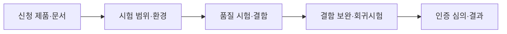
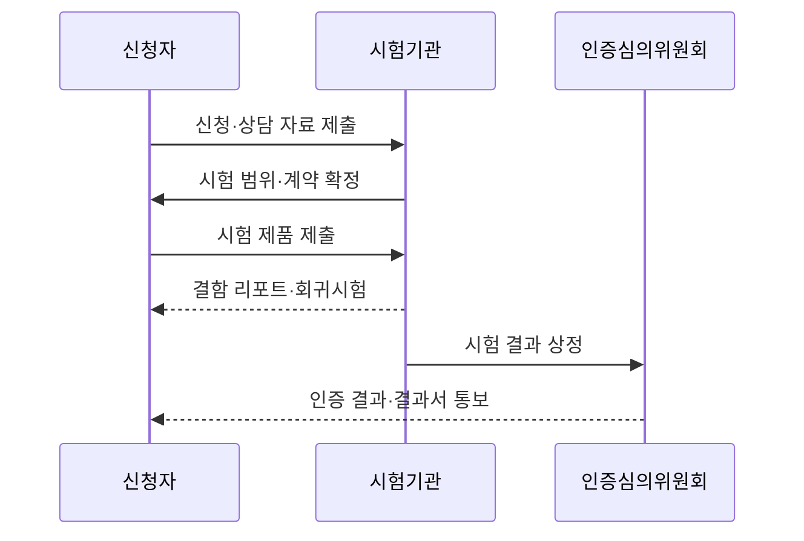

---
sidebar:
  order: 31
  label: "031. 소프트웨어 품질 평가 검증 (TTA & GS 인증)"
  badge:
    text: "기출 · 70%"
    variant: note
title: "소프트웨어 품질 평가 검증 (TTA & GS 인증)"
date: "2026-07-27T23:59:59+09:00"
tags:
  - "notes-evaluation"
weight: 31
extra:
  question_no: "031"
  source_status: "기출"
  source_history: "126회, 134회"
  priority: 70
  priority_note: "반복 기출, 공인 SW 품질 시험·평가 절차"
---

## 미리 알고가기

- **한국정보통신기술협회(Telecommunications Technology Association, TTA)**: '티티에이'로 읽고 기관 영문명의 머리글자를 표기하며 정보통신 시험·인증을 수행
- **우수 소프트웨어(Good Software, GS) 인증**: '지에스 인증'으로 읽고 품질이 우수한 소프트웨어 제품임을 시험·평가해 인증
- **소프트웨어(Software, SW)**: '에스더블유'로 읽고 프로그램·데이터·관련 문서를 통칭하는 영문 머리글자
- **제3자 시험(Third-Party Testing)**: 개발·구매 당사자와 독립된 기관이 수행하는 시험
- **시험 범위(Test Scope)**: 평가에 포함되는 제품 버전·기능·문서·플랫폼·운영 환경
- **시험 명세(Test Specification)**: 시험 대상·조건·절차·기대 결과를 정의한 문서
- **시험 케이스(Test Case)**: 입력·선행 조건·수행 단계·기대 결과를 구체화한 검증 단위
- **결함 리포트(Defect Report)**: 발견한 결함의 재현 조건·영향·증거를 기록한 문서
- **회귀시험(Regression Testing)**: 수정이 기존 정상 기능을 깨뜨리지 않았는지 다시 확인하는 시험
- **품질인증심의위원회**: 시험 결과를 검토해 GS 인증 여부를 결정하는 위원회
- **시험결과서(Test Report)**: 시험 환경·항목·결과·결함·판정을 기록한 공식 문서
- **벤치마크 테스트(Benchmark Test, BMT)**: '비엠티'로 읽고 같은 조건의 제품 성능·기능을 비교하는 시험
- **인수시험(Acceptance Testing)**: 납품 제품이 계약의 수용 기준을 충족하는지 발주자가 확인하는 시험
- **인증 범위(Certification Scope)**: 인증서가 유효한 제품 버전·기능·환경의 경계

## Ⅰ. 개요

- 정의/개념: 독립 시험기관이 실제 SW 제품의 **품질 요구 충족 여부를 시험·인증**
- **배경/필요성**: 공급자 자체 시험만으로 발생하는 **품질 주장 편향·구매 검증 한계 해소**

### 쉽게 이해하기 (학습용)

- 개발사가 품질이 좋다고 주장하는 대신 독립 시험기관이 실제 제품과 문서를 정해진 환경에서 시험하고 인증 여부를 판단한다.

## Ⅱ. 특징

- **제품·버전·운영환경 고정**으로 인증 범위를 명확히 한다.
- **실제 제품의 기능·품질 시험**으로 객관적 적합성을 판정한다.
- **결함 보완·회귀시험·인증심의**로 수정 결과와 증거를 검증한다.

### 쉽게 이해하기 (학습용)

- 인증서가 회사 전체 소프트웨어를 보장하는 것이 아니라 시험한 특정 제품과 버전 및 환경에 대한 결과라는 점을 확인해야 한다.

## Ⅲ. 아키텍처 및 구성요소

| 설계 요소 | 설명 |
|:---|:---|
| 신청 제품·문서 | 제품·버전·기능·매뉴얼 제출 |
| 시험 범위·환경 | 대상 플랫폼·항목·일정 확정 |
| 품질 시험·결함 | 시험 수행과 재현 증거 기록 |
| 결함 보완·회귀시험 | **수정본과 영향 기능 재검증** |
| 인증 심의·결과 | 인증 여부와 범위·결과서 확정 |

> 요약: 제품 시험과 인증심의를 거쳐 인증 범위를 정한다

### 쉽게 이해하기 (학습용)

- 시험할 제품과 환경을 고정하고 결함 수정본을 다시 시험한 뒤 위원회가 인증 범위를 결정한다.

## Ⅳ. 원리 및 절차 흐름도

| 절차 | 설명 |
|:---|:---|
| 신청·상담 자료 제출 | 매뉴얼·기능 목록·환경 제시 |
| 시험 범위·계약 확정 | 대상·수수료·일정·조건 합의 |
| 시험 제품 제출 | 고정 버전과 관련 문서 제공 |
| 결함 리포트·회귀시험 | 결함 수정과 영향 기능 재검증 |
| 시험 결과 상정 | 시험결과서를 위원회에 제출 |
| 인증 결과·결과서 통보 | 인증서·마크·시험결과서 전달 |

> 요약: 제품을 실제 시험·보완하고 심의로 인증을 결정한다.

### 쉽게 이해하기 (학습용)

- 신청 제품의 결함 보완과 회귀시험 결과를 위원회가 검토해 인증 여부를 정한다.

## Ⅴ. 종류 및 비교

| 소프트웨어 품질 검증 방식 | GS 인증 | BMT | 인수시험 |
|:---|:---|:---|:---|
| 적용 기준 | 인증서·마크와 공인 품질 증거 | 후보 제품 성능·기능 선정 | 개별 사업의 최종 인수 결정 |
| 핵심 특징 | 제품 품질의 제3자 인증 | 동일 조건의 제품 간 비교 | 계약 수용 기준 확인 |
| 한계 | 인증 범위 밖 변경 미보장 | 시험 조건 편향 가능 | 계약 요구 누락 가능 |

> 요약: GS는 인증, BMT는 비교, 인수시험은 계약을 본다

### 쉽게 이해하기 (학습용)

- GS는 제품이 품질 기준에 맞는지 인증하고 BMT는 후보끼리 비교하며 인수시험은 납품물이 계약 약속을 지켰는지 확인한다.

## Ⅵ. 실무 사례

1. 도입 제품은 **인증서의 버전·기능·환경과 대조**

### 쉽게 이해하기 (학습용)

- 같은 제품명이어도 인증서의 버전·기능·환경이 다르면 인증 범위로 보지 않음

## Ⅶ. 결론

- GS 인증은 **시험한 제품·버전·환경 범위에서만 유효**

### 쉽게 이해하기 (학습용)

- GS 인증은 품질의 무조건적 보증서가 아니라 특정 제품 범위의 제3자 시험 결과이므로 실제 도입 조건과의 일치 여부를 확인해야 한다.
