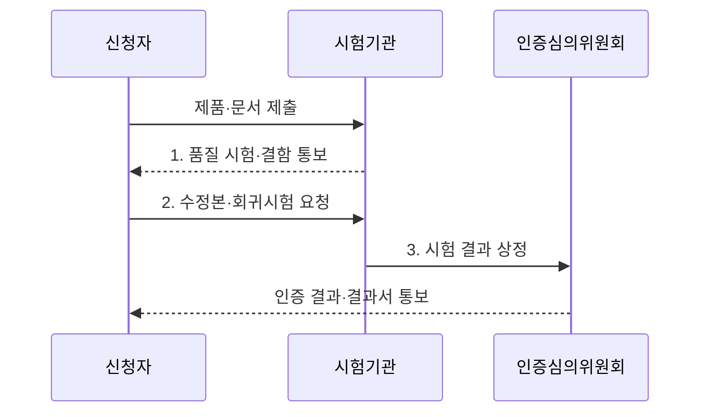

---
sidebar:
  order: 31
  label: "031. 소프트웨어 품질 평가 검증 (TTA & GS 인증)"
  badge:
    text: "기출 · 70%"
    variant: note
title: "소프트웨어 품질 평가 검증 (TTA & GS 인증)"
date: "2026-07-30T00:45:00+09:00"
tags:
  - "notes-evaluation"
weight: 31
extra:
  question_no: "031"
  source_status: "기출"
  source_history: "126회, 134회"
  priority: 70
  priority_note: "반복 기출, 공인 SW 품질 시험·평가 절차"
---

## 미리 알고가기

- **한국정보통신기술협회(Telecommunications Technology Association, TTA)**: 정보통신 기술의 표준화와 소프트웨어 시험·인증을 수행하는 기관이다.
- **우수 소프트웨어(Good Software, GS) 인증**: 실제 소프트웨어 제품이 정해진 품질 기준을 충족하는지 시험·평가하여 부여하는 인증이다.
- **소프트웨어(Software, SW)**: 컴퓨터에서 기능을 수행하는 프로그램·데이터·관련 문서를 포괄하는 논리적 구성요소다.
- **제3자 시험(Third-Party Testing)**: 개발·구매 당사자와 독립된 기관이 품질 요구 충족 여부를 검증하는 시험이다.
- **시험 범위(Test Scope)**: 평가할 제품 버전·기능·문서·플랫폼·운영 환경을 한정한 경계다.
- **시험 명세(Test Specification)**: 시험 대상·조건·절차·기대 결과를 정의한 문서다.
- **시험 케이스(Test Case)**: 입력·선행 조건·수행 단계·기대 결과를 구체화한 검증 단위다.
- **결함 리포트(Defect Report)**: 발견한 결함의 재현 조건·영향·증거를 기록한 문서다.
- **회귀시험(Regression Testing)**: 결함 수정이 기존 정상 기능을 깨뜨리지 않았는지 다시 확인하는 시험이다.
- **품질인증심의위원회**: 시험 결과와 보완 증거를 검토해 GS 인증 여부를 결정하는 위원회다.
- **시험결과서(Test Report)**: 시험 환경·항목·결과·결함·판정을 기록한 공식 문서다.
- **벤치마크 테스트(Benchmark Test, BMT)**: 동일한 조건에서 후보 제품의 성능과 기능을 비교하는 시험이다.
- **인수시험(Acceptance Testing)**: 납품 제품이 계약의 수용 기준을 충족하는지 발주자가 확인하는 시험이다.
- **인증 범위(Certification Scope)**: 인증서의 효력이 미치는 제품 버전·기능·운영 환경의 경계다.

## Ⅰ. 개요

- 정의/개념: 독립 시험기관이 실제 SW 제품을 시험해 **품질 요구 충족 여부**를 판정하고 인증하는 **제3자 품질 검증 체계**
- 배경/필요성: 공급자 자체 시험의 **판정 편향**을 배제하고 구매자가 제품 품질을 객관적으로 확인할 공인 증거 확보

### 쉽게 이해하기 (학습용)

- 개발사가 품질이 좋다고 주장하는 대신 독립 시험기관이 실제 제품과 문서를 정해진 환경에서 시험하고 인증 여부를 판단한다.

## Ⅱ. 특징

- **제품·버전·운영환경 고정**으로 인증 범위를 명확히 한다.
- **실제 제품의 기능·품질 시험**으로 객관적 적합성을 판정한다.
- **결함 보완·회귀시험·인증심의**로 수정 결과와 증거를 검증한다.

### 쉽게 이해하기 (학습용)

- 인증서가 회사 전체 소프트웨어를 보장하는 것이 아니라 시험한 특정 제품과 버전 및 환경에 대한 결과라는 점을 확인해야 한다.

## Ⅲ. 구조 및 구성요소

```mermaid
block-beta
    columns 3
    P["신청 제품·문서"] E["시험 범위·환경"] T["시험기관"]
    space:3
    R["시험결과서"] space C["품질인증심의위원회"]
    P -- T
    E -- T
    T -- R
    R -- C
```

| 구성요소 | 책임 |
|:---|:---|
| 신청 제품·문서 | 시험할 **제품 버전·기능·매뉴얼** 제공 |
| 시험 범위·환경 | 대상 플랫폼·품질 항목·운영 조건의 **인증 경계** 확정 |
| 시험기관 | 시험 케이스 수행, 결함 재현 및 **회귀시험** |
| 시험결과서 | 시험 환경·항목·결함·판정의 **객관적 증거** 기록 |
| 품질인증심의위원회 | 시험 결과와 보완 증거를 검토해 **인증 여부** 결정 |

> 요약: **시험 범위**를 고정한 제품을 독립 시험기관이 검증하고 심의위원회가 인증 여부를 결정하는 구조

### 쉽게 이해하기 (학습용)

- 시험할 제품과 환경을 고정하고 결함 수정본을 다시 시험한 뒤 위원회가 인증 범위를 결정한다.

## Ⅳ. 흐름도



- 1. **품질 시험·결함 통보**: 고정한 제품 범위를 시험 명세에 따라 검증하고 재현 가능한 결함 증거를 전달
- 2. **수정본·회귀시험 요청**: 결함 수정본과 변경 내역을 제출해 기존 정상 기능의 영향까지 재검증
- 3. **시험 결과 상정**: 시험결과서와 보완 증거를 심의해 인증 여부와 범위를 확정

> 요약: 고정한 제품 범위를 **시험·보완·심의**하여 인증 결과를 객관적 증거로 남기는 절차

### 쉽게 이해하기 (학습용)

- 신청 제품의 결함 보완과 회귀시험 결과를 위원회가 검토해 인증 여부를 정한다.

## Ⅴ. 종류 및 비교

| 소프트웨어 품질 검증 방식 | GS 인증 | BMT | 인수시험 |
|:---|:---|:---|:---|
| 적용 기준 | 인증서·마크와 공인 품질 증거 | 후보 제품 성능·기능 선정 | 개별 사업의 최종 인수 결정 |
| 핵심 특징 | 제품 품질의 제3자 인증 | 동일 조건의 제품 간 비교 | 계약 수용 기준 확인 |
| 한계 | 인증 범위 밖 변경 미보장 | 시험 조건 편향 가능 | 계약 요구 누락 가능 |

> 요약: **GS 인증**은 기준 충족, **BMT**는 후보 간 우열, **인수시험**은 계약 충족을 판정

### 쉽게 이해하기 (학습용)

- GS는 제품이 품질 기준에 맞는지 인증하고 BMT는 후보끼리 비교하며 인수시험은 납품물이 계약 약속을 지켰는지 확인한다.

## Ⅵ. 실무 고려사항 및 대책

| 고려사항 | 대책 | 효과 |
|:---|:---|:---|
| 도입 제품의 버전·기능·환경이 **인증 범위와 불일치** | 인증서와 시험결과서를 구매 요구사항·운영 환경에 대조 | 인증 결과의 **오적용 방지** |
| 인증 후 패치로 시험 당시 제품이 **변경** | 변경 기능의 영향도를 분석하고 회귀시험·재인증 여부 판단 | 변경 후 **품질 증거 유지** |
| 시험결과서에 실제 업무의 핵심 조건이 **누락** | 인수시험에서 업무 시나리오와 성능 조건을 추가 검증 | 공인 시험과 **사업 수용성 보완** |

### 쉽게 이해하기 (학습용)

- 같은 제품명이라도 인증서의 버전·기능·환경이 다르면 인증 효력이 그대로 적용되지 않으므로 도입 조건을 대조해야 한다.

## Ⅶ. 결론

- 도입 제품의 버전·기능·환경이 **GS 인증 범위**와 일치하는지 확인하고, 업무 고유 조건은 **인수시험**으로 보완하는 품질 검증 결정

### 쉽게 이해하기 (학습용)

- GS 인증은 품질의 무조건적 보증서가 아니라 특정 제품 범위의 제3자 시험 결과이므로 실제 도입 조건과의 일치 여부를 확인해야 한다.
