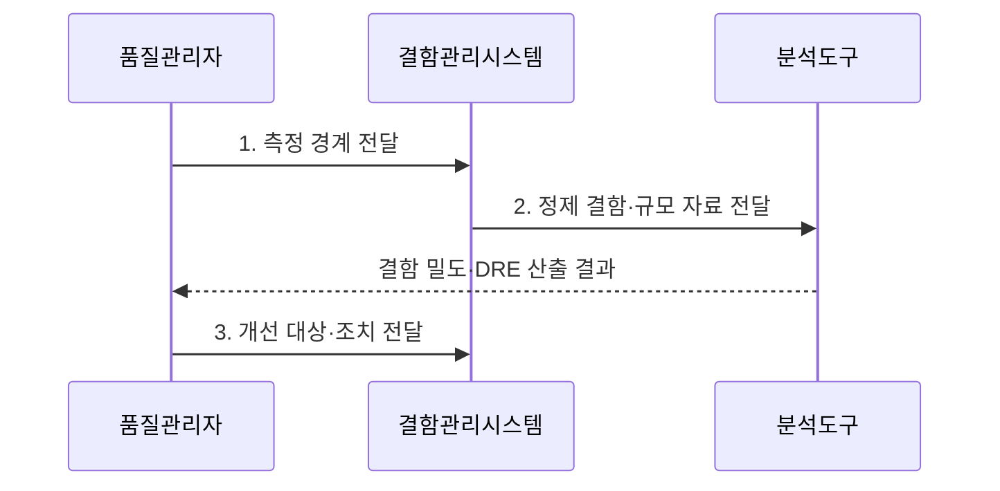

---
sidebar:
  order: 32
  label: "032. 결함 밀도와 결함 제거율"
  badge:
    text: "기출 · 30%"
    variant: note
title: "결함 밀도와 결함 제거율(Defect Density & DRE)"
date: "2026-07-31T05:03:10+09:00"
tags:
  - "notes-evaluation"
weight: 32
extra:
  question_no: "032"
  source_status: "기출"
  source_history: "122회"
  priority: 30
  priority_note: "결함 지표의 계산과 해석을 묻는 주제"
---

## 미리 알고가기

- **결함(Defect)**: 소프트웨어 산출물이 요구사항과 다르게 동작하게 만드는 문제다.
- **결함 밀도(Defect Density)**: 제품 규모 한 단위에서 발견된 결함 수로 결함 집중도를 나타내는 지표다.
- **결함 제거 효율(Defect Removal Efficiency, DRE)**: 전체 발견 결함 중 출시 전에 제거한 결함의 비율을 나타내는 시험 효과성 지표다.
- **천 코드 줄(Kilo Lines of Code, KLOC)**: 소스 코드 1,000줄을 하나의 소프트웨어 규모 단위로 나타낸 값이다.
- **기능점수(Function Point, FP)**: 사용자 관점의 논리 기능을 계수하여 소프트웨어 규모를 나타내는 단위다.
- **유출 결함(Escape Defect)**: 출시 전 시험에서 발견하지 못하고 운영에서 발견된 결함이다.
- **심각도(Severity)**: 결함이 업무와 시스템에 미치는 영향의 크기다.
- **검출 편향**: 시험 범위와 강도 차이 때문에 실제 품질과 별개로 발견 결함 수가 달라지는 현상이다.

## Ⅰ. 개요

- 정의/개념: **결함 밀도**는 규모당 결함 집중도, **DRE**는 출시 전 결함 제거 비율을 나타내는 품질 지표
- 배경/필요성: 단순 결함 건수로는 **제품 규모**와 **시험 검출력** 차이를 구분할 수 없어 품질 비교 곤란

### 쉽게 이해하기 (학습용)

- 결함 100개라는 수만으로는 큰 제품인지 시험을 많이 한 제품인지 알 수 없으므로, 결함 밀도로 제품 크기를 보정하고 DRE로 출시 전 차단 성과를 확인해야 품질 개선 대상을 정할 수 있다.

## Ⅱ. 특징

- **결함 수÷KLOC·FP**를 통한 규모 보정과 결함 집중도 비교
- **출시 전 제거÷전체 발견 결함**을 통한 시험 유출 차단력 평가
- **결함 분류·관찰 기간·규모 단위 통일**을 통한 비교 왜곡 방지

### 쉽게 이해하기 (학습용)

- 결함 밀도가 높으면 해당 모듈에 결함이 집중되었을 가능성이 크고 DRE가 낮으면 많은 결함이 운영으로 빠져나갔다는 뜻이므로, 전자는 제품 구조를 후자는 시험 공정을 우선 개선해야 한다.

## Ⅲ. 구조 및 구성요소

| 구성요소 | 책임 |
|:---|:---|
| **결함 분류 기준** | 중복·오분류를 제거해 지표의 **분자 통일** |
| **제품 규모 기준** | 코드 제품은 KLOC, 기능 제품은 FP로 **분모 고정** |
| **단계·관찰 기간** | 출시 전 제거와 운영 유출의 **관찰 경계 통일** |
| **결함 추적 체계** | 출시 전·운영 결함을 **원인·수정 이력**으로 연결 |
| **심각도 기준** | 업무 영향에 따라 결함의 **우선순위 보정** |

### 쉽게 이해하기 (학습용)

- 분자·분모·기간이 서로 다르면 같은 수치도 다른 뜻이 되므로, 결함 분류부터 운영 유출 추적까지 동일한 측정 경계를 먼저 세워야 팀과 제품 간 비교가 성립한다.

## Ⅳ. 흐름도

- **1. 측정 경계 전달**: 결함 분류·규모 단위·단계·**관찰 기간** 통일
- **2. 정제 결함·규모 자료 전달**: 결함과 같은 버전의 **제품 규모** 연결
- **3. 개선 대상·조치 전달**: 밀도는 모듈, DRE는 **시험 공정** 개선

### 쉽게 이해하기 (학습용)

- 기준을 고정하고 자료를 정제한 뒤 두 지표를 함께 계산해야, 결함이 많은 원인이 제품 자체인지 시험의 검출 부족인지 구분하여 올바른 개선 조치를 선택할 수 있다.

## Ⅴ. 종류 및 비교

| 소프트웨어 결함 품질 지표 | 결함 밀도 | DRE |
|:---|:---|:---|
| **적용 기준** | 규모가 다른 모듈의 **결함 집중도** 비교 | 출시 전 시험 공정의 **유출 차단력** 평가 |
| **핵심 특징** | 규모당 **발견 결함 수** | 출시 전 **결함 제거 비율** |
| **한계** | 시험 강도 차이에 따른 **왜곡** | 짧은 관찰 기간에 따른 **과대평가** |

> **결함 밀도** = 발견 결함 수 / 규모
>
> **DRE** = 출시 전 제거 결함 / (출시 전 제거 결함 + 운영 유출 결함) × 100

### 쉽게 이해하기 (학습용)

- 결함 밀도 상승은 취약 모듈을 다시 살피라는 신호이고 DRE 하락은 시험에서 놓친 결함이 늘었다는 신호이므로, 두 수치를 원인과 조치가 다른 지표로 해석해야 한다.

## Ⅵ. 실무 고려사항 및 대책

| 고려사항 | 대책 | 효과 |
|:---|:---|:---|
| KLOC·FP 혼용에 따른 **결함 밀도 왜곡** | 동일 제품군의 **규모 단위·계수 기준** 통일 | 제품·모듈 간 **비교 가능성 확보** |
| 짧은 관찰 기간에 따른 **DRE 과대평가** | 동일 기간 후 **운영 유출 결함**을 포함해 재산정 | 시험 공정의 **실제 차단력 확인** |
| 낮은 심각도 결함에 따른 **건수 편향** | 심각도별 지표와 **중대 결함 추세** 병기 | 업무 영향 중심의 **개선 우선순위 확보** |

### 쉽게 이해하기 (학습용)

- 동일한 운영 관찰 기간 뒤 유출 결함을 포함해야 출시 전 제거 성과를 같은 조건에서 비교할 수 있다.

## Ⅶ. 결론

- 결함 밀도가 높으면 **취약 모듈 보강**, DRE가 낮으면 **시험 공정 강화**

### 쉽게 이해하기 (학습용)

- 결함 밀도가 높으면 취약 모듈을 보강하고 DRE가 낮으면 시험 공정을 강화하되, 같은 규모·기간·분류 기준일 때만 수치를 비교해야 잘못된 품질 판단을 피할 수 있다.
