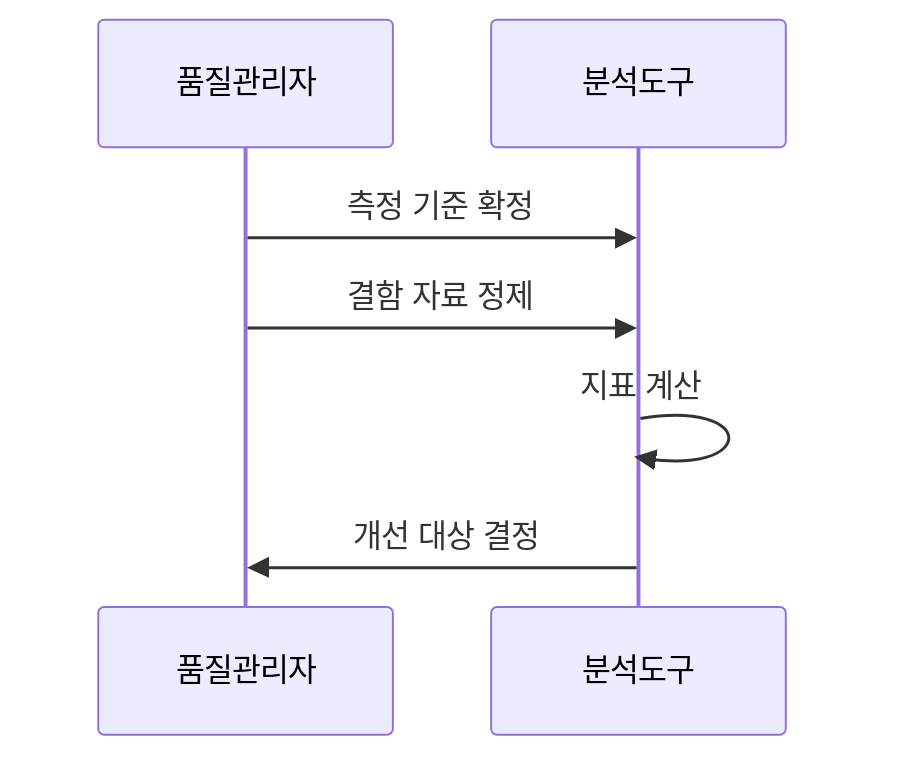

---
sidebar:
  order: 32
  label: "032. 결함 밀도와 결함 제거율"
  badge:
    text: "기출 · 30%"
    variant: note
title: "결함 밀도와 결함 제거율(Defect Density & DRE)"
date: "2026-07-25T14:10:00+09:00"
tags:
  - "notes-evaluation"
weight: 32
extra:
  question_no: "032"
  source_status: "기출"
  source_history: "122회"
  priority: 30
  priority_note: "결함 지표의 계산과 해석을 묻는 주제"
---

## 미리 알고가기

- **결함(Defect)**: 요구사항과 다르게 동작하게 만드는 산출물의 문제
- **결함 밀도(Defect Density)**: 제품 규모 한 단위에 존재하는 결함 수
- **DRE(Defect Removal Efficiency)**: 운영 전에 전체 결함 중 얼마나 제거했는지를 나타내는 비율
- **KLOC(Kilo Lines of Code)**: 코드 1,000줄을 한 단위로 나타낸 규모
- **FP(Function Point)**: 사용자가 인식하는 기능을 기준으로 측정한 소프트웨어 규모
- **유출 결함(Escape Defect)**: 시험에서 발견하지 못하고 운영에서 발견된 결함
- **심각도(Severity)**: 결함이 업무와 시스템에 미치는 영향의 크기
- **검출 편향**: 시험 범위와 강도 차이 때문에 발견 결함 수가 달라지는 현상

## Ⅰ. 개요

- **정의/개념**: 밀도는 규모당 결함, DRE는 사전 제거율이다
- **배경/필요성**: 제품 취약도와 시험 차단력을 구분한다

### 쉽게 이해하기 (학습용)

- 결함 100개라는 수만으로는 큰 제품인지 시험을 많이 한 제품인지 알 수 없으므로, 결함 밀도로 제품 크기를 보정하고 DRE로 출시 전 차단 성과를 확인해야 품질 개선 대상을 정할 수 있다.

## Ⅱ. 특징

- 밀도는 규모를 보정해 결함 집중 영역을 찾는다
- DRE는 운영 유출을 반영해 시험 차단력을 보인다
- 측정 경계 차이는 제품·팀 간 비교를 왜곡한다
- 두 지표 결합은 제품과 시험의 개선 대상을 나눈다

### 쉽게 이해하기 (학습용)

- 결함 밀도가 높으면 해당 모듈에 결함이 집중되었을 가능성이 크고 DRE가 낮으면 많은 결함이 운영으로 빠져나갔다는 뜻이므로, 전자는 제품 구조를 후자는 시험 공정을 우선 개선해야 한다.

## Ⅲ. 아키텍처 및 구성요소

| 설계 요소 | 설명 |
|:---|:---|
| 결함 분류 | 중복·오분류를 제거해 분자를 통일 |
| 규모 기준 | KLOC·FP 중 비교 기준을 선택 |
| 단계·기간 | 발견 단계와 관찰 기간을 고정 |
| 심각도 가중 | 결함 영향에 따라 가중치를 부여 |
| 추적 체계 | 유입부터 운영 유출까지 연결 |

> 요약: 동일한 경계로 결함·규모·유출을 추적한다

### 쉽게 이해하기 (학습용)

- 분자·분모·기간이 서로 다르면 같은 수치도 다른 뜻이 되므로, 결함 분류부터 운영 유출 추적까지 동일한 측정 경계를 먼저 세워야 팀과 제품 간 비교가 성립한다.

## Ⅳ. 원리 및 절차 흐름도

| 절차 | 설명 |
|:---|:---|
| 측정 기준 확정 | 결함·규모·단계·기간을 통일 |
| 결함 자료 정제 | 중복과 오분류 결함을 제거 |
| 지표 계산 | 밀도와 DRE를 같은 기준으로 산출 |
| 개선 대상 결정 | 제품 구조와 시험 공정을 구분 개선 |

> 요약: 기준을 통일해 두 지표를 계산하고 개선을 나눈다

### 쉽게 이해하기 (학습용)

- 기준을 고정하고 자료를 정제한 뒤 두 지표를 함께 계산해야, 결함이 많은 원인이 제품 자체인지 시험의 검출 부족인지 구분하여 올바른 개선 조치를 선택할 수 있다.

## Ⅴ. 종류 및 비교

| 판단 축 | 결함 밀도 | DRE |
|:---|:---|:---|
| 핵심 특징 | 규모당 발견 결함 수 | 출시 전 결함 제거 비율 |
| 적용 기준 | 모듈 간 취약도 비교 | 시험 공정의 차단력 평가 |
| 주요 위험 | 시험 강도 차이로 왜곡 | 관찰 기간이 짧으면 과대평가 |

> 결함 밀도 = 발견 결함 수 / 규모
>
> DRE = 출시 전 제거 결함 / 전체 결함 × 100

> 요약: 밀도는 취약도, DRE는 출시 전 차단력을 평가한다

### 쉽게 이해하기 (학습용)

- 결함 밀도 상승은 취약 모듈을 다시 살피라는 신호이고 DRE 하락은 시험에서 놓친 결함이 늘었다는 신호이므로, 두 수치를 원인과 조치가 다른 지표로 해석해야 한다.

## Ⅵ. 실무 사례

1. 모듈별 밀도로 집중 시험 대상을 선정한다
2. 운영 결함을 포함해 DRE를 재산정한다
3. 심각도 가중 밀도로 위험을 보정한다
4. 개인 평가 대신 공정 개선에 활용한다

### 쉽게 이해하기 (학습용)

- 사례 1은 특정 모듈의 결함 밀도가 높으면 코드가 나쁘다고 단정하지 말고 변경량과 시험 강도를 함께 확인한 뒤 추가 검토와 시험 범위를 정한다.
- 사례 2는 출시 직후에는 유출 결함이 덜 집계되어 DRE가 높게 보이므로, 동일한 운영 관찰 기간이 지난 뒤 다시 계산해야 릴리스 간 차단력을 공정하게 비교할 수 있다.
- 사례 3은 경미한 결함이 많은 제품과 치명적 결함이 적은 제품을 건수만으로 비교하면 위험을 놓치므로, 심각도 가중치를 적용해 실제 업무 영향이 큰 영역을 우선 개선한다.
- 사례 4는 결함 수를 개인 성과에 연결하면 보고를 회피하게 되므로, 지표는 사람의 순위를 매기기보다 결함 유입 원인과 시험 누락 지점을 고치는 데 사용한다.

## Ⅶ. 결론

- 기준을 통일해 제품과 시험을 나눠 개선한다.

### 쉽게 이해하기 (학습용)

- 결함 밀도가 높으면 취약 모듈을 보강하고 DRE가 낮으면 시험 공정을 강화하되, 같은 규모·기간·분류 기준일 때만 수치를 비교해야 잘못된 품질 판단을 피할 수 있다.
