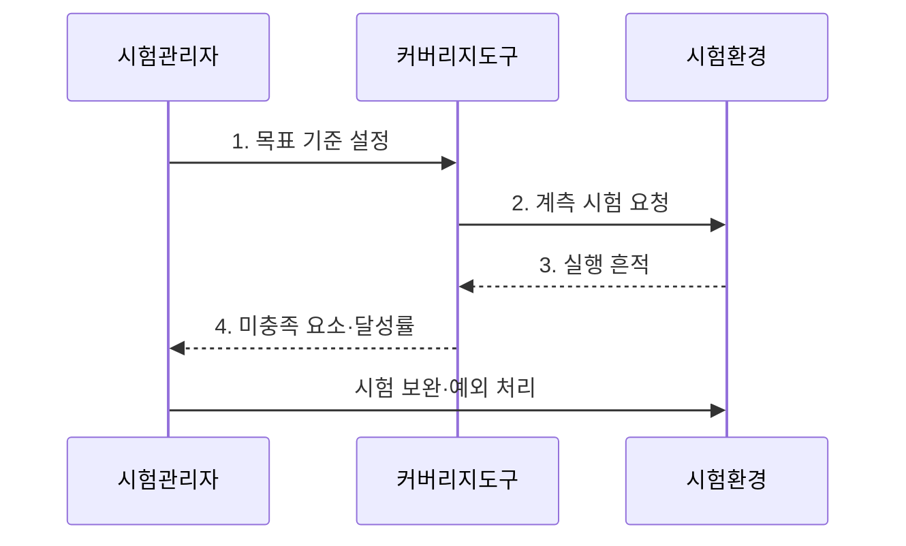

---
sidebar:
  order: 33
  label: "033. 테스트 커버리지"
  badge:
    text: "미출제 · 50%"
    variant: note
title: "테스트 커버리지(구문·분기·MC/DC)"
date: "2026-07-30T01:18:00+09:00"
tags:
  - "notes-evaluation"
weight: 33
extra:
  question_no: "033"
  source_status: "미출제"
  source_history: ""
  priority: 50
  priority_note: "구문·분기·MC/DC를 비교하는 시험 핵심축"
---

## 미리 알고가기

- **테스트 커버리지(Test Coverage)**: 시험 대상의 구조 요소 중 시험으로 실행하거나 충족한 요소의 비율이다.
- **구문 커버리지(Statement Coverage)**: 실행 가능한 각 구문을 한 번 이상 실행한 비율이다.
- **분기 커버리지(Branch Coverage)**: 각 결정의 참과 거짓 결과를 실행한 비율이다.
- **조건 커버리지(Condition Coverage)**: 결정문 안의 각 개별 조건이 참과 거짓을 가진 비율이다.
- **결정(Decision)**: 하나 이상의 조건을 조합해 제어 흐름을 선택하는 논리식이다.
- **수정 조건·결정 커버리지(Modified Condition/Decision Coverage, MC/DC)**: 각 개별 조건이 결정 결과를 독립적으로 바꿀 수 있음을 시험 쌍으로 입증하는 기준이다.
- **포섭 관계(Subsumption)**: 강한 커버리지 기준을 만족하면 약한 기준도 함께 만족하는 관계다.
- **도달 불가 코드(Dead Code)**: 허용된 입력과 제어 흐름으로 실행할 수 없는 코드다.
- **품질 게이트(Quality Gate)**: 정한 커버리지 목표와 예외 기준을 충족해야 다음 단계로 진행시키는 통제 규칙이다.

## Ⅰ. 개요

- 정의/개념: 코드·분기·조건 등 전체 구조 요소 중 시험으로 **실행하거나 충족한 요소의 비율**을 측정해 시험 공백을 찾는 지표
- 배경/필요성: 시험 건수와 성공률만으로 드러나지 않는 **미실행 코드 경로**와 논리 조건의 검증 누락 식별

### 쉽게 이해하기 (학습용)

- 시험이 모두 통과해도 실행하지 않은 코드 경로에는 결함이 남을 수 있으므로, 커버리지는 무엇을 시험했는지가 아니라 무엇을 아직 시험하지 않았는지를 찾아 보완하게 한다.

## Ⅱ. 특징

- **실행 범위 가시화**로 미시험 요소를 찾지만 결과의 정답성은 별도 검증한다.
- **포섭 관계**에 따라 구문·분기·MC/DC 순으로 더 강한 논리 증거를 요구한다.
- **위험 기반 목표와 예외 관리**로 검증 강도와 시험 비용을 조정한다.

### 쉽게 이해하기 (학습용)

- 구문은 문장 실행, 분기는 결정 결과, MC/DC는 개별 조건의 독립 영향을 확인하므로, 안전 중요도가 높을수록 더 강한 기준을 적용하되 높은 수치만으로 정답의 정확성까지 보장된다고 해석해서는 안 된다.

## Ⅲ. 구조 및 구성요소

```mermaid
block-beta
    columns 2
    S["검증 대상"] T["시험 집합"]
    I["계측 도구"]:2
    R["실행 흔적"] G["품질 게이트"]
    S -- I
    T -- I
    I -- R
    R -- G
```

| 구성요소 | 책임 |
|:---|:---|
| 검증 대상 | 시험할 코드·모델과 구문·분기·조건의 **전체 요소** 제공 |
| 시험 집합 | 정상·오류·경곗값 입력과 기대 결과 제공 |
| 계측 도구 | 시험별 실행 경로와 논리 결과 수집 |
| 실행 흔적 | 충족·미충족 요소와 도달 여부 기록 |
| 품질 게이트 | 위험별 목표 충족, 시험 보완 또는 예외 승인 판정 |

> 요약: 실행 흔적으로 미충족 요소와 품질 게이트를 판단한다

### 쉽게 이해하기 (학습용)

- 대상 코드에 계측 정보를 넣고 시험 집합을 실행하면 실제로 지나간 경로가 남으므로, 그 흔적과 전체 구조의 차이를 비교해 추가 시험이 필요한 구문·분기·조건을 찾는다.

## Ⅳ. 흐름도



- 1. **목표 기준 설정**: 기능 위험도에 맞춰 구문·분기·MC/DC와 목표 비율을 선택
- 2. **계측 시험 요청**: 대상 구조를 계측하고 시험 집합으로 코드 경로를 실행
- 3. **실행 흔적**: 시험별 실행 구문·결정 결과·개별 조건의 변화 기록
- 4. **미충족 요소·달성률**: 전체 구조와 실행 흔적을 대조해 시험 공백과 도달 불가 코드를 구분

> 요약: 목표 설정 뒤 미충족 경로를 분석해 보완한다

### 쉽게 이해하기 (학습용)

- 먼저 요구 수준을 정하고 계측 시험을 실행한 뒤 빈 구간의 원인을 분석해야, 실행 가능한 경로에는 시험을 추가하고 도달 불가 코드는 제거하거나 정당한 예외로 기록할 수 있다.

## Ⅴ. 종류 및 비교

| 테스트 커버리지 | 구문 | 분기 | MC/DC |
|:---|:---|:---|:---|
| 적용 기준 | 일반 코드의 기본 점검 | 제어 흐름 중심 점검 | 안전 중요 논리 점검 |
| 핵심 특징 | 각 실행 구문을 확인 | 결정의 참·거짓 흐름을 확인 | 조건별 독립 영향을 시험 쌍으로 확인 |
| 한계 | 미실행 분기를 놓침 | 복합 조건의 독립 영향을 놓침 | 시험 조합 구성 비용 증가 |

> 요약: 구문·분기·조건 독립성 순으로 검증이 강해진다

### 쉽게 이해하기 (학습용)

- 구문 100%여도 한쪽 분기를 타지 않을 수 있고 분기 100%여도 개별 조건의 영향은 드러나지 않을 수 있으므로, 중요한 복합 논리에는 다른 조건을 고정한 채 한 조건만 바꿔 결과가 달라지는 MC/DC 증거가 필요하다.

## Ⅵ. 실무 고려사항 및 대책

| 고려사항 | 대책 | 효과 |
|:---|:---|:---|
| 커버리지 목표만 채우고 **결과 정답성 미검증** | 커버리지 시험과 요구사항 기반 기대 결과 검증을 연결 | 실행 여부와 **기능 정확성 동시 확보** |
| 도달 불가 코드가 분모에 남아 **달성률 저하** | 도달 불가 원인을 분석해 코드를 제거하거나 승인 근거 기록 | 커버리지 수치의 **해석 가능성 확보** |
| 안전 중요 복합 조건을 분기 커버리지만으로 시험해 **조건 영향 누락** | 다른 조건을 고정하고 대상 조건만 바꾸는 MC/DC 시험 쌍 구성 | 개별 조건의 **독립 영향 입증** |

### 쉽게 이해하기 (학습용)

- 차량 제어의 복합 조건은 다른 조건을 고정하고 대상 조건만 바꾼 시험 쌍으로 각 조건이 결정 결과에 미치는 독립 영향을 입증한다.

## Ⅶ. 결론

- 기능 위험도에 따라 **커버리지 기준**을 선택하고 미충족 경로는 시험 보완, 도달 불가 코드는 근거 기반 예외로 처리하는 품질 게이트 결정

### 쉽게 이해하기 (학습용)

- 미충족 구문·분기·조건이 발견되면 위험도에 맞춰 시험을 추가하고, 실행 불가능한 부분만 근거를 남겨 예외 처리해야 커버리지 수치가 실제 시험 충분성을 설명할 수 있다.
