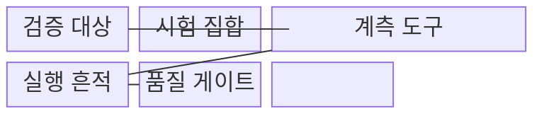
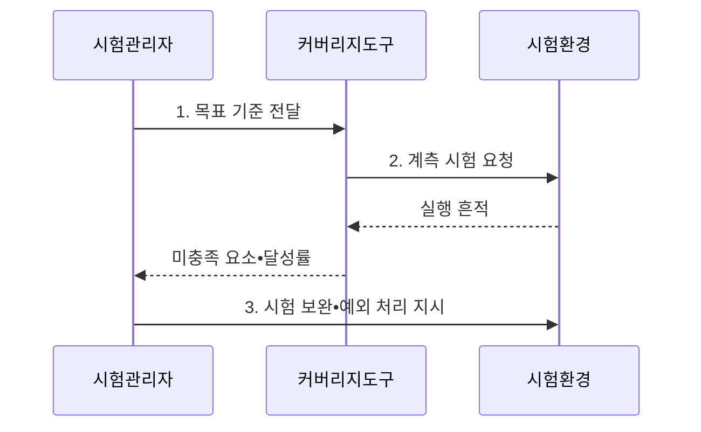

---
sidebar:
  order: 33
  label: "033. 테스트 커버리지"
  badge:
    text: "미출 • 50%"
    variant: note
title: "테스트 커버리지(구문•분기•MC/DC)"
date: "2026-08-03T14:48:00+09:00"
tags:
  - "notes-evaluation"
weight: 33
extra:
  question_no: "033"
  source_status: "미출"
  source_history: ""
  priority: 50
  priority_note: "구문•분기•MC/DC를 비교하는 시험 핵심축"
---

## Ⅰ. 개요

핵심 용어

- **테스트 커버리지(Test Coverage)**: 정한 시험 대상의 구문•분기•조건 같은 구조 요소 중 시험으로 실행하거나 충족한 요소의 비율이다.
- **시험 충분성 지표**: 시험이 코드 구조를 얼마나 폭넓게 다뤘는지 보여 주지만 결과의 정답성 자체는 보장하지 않는 지표이다.
- **미시험 요소**: 정한 구조 커버리지 기준에서 아직 실행•충족되지 않아 시험 보완이나 예외 승인이 필요한 요소이다.

- 정의/개념: 전체 코드 구조 중 시험으로 **실행•충족한 요소 비율** 을 측정하는 시험 충분성 지표
- 배경/필요성: 시험 건수•성공률만으로는 **미실행 경로** 와 조건의 검증 누락을 식별하기 곤란

#### 한줄 요약

- 시험이 모두 통과해도 실행하지 않은 코드 경로에는 결함이 남을 수 있으므로, 커버리지는 무엇을 시험했는지가 아니라 무엇을 아직 시험하지 않았는지를 찾아 보완하게 한다.

## Ⅱ. 특징

핵심 용어

- **포섭 관계**: 더 강한 커버리지 기준을 만족하면 일부 약한 기준도 함께 만족하는 논리 관계이다.
- **품질 게이트**: 위험별 커버리지 목표와 승인된 예외를 충족해야 다음 개발 단계로 진행시키는 통제 규칙이다.
- **위험 기반 목표**: 안전•보안•핵심 업무 코드일수록 더 강한 커버리지 기준과 높은 목표 비율을 적용하는 원칙이다.

- **실행 범위 가시화** 를 통한 미시험 요소 식별과 정답성 별도 검증
- **포섭 관계** 에 따른 구문•분기•MC/DC의 논리 증거 강화
- **위험 기반 목표•예외 관리** 를 통한 검증 강도와 비용 조정

#### 한줄 요약

- 구문은 문장 실행, 분기는 결정 결과, MC/DC는 개별 조건의 독립 영향을 확인하므로, 안전 중요도가 높을수록 더 강한 기준을 적용하되 높은 수치만으로 정답의 정확성까지 보장된다고 해석해서는 안 된다.

## Ⅲ. 구조 및 구성요소

핵심 용어

- **구문 커버리지**: 실행 가능한 각 구문을 한 번 이상 실행한 비율이다.
- **분기 커버리지**: 각 결정의 참•거짓 결과를 모두 실행한 비율이다.
- **조건 커버리지**: 결정문 안의 각 개별 조건이 참과 거짓을 한 번 이상 가진 비율이다.
- **실행 흔적**: 계측된 시험에서 어떤 구문•분기•조건이 실행되고 어떤 결과를 냈는지 남긴 기록이다.

| 구성요소 | 책임 |
|:---|:---|
| **검증 대상** | 코드•모델과 구문•분기•조건의 **전체 요소** 제공 |
| **시험 집합** | 정상•오류•경곗값 입력과 **기대 결과** 제공 |
| **계측 도구** | 시험별 **실행 경로•논리 결과** 수집 |
| **실행 흔적** | 충족•미충족 요소와 **도달 여부** 기록 |
| **품질 게이트** | 목표 충족, 시험 보완 또는 **예외 승인** 판정 |

#### 한줄 요약

- 대상 코드에 계측 정보를 넣고 시험 집합을 실행하면 실제로 지나간 경로가 남으므로, 그 흔적과 전체 구조의 차이를 비교해 추가 시험이 필요한 구문•분기•조건을 찾는다.

## Ⅳ. 흐름도

핵심 용어

- **계측**: 시험 실행 중 구문•분기•조건의 실행 여부를 기록하도록 코드나 바이너리에 측정 기능을 넣는 처리이다.
- **도달 불가 코드**: 허용된 입력과 제어 흐름으로 실행할 수 없어 커버리지 분모에서 예외 검토가 필요한 코드이다.
- **예외 승인**: 도달 불가•방어 코드의 사유와 영향, 승인자를 기록해 목표 미달을 제한적으로 허용하는 결정이다.

- **1. 목표 기준 전달**: 기능 위험도별 **구문•분기•MC/DC** 와 목표 비율 제공
- **2. 계측 시험 요청**: 대상 구조를 계측하고 시험 집합으로 코드 경로를 실행
- **3. 시험 보완•예외 처리 지시**: 미충족 경로는 보완하고 **도달 불가 코드** 는 근거 승인

#### 한줄 요약

- 먼저 요구 수준을 정하고 계측 시험을 실행한 뒤 빈 구간의 원인을 분석해야, 실행 가능한 경로에는 시험을 추가하고 도달 불가 코드는 제거하거나 정당한 예외로 기록할 수 있다.

## Ⅴ. 종류 및 비교

핵심 용어

- **수정 조건•결정 커버리지(Modified Condition/Decision Coverage, MC/DC)**: 각 개별 조건이 다른 조건을 고정한 상태에서 결정 결과를 독립적으로 바꿀 수 있음을 시험 쌍으로 입증하는 기준이다.
- **결정**: 하나 이상의 개별 조건을 조합하여 제어 흐름을 선택하는 논리식이다.
- **커버리지 선택**: 일반 코드는 구문•분기, 안전 중요 복합 논리는 수정 조건•결정 커버리지를 적용하는 구분이다.

| 테스트 커버리지 | 구문 | 분기 | MC/DC |
|:---|:---|:---|:---|
| **적용 기준** | 일반 코드의 **기본 점검** | 제어 흐름 중심 **점검** | 안전 중요 **논리 점검** |
| **핵심 특징** | 각 **실행 구문** 확인 | 결정의 **참•거짓 흐름** 확인 | 조건별 **독립 영향** 을 시험 쌍으로 확인 |
| **한계** | 미실행 분기의 **누락** | 복합 조건의 **독립 영향 누락** | 시험 조합의 **구성 비용 증가** |

#### 한줄 요약

- 구문 100%여도 한쪽 분기를 타지 않을 수 있고 분기 100%여도 개별 조건의 영향은 드러나지 않을 수 있으므로, 중요한 복합 논리에는 다른 조건을 고정한 채 한 조건만 바꿔 결과가 달라지는 MC/DC 증거가 필요하다.

## Ⅵ. 실무 고려사항 및 대책

핵심 용어

- **높은 커버리지의 한계**: 구조 요소를 실행했어도 잘못된 기대 결과•경계값•데이터 조합은 검증하지 못할 수 있는 한계이다.
- **예외 근거**: 도달 불가•방어 코드처럼 목표 미달을 허용할 사유와 영향•승인자를 기록한 증거이다.
- **위험 기반 목표**: 안전•보안•핵심 업무 코드는 더 강한 기준과 높은 비율을 적용하는 원칙이다.
- **시험 오라클**: 실제 결과가 요구사항의 기대 결과와 일치하는지 판정하는 기준이나 메커니즘이다.

| 문제 | 대책 | 효과 |
|:---|:---|:---|
| 커버리지 달성 후 **결과 정답성 미검증** | 커버리지와 **요구사항 기대 결과** 검증 연결 | 실행 여부와 **기능 정확성** 동시 확보 |
| 도달 불가 코드에 따른 **달성률 저하** | 원인 분석 후 코드 제거 또는 **승인 근거** 기록 | 수치의 **해석 가능성 확보** |
| 안전 중요 복합 조건의 **영향 누락** | 조건 하나만 바꾸는 **MC/DC 시험 쌍** 구성 | 개별 조건의 **독립 영향 입증** |

#### 한줄 요약

- 차량 제어의 복합 조건은 다른 조건을 고정하고 대상 조건만 바꾼 시험 쌍으로 각 조건이 결정 결과에 미치는 독립 영향을 입증한다.

## Ⅶ. 결론

핵심 용어

- **구조 커버리지와 정답성**: 커버리지는 실행 범위의 증거이고 단언(assertion)•오라클은 결과가 맞는지 판정하는 증거이므로 함께 필요하다.
- **미시험 요소**: 정한 커버리지 기준에서 아직 실행•충족되지 않아 시험 보완이나 예외 승인이 필요한 구조 요소이다.
- **보완 결정**: 위험도에 맞춰 미충족 요소에는 시험을 추가하고 실행 불가능한 코드만 근거를 남겨 예외 처리하는 판단이다.

- 일반 코드는 **구문•분기**, 안전 중요 논리는 **MC/DC**, 도달 불가는 근거 승인

#### 한줄 요약

- 미충족 구문•분기•조건이 발견되면 위험도에 맞춰 시험을 추가하고, 실행 불가능한 부분만 근거를 남겨 예외 처리해야 커버리지 수치가 실제 시험 충분성을 설명할 수 있다.
