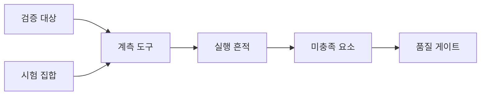
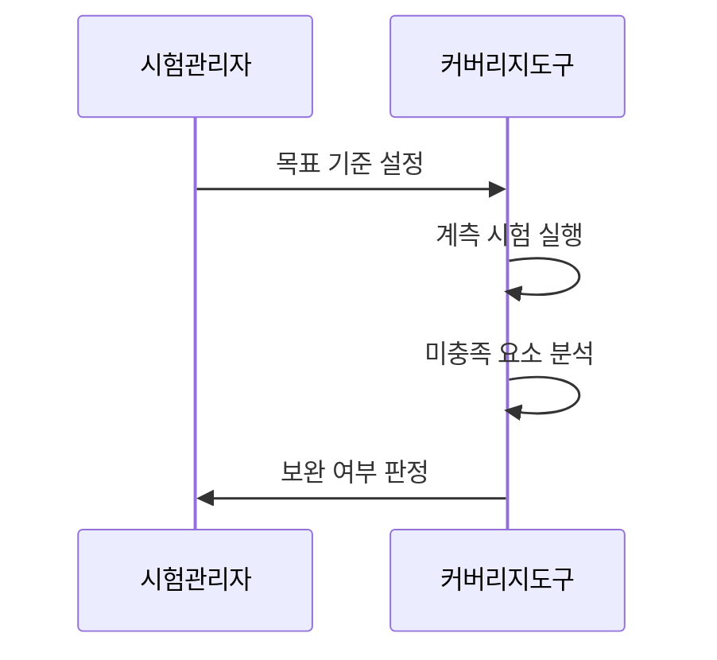

---
sidebar:
  order: 33
  label: "033. 테스트 커버리지"
  badge:
    text: "미출제 · 50%"
    variant: note
title: "테스트 커버리지(구문·분기·MC/DC)"
date: "2026-07-25T14:12:00+09:00"
tags:
  - "notes-evaluation"
weight: 33
extra:
  question_no: "033"
  source_status: "미출제"
  source_history: ""
  priority: 50
  priority_note: "구문·분기·MC/DC를 비교하는 시험 핵심축"
---

## 미리 알고가기

- **테스트 커버리지(Test Coverage)**: 시험 대상 중 실제로 실행하거나 충족한 요소의 비율
- **구문 커버리지(Statement Coverage)**: 실행 가능한 각 구문을 한 번 이상 실행한 비율
- **분기 커버리지(Branch Coverage)**: 각 결정의 참과 거짓 결과를 실행한 비율
- **조건 커버리지(Condition Coverage)**: 결정문 안의 각 개별 조건이 참과 거짓을 가진 비율
- **결정(Decision)**: 하나 이상의 조건을 조합해 제어 흐름을 선택하는 논리식
- **MC/DC(Modified Condition/Decision Coverage)**: 각 개별 조건이 결정 결과를 독립적으로 바꿀 수 있음을 보이는 기준
- **포섭 관계(Subsumption)**: 강한 커버리지 기준을 만족하면 약한 기준도 함께 만족하는 관계
- **도달 불가 코드(Dead Code)**: 어떤 정상 입력과 흐름으로도 실행할 수 없는 코드
- **품질 게이트(Quality Gate)**: 정한 기준을 충족해야 다음 단계로 진행시키는 통제 규칙

## Ⅰ. 개요

- 정의/개념: 시험이 실행한 구조 요소의 비율이다
- 기존 한계: 시험 건수와 성공률만으로는 코드·분기·조건 중 실행되지 않은 영역과 시험 공백을 식별하기 어렵다.

### 쉽게 이해하기 (학습용)

- 시험이 모두 통과해도 실행하지 않은 코드 경로에는 결함이 남을 수 있으므로, 커버리지는 무엇을 시험했는지가 아니라 무엇을 아직 시험하지 않았는지를 찾아 보완하게 한다.

## Ⅱ. 특징

- 커버리지는 실행 범위를 보여도 정답성을 보장하지 않는다
- 강한 기준은 더 깊은 논리 공백을 드러낸다
- 포섭 관계는 중복 측정을 줄여 시험 비용을 낮춘다
- 도달 불가 코드 구분은 커버리지 과장을 막는다
- 위험별 목표 설정은 시험 비용과 검증력을 조정한다

### 쉽게 이해하기 (학습용)

- 구문은 문장 실행, 분기는 결정 결과, MC/DC는 개별 조건의 독립 영향을 확인하므로, 안전 중요도가 높을수록 더 강한 기준을 적용하되 높은 수치만으로 정답의 정확성까지 보장된다고 해석해서는 안 된다.

## Ⅲ. 아키텍처 및 구성요소

| 설계 요소 | 설명 |
|:---|:---|
| 검증 대상 | 시험할 코드와 모델의 범위를 확정 |
| 계측 도구 | 실행 구문과 논리 결과를 수집 |
| 시험 집합 | 정상·오류·경곗값 입력을 제공 |
| 실행 흔적 | 시험별 실행 경로를 기록 |
| 미충족 요소 | 빠진 구문·분기·조건을 식별 |
| 품질 게이트 | 목표 충족 여부와 예외를 판정 |

> 요약: 실행 흔적으로 미충족 요소와 품질 게이트를 판단한다

### 쉽게 이해하기 (학습용)

- 대상 코드에 계측 정보를 넣고 시험 집합을 실행하면 실제로 지나간 경로가 남으므로, 그 흔적과 전체 구조의 차이를 비교해 추가 시험이 필요한 구문·분기·조건을 찾는다.

## Ⅳ. 원리 및 절차 흐름도

| 절차 | 설명 |
|:---|:---|
| 목표 기준 설정 | 중요도에 맞는 종류와 목표를 결정 |
| 계측 시험 실행 | 시험별 실행 흔적과 결과를 수집 |
| 미충족 요소 분석 | 빠진 경로와 도달 불가 코드를 구분 |
| 보완 여부 판정 | 시험 추가 또는 예외 승인을 결정 |

> 요약: 목표 설정 뒤 미충족 경로를 분석해 보완한다

### 쉽게 이해하기 (학습용)

- 먼저 요구 수준을 정하고 계측 시험을 실행한 뒤 빈 구간의 원인을 분석해야, 실행 가능한 경로에는 시험을 추가하고 도달 불가 코드는 제거하거나 정당한 예외로 기록할 수 있다.

## Ⅴ. 종류 및 비교

| 판단 축 | 구문 | 분기 | MC/DC |
|:---|:---|:---|:---|
| 핵심 특징 | 각 실행 구문을 확인 | 참·거짓 흐름을 확인 | 조건별 독립 영향을 확인 |
| 적용 기준 | 일반 코드의 기본 점검 | 제어 흐름 중심 점검 | 안전 중요 논리 점검 |
| 주요 위험 | 미실행 분기를 놓침 | 복합 조건 결함을 놓침 | 시험 조합 비용이 증가 |

> 요약: 구문·분기·조건 독립성 순으로 검증이 강해진다

### 쉽게 이해하기 (학습용)

- 구문 100%여도 한쪽 분기를 타지 않을 수 있고 분기 100%여도 개별 조건의 영향은 드러나지 않을 수 있으므로, 중요한 복합 논리에는 다른 조건을 고정한 채 한 조건만 바꿔 결과가 달라지는 MC/DC 증거가 필요하다.

## Ⅵ. 실무 사례

1. 차량 제어 조건에 MC/DC를 적용한다

### 쉽게 이해하기 (학습용)

- 사례 3은 차량 제어의 복합 조건에서는 각 조건이 결과에 실제 영향을 주는지 증명해야 하므로, 다른 조건은 고정하고 대상 조건만 바꾼 시험 쌍을 구성한다.

## Ⅶ. 결론

- 테스트 누락으로 인한 잔존 결함을 줄이기 위해 **요구 위험·코드 구조·변경 범위·커버리지의 미실행 구간**을 검토하고, 숫자 달성보다 위험 경로를 보완하는 기준으로 커버리지를 활용해야 한다.

### 쉽게 이해하기 (학습용)

- 미충족 구문·분기·조건이 발견되면 위험도에 맞춰 시험을 추가하고, 실행 불가능한 부분만 근거를 남겨 예외 처리해야 커버리지 수치가 실제 시험 충분성을 설명할 수 있다.
