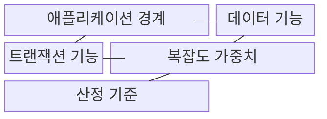
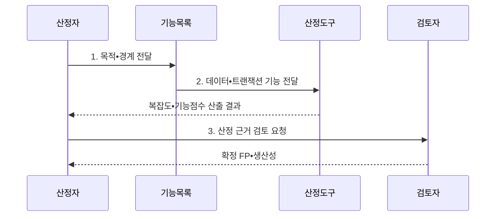

---
sidebar:
  order: 34
  label: "034. 기능점수 기반 규모 산정"
  badge:
    text: "기출 • 30%"
    variant: note
title: "기능점수(FP) 기반 규모•생산성 산정"
date: "2026-08-04T22:25:00+09:00"
tags:
  - "notes-evaluation"
weight: 34
extra:
  question_no: "034"
  source_status: "기출"
  source_history: "126회"
  priority: 30
  priority_note: "기능점수 기반 생산성 산정 기출 주제"
---

## Ⅰ. 개요

핵심 용어

- **기능점수(Function Point, FP) 기반 규모•생산성 산정**: 사용자 관점의 논리 데이터와 트랜잭션 기능을 계수해 소프트웨어 규모를 구하고, 이를 투입 공수로 나눠 생산성을 비교하는 방법이다.
- **생산성**: 투입 공수 한 단위로 구현한 기능 규모를 나타내며 보통 기능점수/인월로 계산하는 지표이다.
- **코드 줄 수(Lines of Code, LOC)**: 소스 코드 줄 수로 구현 결과의 물리 규모를 나타내는 지표이다.

- 정의/개념: 사용자 관점의 **데이터•트랜잭션 기능** 을 계수해 기술 독립적 SW 규모를 산정하는 기법
- 배경/필요성: 개발 전 산출이 어렵고 언어•구현 방식에 종속된 **LOC** 로는 규모•생산성 비교 곤란

#### 한줄 요약

- 구현 언어가 정해지기 전에는 코드 줄 수를 알 수 없으므로, 사용자가 요구한 입력•출력•조회•데이터 기능을 점수로 바꾸면 개발 전에도 규모를 추정하고 완료 후에는 투입 공수 대비 생산성을 비교할 수 있다.

## Ⅱ. 특징

핵심 용어

- **애플리케이션 경계**: 측정 대상과 외부 사용자•시스템을 나누어 기능의 관리 주체를 판정하는 논리적 선이다.
- **미조정 기능점수(Unadjusted Function Point, UFP)**: 기능 유형별 개수와 복잡도 가중치를 합산한 조정 전 기능점수이다.
- **기술 독립성**: 프로그래밍 언어와 구현 방식보다 사용자 기능을 기준으로 규모를 나타내는 성질이다.
- **인월(Man-Month, MM)**: 한 사람이 한 달 동안 투입하는 작업량을 나타내는 노력 단위이다.

- **애플리케이션 경계** 를 통한 내부 데이터와 외부 참조 구분
- **ILF•EIF•EI•EO•EQ 계수** 와 복잡도 가중치에 따른 FP 산출
- **FP는 규모, FP/MM는 생산성**으로 구분한 견적•성과 적용

#### 한줄 요약

- 같은 요구사항은 구현 언어가 달라도 비슷한 FP를 가지므로 기술에 덜 종속적인 비교가 가능하지만, 경계와 기능을 잘못 나누면 점수가 달라지므로 일관된 규칙과 동료 검토가 필요하다.

## Ⅲ. 구조 및 구성요소

핵심 용어

- **내부 논리 파일(Internal Logical File, ILF)**: 측정 대상 시스템이 생성•수정•삭제하며 유지하는 논리 데이터 집합이다.
- **외부 연계 파일(External Interface File, EIF)**: 다른 시스템이 유지하고 측정 대상 시스템이 참조하는 논리 데이터 집합이다.
- **외부 입력(External Input, EI)**: 애플리케이션 경계 밖의 데이터를 받아 내부 상태를 변경하는 기능이다.
- **외부 출력(External Output, EO)**: 처리•계산을 거친 결과를 경계 밖에 제공하는 기능이다.
- **외부 조회(External Inquiry, EQ)**: 내부 상태를 바꾸지 않고 조회 결과를 제공하는 기능이다.

| 구성요소 | 책임 |
|:---|:---|
| **애플리케이션 경계** | 측정 대상과 외부 시스템의 **기능 관리 주체** 확정 |
| **데이터 기능** | 내부 유지 **ILF** 와 외부 참조 **EIF** 식별 |
| **트랜잭션 기능** | 사용자 목적별 **EI•EO•EQ** 식별 |
| **복잡도 가중치** | 기능 유형과 복잡도별 개수를 **UFP** 로 변환 |
| **산정 기준** | 계수 규칙•판정 근거•검토 이력의 **일관성 유지** |

#### 한줄 요약

- 먼저 경계를 그어 데이터의 관리 주체를 구분하고, 그 경계를 드나드는 사용자 거래를 찾은 뒤 복잡도 가중치를 적용해야 같은 기능을 중복 계수하거나 빠뜨리지 않고 규모를 산정할 수 있다.

## Ⅳ. 흐름도

핵심 용어

- **기능 식별**: 사용자 요구와 데이터 이동을 따라 중복 없이 논리 데이터•트랜잭션 기능을 찾는 과정이다.
- **복잡도 가중치**: 기능별 데이터 요소와 참조 파일 수에 따라 낮음•보통•높음 점수를 적용하는 값이다.
- **동료 검토**: 경계•기능 유형•중복•누락의 판정 근거를 다른 산정자가 확인해 계수 편차를 줄이는 절차이다.

- **1. 목적•경계 전달**: 산정 목적과 **애플리케이션 범위** 제공
- **2. 데이터•트랜잭션 기능 전달**: ILF•EIF와 **EI•EO•EQ** 구분
- **3. 산정 근거 검토 요청**: 중복•누락과 **경계•유형 판정** 교정

#### 한줄 요약

- 경계 안팎의 데이터와 사용자 거래를 차례로 세고 가중치를 합산한 뒤 투입 공수로 나누면, 앞의 FP는 만들어야 할 기능 규모를 뒤의 FP/MM는 같은 공수로 얼마나 구현했는지를 뜻한다.

## Ⅴ. 종류 및 비교

핵심 용어

- **FP 적용**: 구현 전 견적과 서로 다른 기술 간 규모•생산성 비교에 사용하는 방식이다.
- **LOC 적용**: 구현 후 코드량과 모듈별 물리 규모 분석에 사용하는 방식이다.
- **MM 적용**: 기능 규모 대비 개발 투입 공수를 계산하는 방식이다.

| 소프트웨어 규모 산정 방식 | FP | LOC | 스토리 포인트 |
|:---|:---|:---|:---|
| **적용 기준** | 견적•계약•**생산성 비교** | 구현 후 **코드량 분석** | 팀 내부 **반복 계획** |
| **핵심 특징** | 사용자 기능의 **절대 규모** | 구현 코드의 **물리 규모** | 팀이 정한 **상대 작업량** |
| **한계** | 경계•유형의 **판정 편차** | 언어•생성 방식에 **종속** | 팀 간 **수치 비교 곤란** |

> **생산성** = 기능점수(FP) / 투입 공수(MM)

#### 한줄 요약

- FP는 무엇을 제공했는지, LOC는 얼마나 코딩했는지, 스토리 포인트는 팀이 얼마나 어렵다고 보았는지를 나타내므로, 조직 간 생산성은 FP/MM로 비교하고 팀 내부 계획은 스토리 포인트로 관리해야 의미가 섞이지 않는다.

## Ⅵ. 실무 고려사항 및 대책

핵심 용어

- **경계 오류**: 내부 유지 데이터와 외부 참조 데이터를 잘못 나누어 ILF•EIF와 FP가 왜곡되는 문제이다.
- **기능 중복 계수**: 동일 사용자 기능을 화면•API•배치별로 중복 계산하여 규모를 부풀리는 문제이다.
- **생산성 비교 조건**: FP/MM을 비교할 때 개발 범위•품질 기준•재사용•팀 숙련도를 동일하게 맞춰야 한다는 조건이다.
- **요구 변경 추적**: 산정 시점별 기능점수 차이를 변경 요구와 연결해 규모•비용 변화의 근거를 남기는 활동이다.

| 문제 | 대책 | 효과 |
|:---|:---|:---|
| 경계 차이에 따른 **기능 중복•누락** | 업무 담당자와 **경계•관리 주체** 합의 | 기능 계수의 **일관성 확보** |
| 개발 유형•기술 차이에 따른 **성과 왜곡** | 조건이 유사한 **FP/MM 기준선** 사용 | 공수 추정의 **비교 타당성 향상** |
| 불명확한 요구사항에 따른 **규모 변동** | 시점별 FP 재산정과 **요구 변경분** 추적 | 규모•비용 변경의 **추적성 확보** |

#### 한줄 요약

- 산정한 FP를 유사 사업의 조직 생산성으로 나누면 개발 조건을 반영한 예상 공수를 구할 수 있다.

## Ⅶ. 결론

핵심 용어

- **규모와 생산성 구분**: FP는 구현할 기능의 규모이고 FP/MM는 공수 대비 산출량이므로 서로 다른 의사결정에 사용해야 한다.
- **비교 기준 통제**: 경계•계수 규칙•개발 범위를 맞춰 FP/MM의 해석 왜곡을 막는 원칙이다.
- **견적•성과 결정**: 예상 공수는 기능점수 규모를 유사 생산성으로 나누고 수행 성과는 동일 조건의 기능점수/인월로 비교하는 판단이다.

- 견적은 **FP 규모** 를 유사 FP/MM로 나누고, 성과는 동일 조건의 **FP/MM** 비교

#### 한줄 요약

- 견적이 필요하면 기능을 FP로 산정하고 수행 효율을 비교하려면 FP를 실제 공수로 나누되, 동일한 경계•계수 규칙•실적 조건을 적용해야 수치가 규모와 생산성을 올바르게 설명한다.
