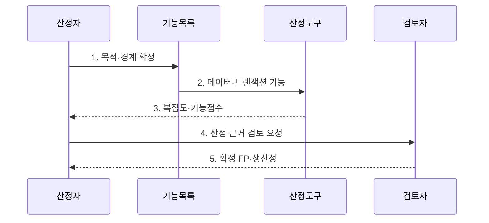

---
sidebar:
  order: 34
  label: "034. 기능점수 기반 규모 산정"
  badge:
    text: "기출 · 30%"
    variant: note
title: "기능점수(FP) 기반 규모·생산성 산정"
date: "2026-07-30T19:30:00+09:00"
tags:
  - "notes-evaluation"
weight: 34
extra:
  question_no: "034"
  source_status: "기출"
  source_history: "126회"
  priority: 30
  priority_note: "기능점수 기반 생산성 산정 기출 주제"
---

## 미리 알고가기

- **기능점수(Function Point, FP)**: 사용자 관점의 논리 기능을 계수하여 소프트웨어 규모를 나타내는 단위다.
- **애플리케이션 경계**: 측정 대상과 외부 사용자·시스템을 나누어 기능의 관리 주체를 판정하는 논리적 선이다.
- **내부 논리 파일(Internal Logical File, ILF)**: 측정 대상 시스템이 생성·수정·삭제하며 유지하는 논리 데이터 집합이다.
- **외부 연계 파일(External Interface File, EIF)**: 다른 시스템이 유지하고 측정 대상 시스템이 참조하는 논리 데이터 집합이다.
- **외부 입력(External Input, EI)**: 시스템 경계 밖의 입력으로 내부 데이터나 처리 동작을 변경하는 기능이다.
- **외부 출력(External Output, EO)**: 계산·가공한 결과를 시스템 경계 밖으로 제공하는 기능이다.
- **외부 조회(External Inquiry, EQ)**: 내부 데이터를 변경하지 않고 입력 조건에 따른 조회 결과를 반환하는 기능이다.
- **미조정 기능점수(Unadjusted Function Point, UFP)**: 기능 유형별 개수와 복잡도 가중치를 합산한 조정 전 기능점수다.
- **인월(Man-Month, MM)**: 한 사람이 한 달 동안 투입하는 작업량을 나타내는 노력 단위다.
- **생산성(Productivity)**: 투입 공수 한 단위로 구현한 기능 규모를 나타내는 지표다.
- **코드 줄 수(Lines of Code, LOC)**: 소스 코드의 줄 수를 기준으로 구현 규모를 나타내는 지표다.

## Ⅰ. 개요

- 정의/개념: 애플리케이션 경계 안의 **데이터·트랜잭션 기능**을 사용자 관점에서 계수해 구현 기술과 독립적인 SW 규모를 산정하는 기법
- 배경/필요성: 개발 전에 알기 어렵고 언어·구현 방식에 따라 달라지는 **LOC의 규모 비교 한계**를 보완할 견적·생산성 기준 확보

### 쉽게 이해하기 (학습용)

- 구현 언어가 정해지기 전에는 코드 줄 수를 알 수 없으므로, 사용자가 요구한 입력·출력·조회·데이터 기능을 점수로 바꾸면 개발 전에도 규모를 추정하고 완료 후에는 투입 공수 대비 생산성을 비교할 수 있다.

## Ⅱ. 특징

- **애플리케이션 경계**로 내부 데이터와 외부 참조를 구분한다.
- **ILF·EIF·EI·EO·EQ 계수**와 복잡도 가중치로 FP를 산출한다.
- **FP는 규모, FP/MM는 생산성**으로 구분해 견적·성과에 적용한다.

### 쉽게 이해하기 (학습용)

- 같은 요구사항은 구현 언어가 달라도 비슷한 FP를 가지므로 기술에 덜 종속적인 비교가 가능하지만, 경계와 기능을 잘못 나누면 점수가 달라지므로 일관된 규칙과 동료 검토가 필요하다.

## Ⅲ. 구조 및 구성요소

```mermaid
block-beta
  columns 3
    B["애플리케이션 경계"]:2
    D["데이터 기능"] T["트랜잭션 기능"]
    W["복잡도 가중치"]:2
    R["산정 기준"]:2
    B -- D
    B -- T
    D -- W
    T -- W
    W -- R
  B --- D --- W
  W --- R
```

| 구성요소 | 책임 |
|:---|:---|
| 애플리케이션 경계 | 측정 대상과 외부 시스템을 나눠 **기능 관리 주체** 확정 |
| 데이터 기능 | 내부 유지 데이터 ILF와 외부 참조 데이터 EIF 식별 |
| 트랜잭션 기능 | 사용자 목적별 EI·EO·EQ 식별 |
| 복잡도 가중치 | 기능 유형과 복잡도에 따른 개수를 **UFP**로 변환 |
| 산정 기준 | 계수 규칙·판정 근거·검토 이력을 통제해 일관성 유지 |

### 쉽게 이해하기 (학습용)

- 먼저 경계를 그어 데이터의 관리 주체를 구분하고, 그 경계를 드나드는 사용자 거래를 찾은 뒤 복잡도 가중치를 적용해야 같은 기능을 중복 계수하거나 빠뜨리지 않고 규모를 산정할 수 있다.

## Ⅳ. 흐름도



- **1. 목적·경계 확정**: 신규 개발·개선·생산성 평가 목적과 애플리케이션 범위를 고정
- **2. 데이터·트랜잭션 기능**: ILF·EIF는 관리 주체로, EI·EO·EQ는 사용자 목적과 처리 논리로 구분
- **3. 복잡도·기능점수**: 유형별 개수에 복잡도 가중치를 적용해 UFP 산출
- **4. 산정 근거 검토 요청**: 중복·누락과 경계·유형 판정을 동료 검토로 교정
- **5. 확정 FP·생산성**: 확정 규모는 FP, 실제 투입 공수당 산출 규모는 FP/MM로 분리 산정

### 쉽게 이해하기 (학습용)

- 경계 안팎의 데이터와 사용자 거래를 차례로 세고 가중치를 합산한 뒤 투입 공수로 나누면, 앞의 FP는 만들어야 할 기능 규모를 뒤의 FP/MM는 같은 공수로 얼마나 구현했는지를 뜻한다.

## Ⅴ. 종류 및 비교

| 소프트웨어 규모 산정 방식 | FP | LOC | 스토리 포인트 |
|:---|:---|:---|:---|
| 적용 기준 | 견적·계약·생산성 비교 | 구현 후 코드량 분석 | 팀 내부 반복 계획 |
| 핵심 특징 | 사용자 기능의 절대 규모 | 구현 코드의 물리 규모 | 팀이 정한 상대 작업량 |
| 한계 | 경계·유형 판정 편차 | 언어·생성 방식 종속 | 팀 간 수치 비교 곤란 |

> 생산성 = 기능점수(FP) / 투입 공수(MM)

### 쉽게 이해하기 (학습용)

- FP는 무엇을 제공했는지, LOC는 얼마나 코딩했는지, 스토리 포인트는 팀이 얼마나 어렵다고 보았는지를 나타내므로, 조직 간 생산성은 FP/MM로 비교하고 팀 내부 계획은 스토리 포인트로 관리해야 의미가 섞이지 않는다.

## Ⅵ. 실무 고려사항 및 대책

| 고려사항 | 대책 | 효과 |
|:---|:---|:---|
| 산정자마다 애플리케이션 경계를 다르게 잡아 **기능 중복·누락** | 업무 담당자와 경계를 합의하고 외부 시스템별 관리 주체 기록 | 기능 계수의 **일관성 확보** |
| 다른 개발 유형·기술의 생산성을 직접 비교해 **성과 왜곡** | 신규·개선 유형과 조직·기술 조건이 유사한 FP/MM 기준선 사용 | 공수 추정의 **비교 타당성 향상** |
| 초기 요구사항이 불명확해 기능 유형과 복잡도가 **변동** | 기준 시점별 FP를 재산정하고 요구 변경분을 별도 추적 | 규모·비용 변경의 **추적성 확보** |

### 쉽게 이해하기 (학습용)

- 산정한 FP를 유사 사업의 조직 생산성으로 나누면 개발 조건을 반영한 예상 공수를 구할 수 있다.

## Ⅶ. 결론

- 합의한 경계와 계수 규칙으로 **FP 규모**를 확정하고 유사 사업의 **FP/MM 생산성**을 적용해 공수와 수행 효율을 판단하는 산정 결정

### 쉽게 이해하기 (학습용)

- 견적이 필요하면 기능을 FP로 산정하고 수행 효율을 비교하려면 FP를 실제 공수로 나누되, 동일한 경계·계수 규칙·실적 조건을 적용해야 수치가 규모와 생산성을 올바르게 설명한다.
