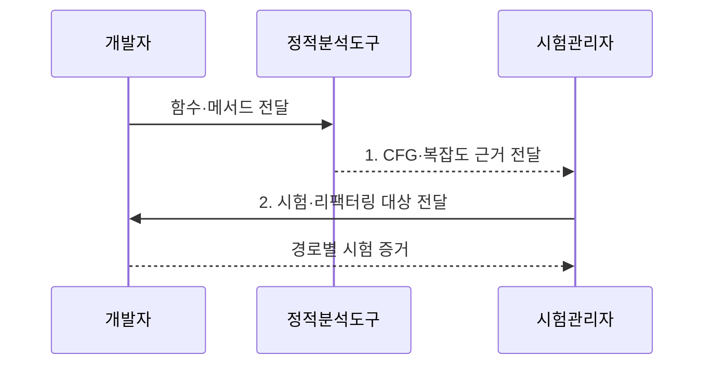

---
sidebar:
  order: 35
  label: "035. 순환 복잡도 (McCabe's Cyclomatic Complexity)"
  badge:
    text: "미출 · 50%"
    variant: note
title: "순환 복잡도 (McCabe's Cyclomatic Complexity)"
date: "2026-07-31T11:30:40+09:00"
tags:
  - "notes-evaluation"
weight: 35
extra:
  question_no: "035"
  source_status: "미출"
  source_history: ""
  priority: 50
  priority_note: "제어흐름 경로 수로 시험 복잡도를 판단"
---

## 미리 알고가기

- **제어 흐름 그래프(Control Flow Graph, CFG)**: 프로그램의 기본 블록을 노드로, 블록 사이의 실행 이동을 간선으로 나타낸 그래프다.
- **기본 블록**: 분기 없이 순서대로 실행되는 하나 이상의 명령어 묶음이다.
- **연결 성분(P)**: 서로 경로가 연결되지 않은 독립적인 제어 흐름 그래프의 수다.
- **순환 복잡도(V(G))**: CFG의 간선 수 E, 노드 수 N, 연결 성분 수 P로 선형 독립 경로 수를 나타내는 지표다.
- **선형 독립 경로**: 이전 경로에 없던 간선을 하나 이상 포함하는 실행 경로다.
- **결정점**: if·case·반복문처럼 실행 경로가 둘 이상으로 갈리는 지점이다.
- **기본 경로 테스트**: 선형 독립 경로마다 시험을 설계해 제어 흐름을 확인하는 기법이다.
- **인지 복잡도**: 사람이 코드의 제어 흐름을 이해하기 어려운 정도를 측정하는 지표다.
- **중첩 깊이**: 조건문이나 반복문이 안쪽으로 겹쳐 들어간 최대 단계다.
- **회귀 테스트**: 코드 변경 뒤 기존 기능이 그대로 동작하는지 다시 확인하는 시험이다.
- **리팩터링**: 외부 동작은 유지하면서 코드 내부 구조를 개선하는 활동이다.

> **키워드:** 순환 복잡도 (McCabe's Cyclomatic Complexity)

## Ⅰ. 개요

- 정의/개념: CFG의 간선·노드·연결 성분으로 **선형 독립 경로 수**를 산출하는 제어 흐름 복잡도 지표
- 배경/필요성: 코드 길이만으로는 **분기 증가**에 따른 시험 경로 누락 위험과 개선 우선순위 판단 곤란

### 쉽게 이해하기 (학습용)
- 분기마다 새 실행 길이 생기므로 독립 경로 수만큼 기본 테스트를 준비한다.


## Ⅱ. 특징


> 단일 연결 제어 흐름 그래프를 가정한 파란 선은 결정점이 하나 늘 때마다 \(V(G)\)와 기본 독립 경로 수가 하나씩 증가하는 \(V(G)=결정점 수+1\) 관계를 나타낸다.

- 수식 **$V(G)=E-N+2P$** 적용으로 CFG의 선형 독립 경로 수 산출
- 단일 CFG에서 **결정점 수+1**을 통한 동일 값 계산
- **제어 흐름 기반 측정**을 통한 언어·코드 길이 독립적 경로 비교

### 쉽게 이해하기 (학습용)
- 조건문이 한 갈래를 더 만들면 확인할 기본 실행 경로도 하나 늘어난다.


## Ⅲ. 구조 및 구성요소

```mermaid
block-beta
    columns 3
    B["분석 경계"] C["CFG"]
    V["복잡도 산출"] P["임계값 정책"]
    B -- C
    C -- V
    V -- P
  B --- V
```

| 구성요소 | 책임 |
|:---|:---|
| **분석 경계** | 함수·메서드 단위의 측정 범위와 **연결 성분** 구분 |
| **CFG** | 기본 블록과 제어 이동을 **노드·간선**으로 표현 |
| **복잡도 산출** | $E-N+2P$로 **선형 독립 경로 수** 계산 |
| **임계값 정책** | 기준 초과 함수를 **시험·리팩터링 대상**으로 지정 |

### 쉽게 이해하기 (학습용)
- 함수의 실행 지도를 그려 독립 경로 수를 계산하고 기준 초과 함수를 찾는다.


## Ⅳ. 흐름도



1. **CFG·복잡도 근거 전달**: 기본 블록과 제어 이동으로 **독립 경로 수** 산출
2. **시험·리팩터링 대상 전달**: 임계값과 변경·결함 이력으로 **우선순위** 결정

### 쉽게 이해하기 (학습용)

- 함수를 제어 흐름 그래프로 바꿔 독립 경로 수를 계산하고, 각 경로를 실제 시험 증거와 연결한다.

## Ⅴ. 종류 및 비교

| 복잡도 지표 | 순환 복잡도 | 인지 복잡도 | 중첩 깊이 |
|:---|:---|:---|:---|
| **적용 기준** | 기본 경로의 **시험 범위 산정** | 코드 리뷰·**리팩터링 우선순위** | 과도한 **제어문 중첩 제한** |
| **핵심 특징** | **선형 독립 경로 수** 측정 | 사람이 느끼는 **이해 난도** 측정 | 제어문이 겹친 **최대 단계** 측정 |
| **한계** | 데이터·호출 **의존성 미반영** | 도구별 **계산 규칙 상이** | 비중첩 **분기 수 미반영** |

> 요약: **경로 수·인지 난도·중첩 단계**는 서로 다른 측정 대상

### 쉽게 이해하기 (학습용)
- 시험할 경로 수는 순환 복잡도, 읽기 어려움은 인지 복잡도, 겹친 단계는 중첩 깊이로 판단한다.


## Ⅵ. 실무 고려사항 및 대책

| 고려사항 | 대책 | 효과 |
|:---|:---|:---|
| 높은 복잡도 함수의 **독립 경로 누락** | 독립 경로별 **시험 케이스·실행 흔적** 연결 | 분기별 **기본 경로 검증** |
| 임계값 단독 적용에 따른 **우선순위 왜곡** | 변경 빈도·결함 이력·**업무 중요도** 병행 평가 | 위험 중심의 **리팩터링 선정** |
| 함수 분할에 따른 **전체 이해도 저하** | **인지 복잡도·결합도** 지표 병행 검토 | 수치 목적의 **형식적 분할 방지** |

### 쉽게 이해하기 (학습용)
- 결제 함수가 임계값을 넘으면 각 독립 경로에 시험 케이스와 실행 흔적을 연결해 분기 누락을 방지한다.


## Ⅶ. 결론

- **순환 복잡도**만큼 기본 경로를 시험하고 변경·결함이 잦은 함수는 **리팩터링 우선**

### 쉽게 이해하기 (학습용)
- 순환 복잡도는 코드 품질 점수가 아니라 빠뜨리지 말아야 할 기본 경로 수를 알려 주는 기준이다.
