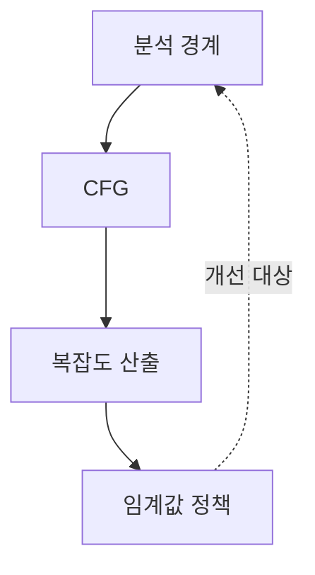
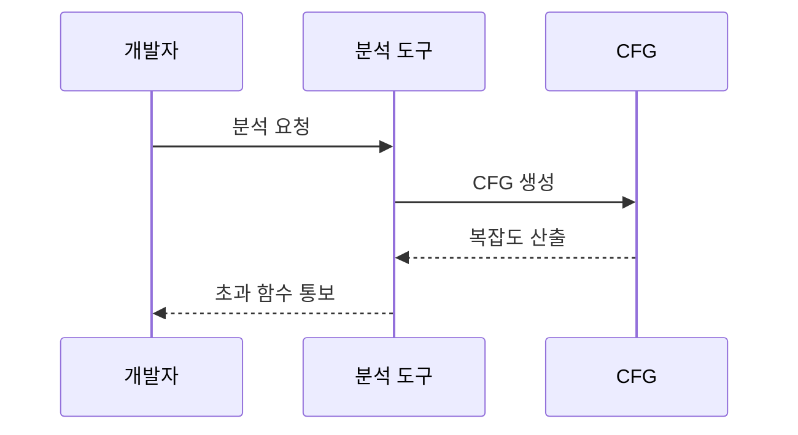

---
sidebar:
  order: 35
  label: "035. 순환 복잡도 (McCabe's Cyclomatic Complexity)"
  badge:
    text: "미출제 · 50%"
    variant: note
title: "순환 복잡도 (McCabe's Cyclomatic Complexity)"
date: "2026-07-25T14:16:00+09:00"
tags:
  - "notes-evaluation"
weight: 35
extra:
  question_no: "035"
  source_status: "미출제"
  source_history: ""
  priority: 50
  priority_note: "제어흐름 경로 수로 시험 복잡도를 판단"
---

## 미리 알고가기

- **CFG (Control Flow Graph)**: 프로그램의 기본 블록을 노드로, 블록 사이의 실행 이동을 간선으로 나타낸 그래프
- **기본 블록**: 분기 없이 순서대로 실행되는 하나 이상의 명령어 묶음
- **연결 성분(P)**: 서로 경로가 연결되지 않은 독립적인 제어 흐름 그래프의 수
- **V(G)·E·N**: 순환 복잡도 V(G)를 계산할 때 E는 CFG의 간선 수, N은 노드 수를 뜻함
- **선형 독립 경로**: 이전 경로에 없던 간선을 하나 이상 포함하는 실행 경로
- **결정점**: if·case·반복문처럼 실행 경로가 둘 이상으로 갈리는 지점
- **기본 경로 테스트**: 선형 독립 경로마다 테스트를 설계해 모든 제어 흐름을 확인하는 기법
- **인지 복잡도**: 사람이 코드의 제어 흐름을 이해하기 어려운 정도를 측정하는 지표
- **중첩 깊이**: 조건문이나 반복문이 안쪽으로 겹쳐 들어간 최대 단계
- **회귀 테스트**: 코드 변경 뒤 기존 기능이 그대로 동작하는지 다시 확인하는 테스트
- **리팩터링**: 외부 동작은 유지하면서 코드 내부 구조를 개선하는 활동

## Ⅰ. 개요

- 정의/개념: CFG의 선형 독립 경로 수를 나타내는 지표다
- **배경/필요성**: 분기 증가에 따른 테스트 경로 누락을 막는다

### 쉽게 이해하기 (학습용)
- 분기마다 새 실행 길이 생기므로 독립 경로 수만큼 기본 테스트를 준비한다.

## Ⅱ. 특징

- $V(G)=E-N+2P$는 독립 경로 수를 산출한다
- 단일 CFG는 결정점 수에 1을 더해 계산한다
- 분기 추가는 최소 기본 경로와 시험 비용을 늘린다
- 경로 중심이라 가독성·모듈 의존성을 놓칠 수 있다
- 보조 지표 결합은 복잡도 해석의 오판을 줄인다

### 쉽게 이해하기 (학습용)
- 조건문이 한 갈래를 더 만들면 확인할 기본 실행 경로도 하나 늘어난다.

## Ⅲ. 아키텍처 및 구성요소

| 설계 요소 | 설명 |
|:---|:---|
| 분석 경계 | 함수·메서드 단위로 측정 범위 구분 |
| CFG | 기본 블록과 제어 이동 관계 표현 |
| 복잡도 산출 | 간선·노드·연결 성분으로 계산 |
| 임계값 정책 | 초과 함수를 테스트·개선 대상으로 지정 |

> 요약: CFG에서 복잡도를 계산해 개선 대상을 정한다

### 쉽게 이해하기 (학습용)
- 함수의 실행 지도를 그려 독립 경로 수를 계산하고 기준 초과 함수를 찾는다.

## Ⅳ. 원리 및 절차 흐름도

| 절차 | 설명 |
|:---|:---|
| 분석 요청 | 함수별 복잡도 분석을 실행 |
| CFG 생성 | 기본 블록과 제어 이동을 그래프로 변환 |
| 복잡도 산출 | 독립 경로 수를 계산해 임계값과 비교 |
| 초과 함수 통보 | 테스트·리팩터링 대상 함수 제시 |

> 요약: CFG를 만들고 복잡도 임계값 초과 함수를 찾는다

### 쉽게 이해하기 (학습용)
- 도구가 코드의 갈림길을 세어 기준을 넘은 함수를 개발자에게 알려 준다.

## Ⅴ. 종류 및 비교

| 비교축 | 순환 복잡도 | 인지 복잡도 | 중첩 깊이 |
|:---|:---|:---|:---|
| 핵심 특징 | 선형 독립 경로 수 측정 | 사람이 느끼는 이해 난도 측정 | 제어문이 겹친 최대 단계 측정 |
| 적용 기준 | 기본 경로 테스트 범위 산정 | 코드 리뷰·리팩터링 우선순위 | 과도한 제어문 중첩 제한 |
| 주요 위험 | 데이터·호출 의존성은 반영 못 함 | 도구별 계산 규칙이 다름 | 비중첩 분기 수를 반영 못 함 |

> 요약: 경로 수·인지 난도·중첩 단계는 측정 대상이 다르다

### 쉽게 이해하기 (학습용)
- 테스트 길 수는 순환 복잡도, 읽기 어려움은 인지 복잡도, 겹친 단계는 중첩 깊이로 판단한다.

## Ⅵ. 실무 사례

1. 결제 함수가 임계값을 넘으면 기본 경로 시험을 추가한다

### 쉽게 이해하기 (학습용)
- 결제 함수의 독립 경로를 시험으로 연결해 분기 하나가 빠지는 것을 방지한다.

## Ⅶ. 결론

- 독립 경로 수로 기본 테스트 범위를 결정한다.

### 쉽게 이해하기 (학습용)
- 순환 복잡도는 코드 품질 점수가 아니라 빠뜨리지 말아야 할 기본 경로 수를 알려 주는 기준이다.
